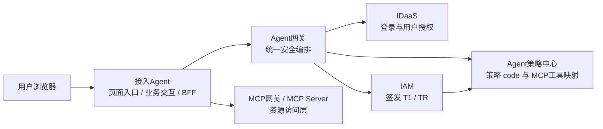
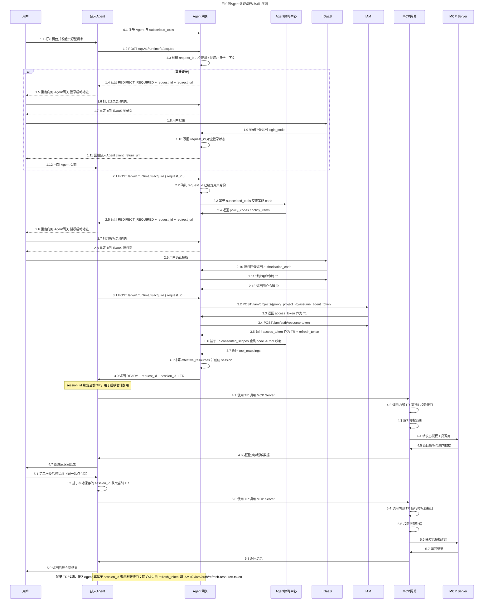
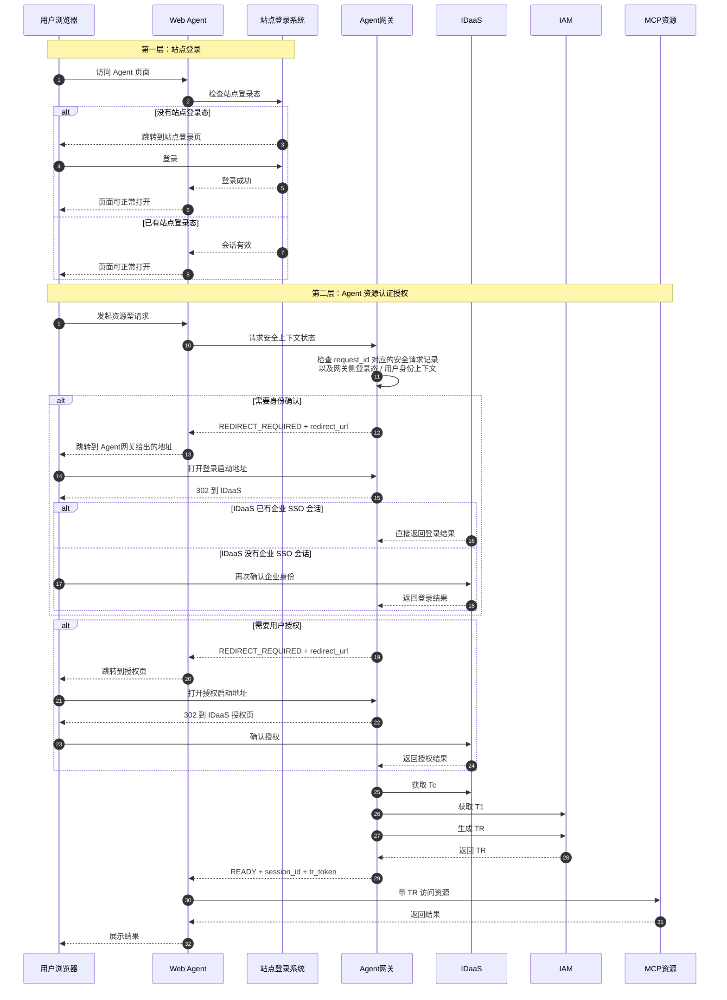
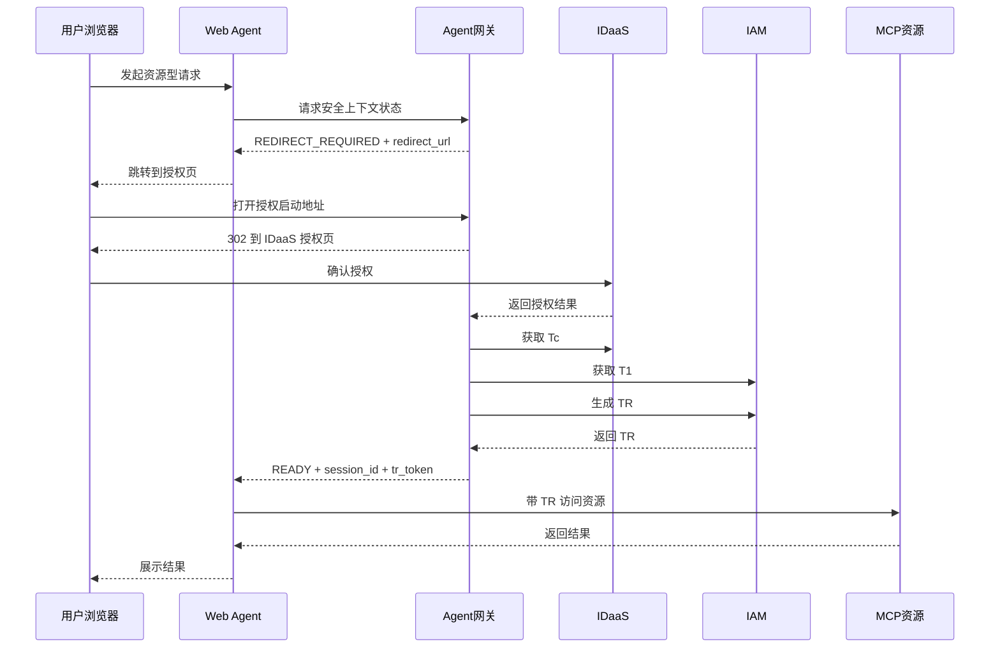
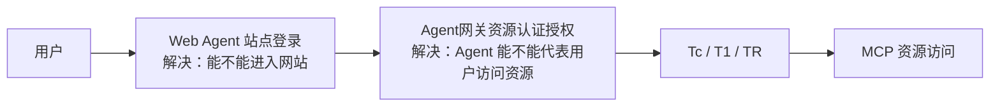
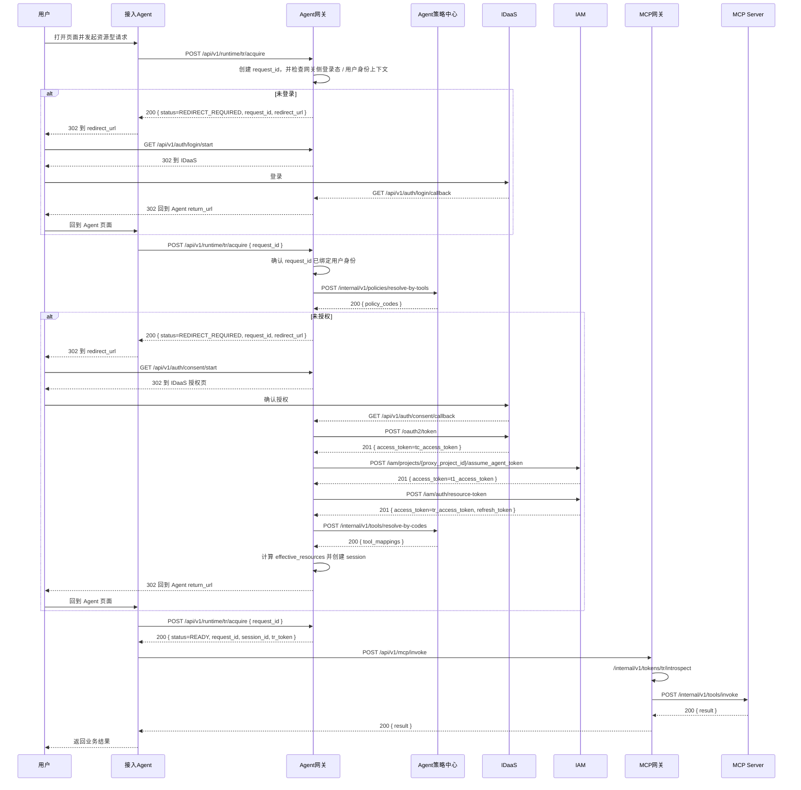

# Agent 安全体系总体架构

## 1. 系统定位

这套方案是一套可供多种业务 Agent 复用的通用安全底座，不是为某一个 ERP Agent 单独定制的专用方案。

它要同时解决三件事：

- 用户是谁
- 当前执行操作的 Agent 是谁
- 这个 Agent 在当前会话里到底能访问哪些资源

当前文档中的财报、发票和 `erp:*` 策略 code 仅用于示例说明。

## 2. 架构口径

这套方案统一采用下面这套边界：

- 浏览器流量入口是 `ALB -> 接入Agent`
- `Agent网关` 是内部安全编排服务
- 接入 Agent 不直接对接 `IDaaS`
- 登录、授权、`Tc / T1 / TR` 的申请、校验与刷新由 `Agent网关` 统一处理
- 接入 Agent 最终只拿到：
  - `session_id`
  - `TR`

一句话概括：

`接入Agent负责业务入口和页面交互，Agent网关负责统一安全编排。`

## 3. 核心模块

- **用户 (User)**：最终使用者
- **ALB**：浏览器流量入口，负责把请求转给接入 Agent
- **接入 Agent (Business Agent)**：用户真正使用的业务 Agent，例如 ERP Agent、采购助手、报表助手等
- **Agent网关**：内部安全编排服务，负责登录、授权、`Tc / T1 / TR` 的申请、校验与刷新
- **IDaaS**：用户登录和用户授权中心，签发 `Tc`
- **IAM**：Agent 身份和委托令牌中心，签发 `T1` 和 `TR`
- **Agent策略中心**：维护“策略 code <-> MCP 工具”的映射
- **MCP网关 / MCP Server**：资源访问层，只接受 `TR`

## 4. 系统总架构图

这张图要表达的重点是：

- 用户第一跳先到接入 Agent，不到 Agent 网关
- Agent 网关不承接网站首页流量，只承接安全编排能力
- 接入 Agent 通过调用 Agent 网关，拿到最终可用的 `TR`

### 4.1 总体时序图

这张图把当前方案的主链路放在一张图里：用户先和 `接入Agent` 交互，`接入Agent` 向 `Agent网关` 请求安全上下文；`Agent网关` 负责登录、授权、`Tc / T1 / TR` 的生成；`接入Agent` 在拿到 `session_id + TR` 后访问 `MCP网关`，后续会话继续复用当前 `session_id` 和 `TR`。

其中，当前 IAM 对接基线采用本地测试环境地址：`https://apig.hisuat.huawei.com`。

## 5. Web Agent 场景下的两层认证

Web Agent 场景最容易混淆的是：为什么看起来像有两次“登录/认证”。

实际上是两层不同的能力：

- **第一层：站点登录**
  - 解决“用户能不能进入这个 Web Agent 网站”
- **第二层：Agent 资源认证授权**
  - 解决“这个 Agent 能不能代表当前用户访问 MCP 资源”

### 5.1 详细图

这张图要表达的重点是：

- 站点登录和 Agent 资源认证授权不是一回事
- `Agent网关` 判断“是否已登录”时，依赖的是当前 `request_id` 对应的安全请求记录，以及登录回调后写回的网关侧用户身份上下文
- 登录回调完成后，`Agent网关` 会把这次安全请求推进到“待授权”或“可继续处理”
- 接入 Agent 本身不需要直接识别 `IDaaS` 登录态，它只需要根据网关返回的 `READY` 或 `REDIRECT_REQUIRED` 推进流程
- `REDIRECT_REQUIRED` 只是对外统一状态，`Agent网关` 内部仍会区分“需要登录”还是“需要授权”

### 5.2 常见授权路径图

下面这张图只保留最常见的一条路径：

- 用户已经完成站点登录
- `Agent网关` 已经识别到用户身份
- 当前只差 Agent 资源授权

### 5.3 简化图

## 6. 默认方案的主流程

当前接口与交互文档只覆盖默认方案。

这张图里“Agent网关怎么识别用户是否已经登录”体现为两步：

1. `POST /api/v1/runtime/tr/acquire`
   `Agent网关` 先创建当前 `request_id` 对应的安全请求记录，并检查它是否已经绑定了网关侧用户身份上下文。
2. `GET /api/v1/auth/login/callback`
   当 `IDaaS` 回调回来后，`Agent网关` 会把登录结果写回这条安全请求记录。之后接入 Agent 再带着 `request_id` 调同一个 `TR` 获取接口时，网关就知道这次请求已经完成登录。

也就是说，网关识别“是否已登录”不是靠接入 Agent 直接传一个用户登录态，而是靠：

- 当前 `request_id`
- 登录回调写回的网关侧状态

## 7. 插件方案的定位

插件方案仍然保留为扩展能力：

- 接入 Agent 先做一次“无敏感数据”的工具识别
- 返回本次真正需要的 MCP 工具
- Agent 网关再去策略中心做 `tool -> code` 反查
- 最终把授权范围缩到本次请求最小集合

当前接口与交互文档**不展开插件方案实现**，只保留其架构定位。

## 8. 关键边界

- 用户第一跳到的是接入 Agent，不是 Agent 网关
- 接入 Agent 不直接对接 `IDaaS`
- `Agent网关` 统一负责登录、授权和令牌生成
- 接入 Agent 不持有 `Tc/T1`
- 接入 Agent 只持有：
  - `session_id`
  - 当前 `TR`
- 真正访问 MCP 时，只能使用 `TR`
