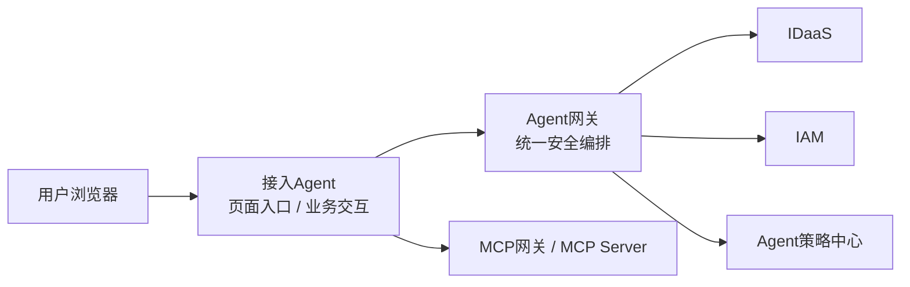
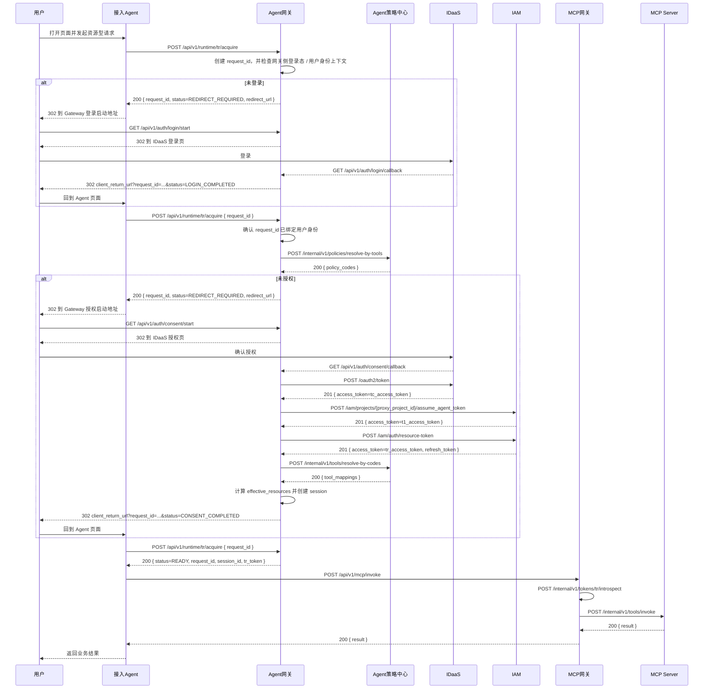

# 默认方案接口与模块交互

> 本目录只覆盖默认方案。财报、发票与 `erp:*` 策略 code 仅为示例业务场景。

## 文档导航

1. [01_全局约定.md](/D:/IDEA_Project/init_env/auth-design-spec/docs/design/default_scheme_interfaces/01_全局约定.md)
   统一约定、状态值、错误码、Token 和会话边界
2. [02_接入准备与认证授权.md](/D:/IDEA_Project/init_env/auth-design-spec/docs/design/default_scheme_interfaces/02_接入准备与认证授权.md)
   Agent 注册、登录启动、登录回调、默认方案授权、`Tc` 获取
3. [03_T1与TR生成.md](/D:/IDEA_Project/init_env/auth-design-spec/docs/design/default_scheme_interfaces/03_T1与TR生成.md)
   `T1` 获取、`TR` 生成、同步返回 `session_id + TR`
4. [04_资源访问与TR刷新.md](/D:/IDEA_Project/init_env/auth-design-spec/docs/design/default_scheme_interfaces/04_资源访问与TR刷新.md)
   MCP 调用、运行时校验、会话复用、`TR` 刷新
5. [05_数据对象与状态模型.md](/D:/IDEA_Project/init_env/auth-design-spec/docs/design/default_scheme_interfaces/05_数据对象与状态模型.md)
   数据对象、状态模型与典型交互场景

## 已锁定的设计前提

- 只设计默认方案，不展开插件方案接口
- 浏览器入口流量是：`ALB -> 接入Agent`
- `Agent网关` 是内部安全编排服务
- 接入 Agent 不直接对接 `IDaaS`
- 接入 Agent 只透传并暂存 `session_id + 当前 TR`
- 接入 Agent 不持有 `Tc / T1`
- `TR` 过期后只能回 `Agent网关` 刷新
- `session_id` 只是会话索引，不是独立凭证
- Agent 调 `Agent网关` 时需要运行时身份认证，但当前文档不绑定具体技术实现

## 真实令牌接口基线

- `Tc` 接口：`POST /oauth2/token`
- `T1` 接口：`POST https://apig.hisuat.huawei.com/iam/projects/{proxy_project_id}/assume_agent_token`
- `TR` 接口：`POST https://apig.hisuat.huawei.com/iam/auth/resource-token`
- `TR` 刷新接口：`POST https://apig.hisuat.huawei.com/iam/auth/refresh-resource-token`
- 当前 IAM 文档未提供 `TR introspect` 官方接口，因此资源访问阶段保留内部 `TR` 运行时校验接口

## 接口分层

### 第一层：接入 Agent 可见接口

- `POST /api/v1/runtime/tr/acquire`
- `POST /api/v1/runtime/sessions/{session_id}/tr/refresh`
- `POST /api/v1/mcp/invoke`

### 第二层：Agent 网关内部编排接口

- `GET /api/v1/auth/login/start`
- `GET /api/v1/auth/login/callback`
- `GET /api/v1/auth/consent/start`
- `GET /api/v1/auth/consent/callback`
- `POST /internal/v1/policies/resolve-by-tools`
- `POST /oauth2/token`
- `POST https://apig.hisuat.huawei.com/iam/projects/{proxy_project_id}/assume_agent_token`
- `POST https://apig.hisuat.huawei.com/iam/auth/resource-token`
- `POST https://apig.hisuat.huawei.com/iam/auth/refresh-resource-token`

### 第三层：资源访问内部接口

- `POST /internal/v1/tokens/tr/introspect`
- `POST /internal/v1/tools/invoke`

## 静态结构图

这张图表达的是：

- 用户先进入接入 Agent
- 接入 Agent 在需要资源访问时调用 `Agent网关`
- `Agent网关` 统一负责登录、授权、`Tc / T1 / TR`

## Web Agent 的两层安全

Web Agent 场景下，需要区分两层能力：

- **站点登录**
  - 解决：用户能不能进入 Web Agent 网站
- **Agent 资源认证授权**
  - 解决：这个 Agent 能不能代表用户访问 MCP 资源

当前接口与交互文档重点覆盖第二层。

## 总时序图

## 总图怎么读

如果你只想先抓主线，可以按这 6 步理解：

1. 用户先到接入 Agent
2. 接入 Agent 在需要资源访问时调用 `Agent网关`
3. `Agent网关` 判断是否需要登录
4. 登录完成后再判断是否需要授权
5. `Agent网关` 负责拿 `Tc / T1 / TR`
6. 接入 Agent 最终只拿 `session_id + TR` 去访问 MCP

## 实现时的 4 条硬规则

- `security_request` 是唯一流程主记录，登录回调、授权回调、状态查询都围绕它推进
- `POST /api/v1/runtime/tr/acquire` 是接入 Agent 唯一的 `TR` 获取入口
- `session` 只在首次进入 `READY` 后创建
- 浏览器回跳只负责通知接入 Agent 继续查状态，不直接把 `TR` 暴露给浏览器

## 快速接口总览

| Phase | 方法 | 路径 | 说明 |
|---|---|---|---|
| 0 | `POST` | `/api/v1/agents/register` | 注册 Agent 与订阅工具 |
| 1-3 | `POST` | `/api/v1/runtime/tr/acquire` | 获取或续取当前请求对应的 `TR` |
| 1 | `GET` | `/api/v1/auth/login/start` | 由网关启动登录 |
| 1 | `GET` | `/api/v1/auth/login/callback` | 登录回调 |
| 2 | `GET` | `/api/v1/auth/consent/start` | 由网关启动授权 |
| 2 | `GET` | `/api/v1/auth/consent/callback` | 授权回调 |
| 2 | `POST` | `/internal/v1/policies/resolve-by-tools` | 按工具反查策略 code |
| 2 | `POST` | `/oauth2/token` | 获取 `Tc` |
| 3 | `POST` | `https://apig.hisuat.huawei.com/iam/projects/{proxy_project_id}/assume_agent_token` | 获取 `T1` |
| 3 | `POST` | `https://apig.hisuat.huawei.com/iam/auth/resource-token` | 生成 `TR` |
| 3 | `POST` | `/internal/v1/tools/resolve-by-codes` | 按 code 正向解析工具 |
| 4-5 | `POST` | `/api/v1/mcp/invoke` | 调用 MCP 工具 |
| 4-5 | `POST` | `/internal/v1/tokens/tr/introspect` | 运行时校验 `TR` |
| 4-5 | `POST` | `/internal/v1/tools/invoke` | 执行工具调用 |
| 5 | `POST` | `/api/v1/runtime/sessions/{session_id}/tr/refresh` | 刷新 `TR` |
| 5 | `POST` | `https://apig.hisuat.huawei.com/iam/auth/refresh-resource-token` | IAM 刷新 `TR` |
