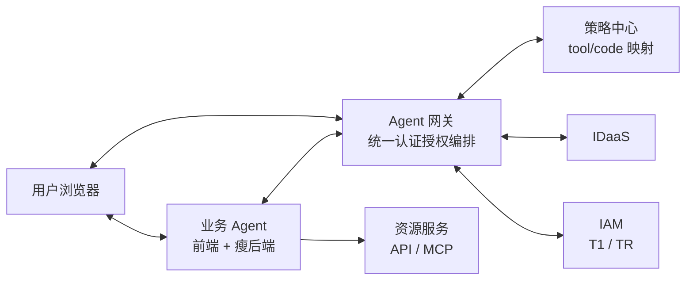
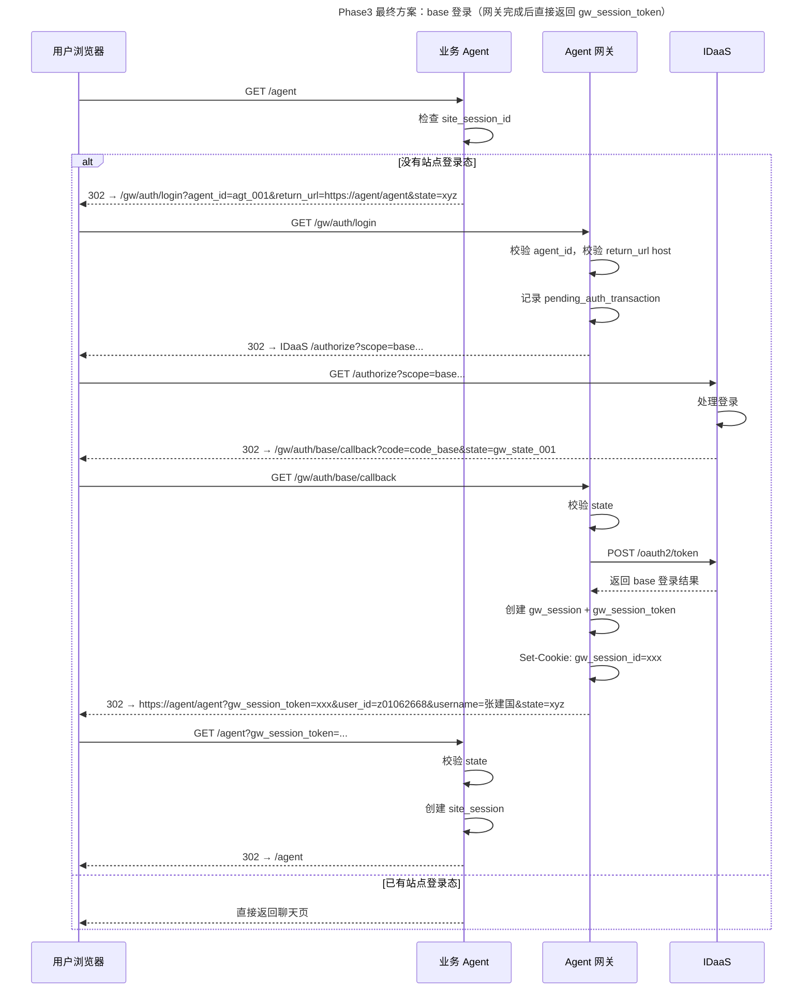
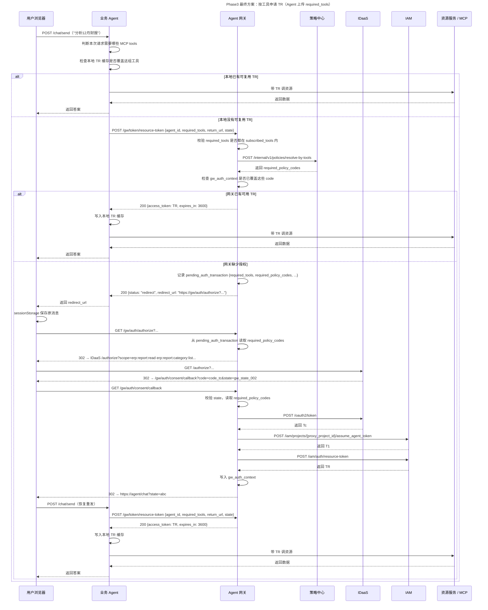
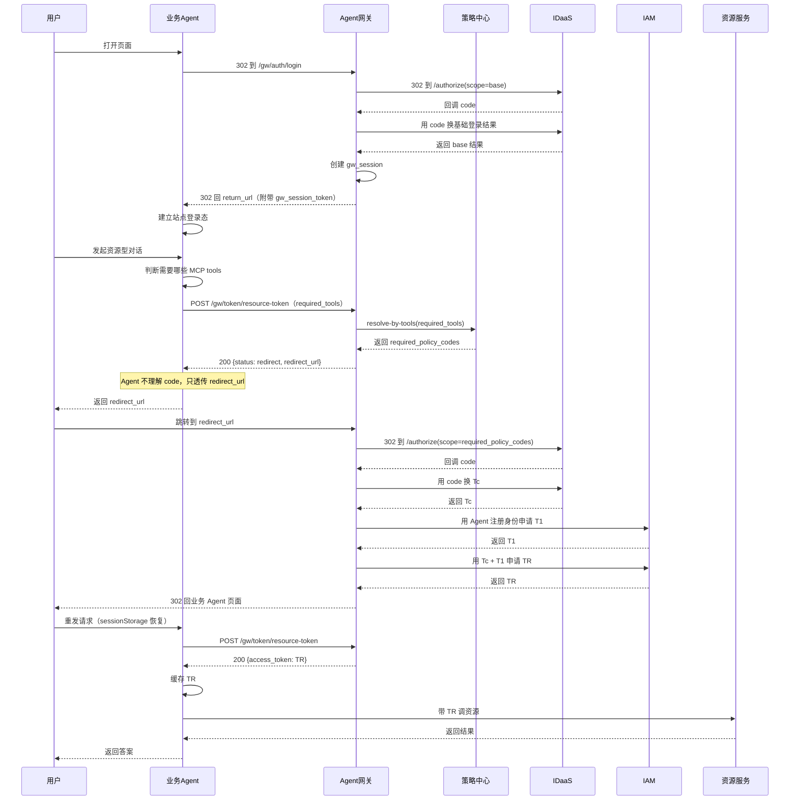

# 第三阶段最终方案：引入 Agent 网关 + 策略中心，按工具申请 `TR`

---

## 1. 目标

这一版方案在上一版 phase3 的基础上，再补上一个关键约束：

- 业务 Agent **不知道权限 code 长什么样**
- 业务 Agent 只知道：自己这次要调用哪些 `MCP tool`
- `Agent 网关` 负责把 `required_tools` 反查成 `policy_code`
- `策略中心` 负责统一维护 `tool <-> policy_code` 映射
- `IDaaS` 仍然基于 `policy_code` 做登录与授权
- `IAM` 仍然基于 `Tc + T1` 生成最终可访问资源的 `TR`
- 资源服务最终仍然只认 `TR`

一句话总结：

**业务 Agent 面向工具，Agent 网关面向授权流程，策略中心面向 `tool/code` 映射，IDaaS 面向 code 授权，资源服务面向 `TR`。**

---

## 2. 核心分工变化

| 职责 | phase2 归属 | 旧 phase3 归属 | 最终 phase3 归属 |
|---|---|---|---|
| OAuth2 redirect / callback | 业务 Agent | Agent 网关 | **Agent 网关** |
| code 换 `Tc` | 业务 Agent | Agent 网关 | **Agent 网关** |
| 申请 `T1` | 业务 Agent | Agent 网关 | **Agent 网关** |
| 用 `Tc + T1` 合成 `TR` | 业务 Agent | Agent 网关 | **Agent 网关** |
| 维护 `tool <-> code` 映射 | 无 | 无 | **策略中心** |
| 判断本次要访问哪些工具 | 业务 Agent | 业务 Agent | **业务 Agent** |
| 判断这些工具对应哪些 code | 业务 Agent / 人工约定 | 业务 Agent | **Agent 网关 + 策略中心** |
| 本地站点登录态 `site_session` | 业务 Agent | 业务 Agent | **业务 Agent** |
| 本地 `TR` 缓存 | 业务 Agent | 业务 Agent | **业务 Agent** |
| 带 `TR` 调资源服务 | 业务 Agent | 业务 Agent | **业务 Agent** |

这版最关键的变化只有一条：

**业务 Agent 不再上传 `scope/code`，而是上传本次请求所需的 `required_tools`。**

---

## 3. 总体架构图



这张图表达的是：

- 浏览器 OAuth2 重定向经过网关，callback URL 全部指向网关
- 业务 Agent 不再直连 `IDaaS / IAM`
- 业务 Agent 只向网关提交 `required_tools`
- 网关通过策略中心把工具需求翻译成授权 code
- 业务 Agent 拿到 `TR` 后本地缓存，直接调用资源服务
- 网关不代理业务资源流量

---

## 4. 关键概念

### 4.1 Agent Registry（Agent 注册表）

每个业务 Agent 接入前在网关注册：

```text
agent_id              → agt_business_001
agent_name            → 业务数据助手
agent_service_account → svc_ai_business_agent
principal             → com.huawei.business.agent
subscribed_tools      → [
                          mcp:financial-report-server/query_monthly_report,
                          mcp:financial-report-server/list_report_categories,
                          mcp:invoice-server/query_invoices
                        ]
allowed_return_hosts  → [business-agent.huawei.com]
```

这里的 `subscribed_tools` 表达的是：

- 这个 Agent 最多能申请哪些工具能力
- 网关收到 `required_tools` 后，先用它做能力边界校验

### 4.2 策略中心（Policy Center）

策略中心统一维护三类对象：

#### policy 定义

```text
policy_code -> display_name, description, consent_text
```

例如：

```text
erp:report:read -> 读取财报数据
erp:report:category:list -> 查看报表分类
erp:invoice:read -> 读取发票数据
```

#### tool 定义

```text
tool_id -> server_name, method_name, display_name
```

例如：

```text
mcp:financial-report-server/query_monthly_report
mcp:financial-report-server/list_report_categories
mcp:invoice-server/query_invoices
```

#### tool / code 映射关系

```text
tool_id <-> policy_code
```

这里建议按**多对多**设计，不要写死成一对一：

- 一个 `policy_code` 可以覆盖多个工具
- 一个工具也可能依赖多个 `policy_code`

### 4.3 gw_session（网关侧会话）

base 登录成功后由网关创建：

```text
gw_session_id → user_id, username, created_at
```

同时向浏览器种 `gw_session_id` cookie（网关域，HttpOnly + Secure），用于后续业务授权时识别用户。

### 4.4 gw_session_token（网关颁发给业务 Agent 的凭证）

base 登录完成后，网关通过 `return_url` 带回业务 Agent：

```text
gw_session_token → 对应网关侧 gw_session_id 的不透明引用
```

业务 Agent 将其存入本地 `site_session`，后续调用网关取 `TR` 时使用。

### 4.5 gw_auth_context（网关侧授权上下文）

业务授权成功后由网关创建：

```text
key:   gw_session_id + agent_id
value: consented_policy_codes, tc, t1, tr, expires_at
```

这里保存的是 code 视角的授权事实，不再保存“业务 Agent 自己传上来的 scope”。

### 4.6 pending_auth_transaction（临时状态，用后即删）

OAuth2 重定向过程中暂存：

```text
gw_state / request_id ->
  agent_id,
  required_tools,
  required_policy_codes,
  missing_policy_codes,
  return_url,
  gw_session_id,
  outer_state
```

它的作用是：

- 把“这次业务请求到底需要哪些工具”带过重定向流程
- 把“这些工具对应哪些 code”固定下来
- 回调后继续完成 `Tc / T1 / TR` 编排

---

## 5. 主时序图

### 5.1 base 登录阶段



这一段和上一版 phase3 基本一致，变化不大。

### 5.2 业务授权 + 获取 `TR` 阶段



这张图里最关键的变化是：

- 业务 Agent 不再判断需要哪个 `scope/code`
- 业务 Agent 只判断需要哪些 `required_tools`
- 网关再去策略中心把 `required_tools` 反查成 `required_policy_codes`
- 最终对 IDaaS 发起授权时，仍然是 code 视角

---

## 6. 业务 Agent 侧怎么处理

### 6.1 页面首次打开时

业务 Agent 仍然只做下面几件事：

1. 检查是否已有本地 `site_session`
2. 如果没有，302 到网关 `GET /gw/auth/login`
3. base 登录完成后，在页面入口 handler 中接收：
   - `gw_session_token`
   - `user_id`
   - `username`
   - `state`
4. 校验 `state`
5. 创建本地 `site_session`
6. 302 到干净 URL

这部分和旧 phase3 一样，不需要新增 callback 接口。

### 6.2 用户发起资源请求时

业务 Agent 不再判断“需要哪个权限 code”，而是只判断：

- 这次请求准备调用哪些 `MCP tool`

例如：

```text
- mcp:financial-report-server/query_monthly_report
- mcp:financial-report-server/list_report_categories
```

然后：

1. 先看本地 `TR` 缓存能不能覆盖这组工具
2. 能覆盖就直接带 `TR` 调资源服务
3. 不能覆盖就向网关发起：

```http
POST /gw/token/resource-token
Authorization: Bearer <gw_session_token>
```

```json
{
  "agent_id": "agt_business_001",
  "required_tools": [
    "mcp:financial-report-server/query_monthly_report",
    "mcp:financial-report-server/list_report_categories"
  ],
  "return_url": "https://business-agent.huawei.com/chat",
  "state": "st_auth_001"
}
```

### 6.3 收到 `redirect_url` 时

业务 Agent 仍然不自己发 302 去打断原始 POST，而是：

- 后端返回 `200 {status: "redirect", redirect_url}` 给前端
- 前端把当前消息写入 `sessionStorage`
- 前端跳转到 `redirect_url`
- 授权回来后依据 `state` 从 `sessionStorage` 恢复消息并重发

### 6.4 收到 `TR` 时

业务 Agent：

- 把 `TR` 写入本地 `tr_cache`
- 后续请求优先复用本地缓存
- 本地缓存命中判断从“scope 是否覆盖”改成“当前 `TR` 是否覆盖本次所需工具集合”

### 6.5 业务 Agent 明确不用做什么

- 不开发 `/auth/base/callback`
- 不开发 `/auth/consent/callback`
- 不调用 `IDaaS /oauth2/token`
- 不调用 `IAM /assume_agent_token`
- 不调用 `IAM /resource-token`
- 不构造授权 code 列表
- 不理解 `policy_code`
- 不保存 `Tc / T1`

一句话总结：

**业务 Agent 只理解“我要哪些工具”“我有没有可复用 TR”“网关给没给 redirect_url / TR”。**

---

## 7. Agent 网关侧怎么处理

### 7.1 登录入口 `/gw/auth/login`

网关需要做：

- 校验 `agent_id`
- 校验 `return_url` host 是否在白名单里
- 生成内部 `gw_state`
- 写入 `pending_auth_transaction`
- 302 到 IDaaS `scope=base` 的 `/authorize`

### 7.2 登录回调 `/gw/auth/base/callback`

网关需要做：

- 校验 `gw_state`
- 用 code 换基础登录结果
- 创建 `gw_session`
- 生成 `gw_session_token`
- 写入 `gw_session_id` cookie
- 把 `gw_session_token + 用户信息` 拼回业务 Agent 的 `return_url`

### 7.3 运行时取 `TR`：`POST /gw/token/resource-token`

这是最终方案里最关键的运行时接口。网关收到请求后要依次做四步。

#### 第一步：校验 Agent 能力边界

从 `agent_registry.subscribed_tools` 判断：

- `required_tools` 是否都属于该 Agent 已订阅能力
- 如果出现未订阅工具，直接拒绝，不进入授权流程

#### 第二步：反查权限 code

调用策略中心：

```http
POST /internal/v1/policies/resolve-by-tools
```

输入：

- `agent_id`
- `required_tools`

输出：

- `required_policy_codes`
- `policy_items`

这一步之后，网关才知道这次需要用户同意哪些 code。

#### 第三步：检查当前授权是否已覆盖

从 `gw_auth_context` 里判断：

- 当前用户在当前 Agent 下是否已同意这些 `required_policy_codes`
- 当前 `TR` 是否仍然有效

如果都满足，直接返回 `TR`。

#### 第四步：如果未覆盖，则返回 `redirect_url`

如果授权不够：

- 把 `required_tools + required_policy_codes + return_url + state` 写入 `pending_auth_transaction`
- 由网关构造统一的 `redirect_url`
- 返回给业务 Agent

业务 Agent 不需要理解“为什么缺授权”，只需要透传 `redirect_url`。

### 7.4 授权入口 `/gw/auth/authorize`

网关需要做：

- 从网关域 cookie 中取 `gw_session_id`
- 读取 `pending_auth_transaction`
- 取出这次已解析好的 `required_policy_codes`
- 用这些 code 统一拼装 IDaaS 授权地址
- 302 到 IDaaS

也就是说：

- 对业务 Agent 来说，输入是 `required_tools`
- 对 IDaaS 来说，输入仍然是 `policy_code`
- 这个翻译动作完全收敛在网关里

### 7.5 授权回调 `/gw/auth/consent/callback`

网关需要做：

- 校验 `gw_state`
- 读取 `pending_auth_transaction`
- 用 code 换 `Tc`
- 从注册表取 Agent 身份信息
- 向 IAM 申请 `T1`
- 用 `Tc + T1` 申请 `TR`
- 把 `required_policy_codes` 写入 `gw_auth_context`
- 302 回业务 Agent 原页面

### 7.6 后续透明复用

后续同一用户、同一 Agent 再发起工具请求时：

- 网关优先判断已有 `TR` 是否覆盖本次工具需求
- 若已覆盖，直接返回 `TR`
- 若后续要支持自动续期，则由网关基于已保存的 `Tc + T1` 完成，对业务 Agent 透明

---

## 8. 最小接口集合

### 8.1 业务 Agent ↔ Agent 网关

- `POST /gw/token/resource-token`
  - 输入：`agent_id + required_tools + return_url + state`
  - 输出：`TR` 或 `redirect_url`

### 8.2 Agent 网关 ↔ 策略中心

- `POST /internal/v1/policies/resolve-by-tools`
  - 输入：`agent_id + required_tools`
  - 输出：`required_policy_codes + policy_items`

### 8.3 浏览器 ↔ Agent 网关

- `GET /gw/auth/login`
- `GET /gw/auth/base/callback`
- `GET /gw/auth/authorize`
- `GET /gw/auth/consent/callback`

### 8.4 Agent 网关 ↔ IDaaS

- `GET /authorize`
  - base 登录时：`scope=base`
  - 业务授权时：`scope=<required_policy_codes>`
- `POST /oauth2/token`
  - 用授权码换基础登录结果或 `Tc`

### 8.5 Agent 网关 ↔ IAM

- `POST /iam/projects/{proxy_project_id}/assume_agent_token`
- `POST /iam/auth/resource-token`

### 8.6 业务 Agent ↔ 资源服务

- 资源服务接口只接受 `TR`
- 与 phase2 保持一致

---

## 9. 状态模型

### 9.1 Agent 网关侧状态

#### `agent_registry`

```text
agent_id -> agent_name, agent_service_account, principal, subscribed_tools, allowed_return_hosts
```

用途：

- Agent 身份管理
- Agent 能力边界校验
- return_url 白名单校验

#### `gw_session`

```text
gw_session_id -> user_id, username, created_at
```

用途：

- 网关侧识别当前用户

#### `gw_auth_context`

```text
(gw_session_id + agent_id) -> consented_policy_codes, tc, t1, tr, expires_at
```

用途：

- 记录当前用户在当前 Agent 下已同意的 code 集合
- 后续直接返回 `TR`
- 后续做透明续期

#### `pending_auth_transaction`

```text
gw_state / request_id ->
  agent_id,
  required_tools,
  required_policy_codes,
  missing_policy_codes,
  return_url,
  gw_session_id,
  outer_state
```

用途：

- OAuth2 跳转期间关联这次请求上下文
- 保证回调后还能恢复“工具需求 -> 授权 code -> 最终 TR”这条链路

### 9.2 业务 Agent 侧状态

#### `site_session`

```text
site_session_id -> gw_session_token, user_id, username
```

用途：

- 业务网站自身登录态

#### `tr_cache`

```text
(agent_id + required_tools_hash) -> tr, expires_at
```

或：

```text
agent_id -> tr, covered_tools / covered_policy_codes, expires_at
```

用途：

- 减少对网关的重复调用
- 判断当前 `TR` 是否覆盖本次工具请求

---

## 10. 安全要点

1. `return_url` 必须按 `allowed_return_hosts` 做 host 白名单校验，防 open redirect
2. 所有跳转都必须带 `state`，并在回调时校验，防 CSRF
3. `gw_session_id` 只存在于网关域 cookie 中，必须 `HttpOnly + Secure`
4. `gw_session_token` 是不透明引用，不直接暴露敏感信息
5. `T1` 身份必须来自 `agent_registry`，不能信任业务 Agent 运行时上传
6. `required_tools` 必须先经过 `subscribed_tools` 校验，防止 Agent 越权申请未接入工具
7. 策略中心是唯一 `tool/code` 映射来源，业务 Agent 不直接拼接授权 code
8. 业务 Agent 接收 `gw_session_token` 后应尽快写入 `site_session` 并重定向到干净 URL

---

## 11. 简化总图



这张图用于快速理解主线，重点只有五句：

- 第一次打开页面时，网关代为完成基础登录，Agent 只收一个 `gw_session_token`
- 业务 Agent 发起资源请求时，不上传 code，只上传 `required_tools`
- 网关通过策略中心把工具需求翻译成授权 code
- 网关代为完成全部授权流程（IDaaS 授权 → 换 `Tc` → 申请 `T1` → 合成 `TR`）
- 业务 Agent 最终只拿 `TR` 并使用 `TR`

---

## 12. 一页结论

如果只记住这一版最关键的 6 句话，可以压成下面这几句：

1. 第三阶段最终方案里，业务 Agent 不再理解 `scope/code`，只理解本次请求需要哪些 `MCP tool`
2. `tool -> code` 的翻译全部收敛到 `Agent 网关 + 策略中心`
3. 对 IDaaS 来说，授权对象仍然是 `policy_code`，这一点不变
4. 对 IAM 和资源服务来说，最终仍然只认 `Tc / T1 / TR` 三令牌模型和最终 `TR`
5. 对业务 Agent 来说，真正新增且长期对接的核心接口只有 `POST /gw/token/resource-token`
6. **业务 Agent 轻，Agent 网关重，策略中心负责语言转换，这才是这版方案的核心结构**
