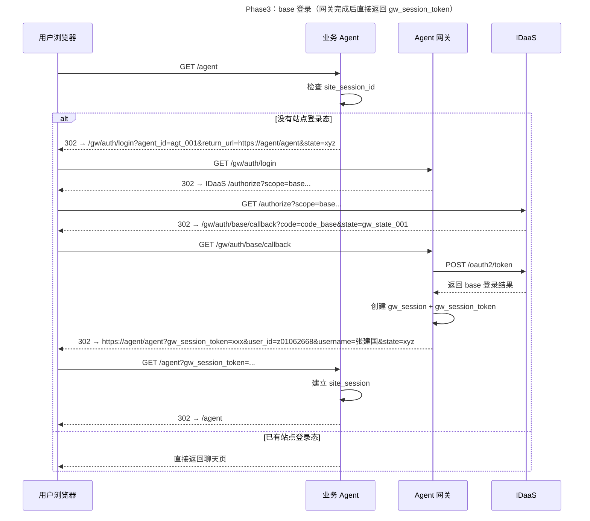
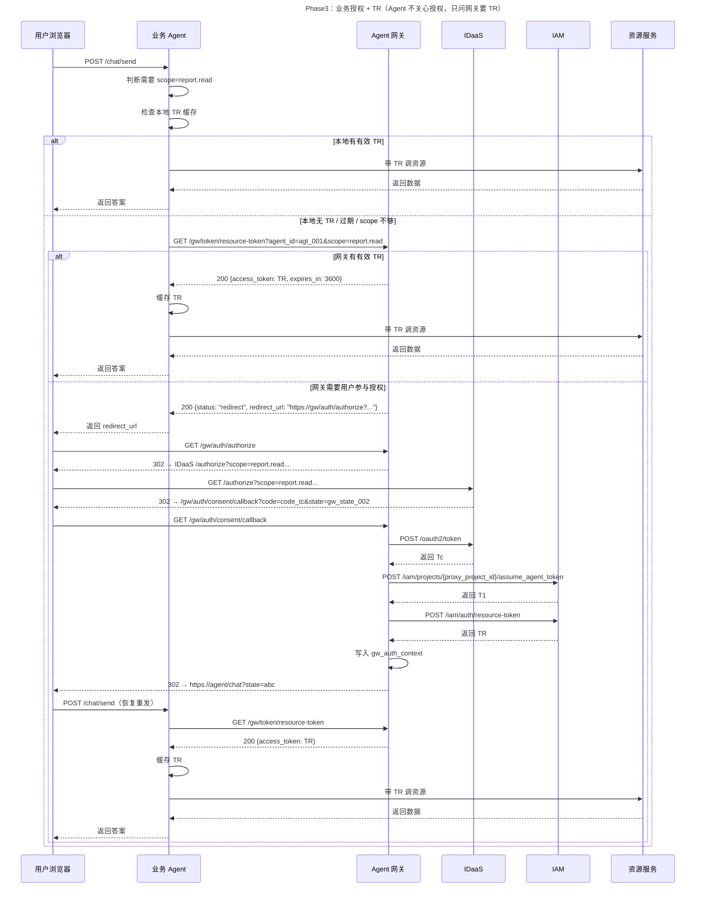

# 第三阶段：引入 Agent 网关后的接口设计

## 1. 目标

这一版方案在第二阶段 `Tc / T1 / TR` 三令牌模型基础上，进一步引入 `Agent 网关`，把原来由业务 Agent 自己承担的认证授权编排统一收口。

最终目标是：

- 浏览器 OAuth2 跳转和 callback 全部由 `Agent 网关` 处理
- `Tc / T1 / TR` 的申请、缓存、续期编排都由 `Agent 网关` 处理
- 业务 Agent 不再直连 `IDaaS / IAM`
- 业务 Agent 不再实现专用 callback 接口
- 业务 Agent 只保留最小运行时职责：
  - 页面入口发起登录跳转
  - 需要资源时向网关要 `TR`
  - 收到 `redirect_url` 时透传给前端
  - 收到 `TR` 后本地缓存并带 `TR` 调资源服务

一句话总结：**网关负责所有认证授权复杂度，业务 Agent 只负责拿 `TR` 并使用 `TR`。**

---

## 2. 模块边界与开发职责

| 模块 | 需要开发的接口 / 处理点 | 主要职责 | 不负责什么 |
|---|---|---|---|
| 业务 Agent 前端 | 页面入口、跳转处理、`sessionStorage` 恢复消息 | 接收后端返回的 `redirect_url` 并跳转；授权回来后恢复消息并重发 | 不直连 `IDaaS / IAM`；不处理 code；不理解 `Tc / T1` |
| 业务 Agent 后端/BFF | `GET /agent`、`POST /chat/send`、本地 `site_session`、本地 `tr_cache` | 建立站点登录态；判断请求所需 scope；按需向网关要 `TR`；带 `TR` 调资源服务 | 不实现 OAuth2 callback；不构造授权 URL；不申请 `Tc / T1 / TR` |
| Agent 网关 | `/gw/auth/login`、`/gw/auth/base/callback`、`/gw/auth/authorize`、`/gw/auth/consent/callback`、`/gw/token/resource-token` | 统一编排登录、授权、code 换 token、T1/TR 申请、网关侧状态维护 | 不承接业务聊天页流量；不直接调用资源服务 |
| IDaaS | `/authorize`、`/oauth2/token` | 用户登录、用户授权、签发基础登录结果与 `Tc` | 不保存 Agent 本地会话；不处理 `T1 / TR` |
| IAM | `/iam/projects/{proxy_project_id}/assume_agent_token`、`/iam/auth/resource-token` | 签发 `T1`，基于 `Tc + T1` 签发 `TR` | 不处理页面跳转；不处理业务 Agent 页面恢复 |
| 资源服务 | 资源访问接口 | 接受 `TR` 并返回业务数据 | 不接受 `Tc / T1`；不参与登录授权流程 |

### 2.1 对业务 Agent 的直接影响

相比第二阶段，业务 Agent 侧最关键的变化有四个：

1. 不再开发 `/auth/base/callback` 和 `/auth/consent/callback`
2. 不再调用 `IDaaS /oauth2/token`
3. 不再调用 `IAM` 的 `assume_agent_token` 和 `resource-token`
4. 只需要对接 `Agent 网关` 的 1 个运行时接口：`GET /gw/token/resource-token`

### 2.2 对 Agent 网关 的直接影响

Agent 网关成为整条链路里最重的模块，需要统一处理：

- `agent_id` 校验
- `return_url` 白名单校验
- `state` 生成与校验
- 登录 callback
- 授权 callback
- `code -> Tc`
- `Agent Registry -> T1`
- `Tc + T1 -> TR`
- `gw_session / gw_auth_context / pending_auth_transaction` 状态维护

---

## 3. 核心时序

### 3.1 base 登录阶段



### 3.2 业务授权 + 获取 TR 阶段



---

## 4. 接口总览

| 调用方 | 被调用方 | 方法 | 路径 | 用途 | 关键输入 | 关键输出 | 状态影响 |
|---|---|---|---|---|---|---|---|
| 业务 Agent | Agent 网关 | `GET` | `/gw/token/resource-token` | 按需获取 `TR` 或获取跳转指令 | `Authorization: Bearer gw_session_token`、`agent_id`、`scope` | `TR` 或 `redirect_url` | 可能读取或写入 `gw_auth_context` |
| 用户浏览器 | Agent 网关 | `GET` | `/gw/auth/login` | 发起 base 登录 | `agent_id`、`return_url`、`state` | 302 到 IDaaS 登录页 | 写入 `pending_auth_transaction` |
| IDaaS | Agent 网关 | `GET` | `/gw/auth/base/callback` | base 登录成功回调 | `code`、`state` | 302 回业务 Agent 页 | 创建 `gw_session` |
| 用户浏览器 | Agent 网关 | `GET` | `/gw/auth/authorize` | 发起业务授权 | `agent_id`、`scope`、`return_url`、`state` | 302 到 IDaaS 授权页 | 写入 `pending_auth_transaction` |
| IDaaS | Agent 网关 | `GET` | `/gw/auth/consent/callback` | 业务授权成功回调 | `code`、`state` | 302 回业务 Agent 页 | 写入 `gw_auth_context` |
| Agent 网关 | IDaaS | `POST` | `/oauth2/token` | 用 code 换基础登录结果或 `Tc` | `grant_type`、`code`、`client_id`、`redirect_uri` | base 结果或 `Tc` | 无 |
| Agent 网关 | IAM | `POST` | `/iam/projects/{proxy_project_id}/assume_agent_token` | 申请 `T1` | `agent_service_account`、`principal`、`agent_id` | `T1` | 无 |
| Agent 网关 | IAM | `POST` | `/iam/auth/resource-token` | 用 `Tc + T1` 生成 `TR` | `Authorization: Bearer <T1>`、`user_token=<Tc>` | `TR` | 无 |
| 业务 Agent | 资源服务 | `POST/GET` | 业务资源接口 | 带 `TR` 调资源 | `Authorization: Bearer <TR>` | 业务数据 | 不影响网关状态 |

---

## 5. 接口详细说明

### 5.1 `GET /gw/token/resource-token`

**调用方**：业务 Agent 后端/BFF  
**被调用方**：Agent 网关  
**用途**：当本地 `TR` 缺失、过期或 scope 不够时，向网关申请资源令牌；如果网关判断需要用户参与，则返回跳转指令

#### 请求示例

```http
GET /gw/token/resource-token?agent_id=agt_business_001&scope=report.read
Authorization: Bearer gwst_001
```

#### 成功响应示例：返回 `TR`

```json
{
  "access_token": "eyJhbGciOiJSUzUxMiIsInR5cCI6IkpXVCJ9.<TR-Payload>.signature",
  "expires_in": 3600
}
```

#### 成功响应示例：需要用户参与授权

```json
{
  "status": "redirect",
  "redirect_url": "https://agent-gateway.huawei.com/gw/auth/authorize?agent_id=agt_business_001&scope=report.read&return_url=https%3A%2F%2Fbusiness-agent.huawei.com%2Fchat&state=st_auth_001"
}
```

#### 处理规则

- 业务 Agent 只有在本地 `TR` 不可用时才调用这个接口
- 网关先根据 `gw_session_token` 找到对应的 `gw_session_id`
- 再根据 `gw_session_id + agent_id` 检查 `gw_auth_context`
- 如果已有满足 scope 的有效 `TR`，直接返回 `TR`
- 如果没有，则返回 `redirect_url`
- 对业务 Agent 来说，不需要区分“未授权”“需要重新授权”“TR 刷新失败”等细节，只要处理两种结果：
  - 返回 `TR`
  - 返回 `redirect_url`

#### 状态变化

- 直接返回 `TR` 时：可能读取 `gw_auth_context`
- 返回 `redirect_url` 时：通常不写业务 Agent 本地状态，由前端跳转后再推进后续流程

---

### 5.2 `GET /gw/auth/login`

**调用方**：用户浏览器  
**被调用方**：Agent 网关  
**用途**：统一启动 base 登录流程

#### Query 参数示例

```text
agent_id=agt_business_001
return_url=https://business-agent.huawei.com/agent
state=st_login_outer_001
```

#### 处理结果

- 校验 `agent_id` 是否存在于 `agent_registry`
- 校验 `return_url` 的 host 是否在 `allowed_return_hosts` 白名单内
- 生成内部 `gw_state`
- 写入 `pending_auth_transaction`
- 302 到 IDaaS `scope=base` 的 `/authorize`

#### 状态变化

```text
pending_auth_transaction[gw_state] = {
  agent_id,
  return_url,
  outer_state
}
```

---

### 5.3 `GET /gw/auth/base/callback`

**调用方**：IDaaS  
**被调用方**：Agent 网关  
**用途**：接收 base 登录回调，建立网关侧用户会话，并把 `gw_session_token` 带回业务 Agent

#### Query 参数示例

```text
code=code_base_001
state=gw_state_login_001
```

#### 处理结果

1. 校验 `state`
2. 读取 `pending_auth_transaction`
3. 调用 `POST /oauth2/token` 换基础登录结果
4. 创建 `gw_session`
5. 生成 `gw_session_token`
6. Set-Cookie：`gw_session_id=...; HttpOnly; Secure`
7. 302 回：

```text
https://business-agent.huawei.com/agent?gw_session_token=gwst_001&user_id=z01062668&username=张建国&state=st_login_outer_001
```

#### 状态变化

```text
gw_session[gw_session_id] = {
  user_id,
  username,
  created_at
}
```

---

### 5.4 `GET /gw/auth/authorize`

**调用方**：用户浏览器  
**被调用方**：Agent 网关  
**用途**：统一启动业务授权流程

#### Query 参数示例

```text
agent_id=agt_business_001
scope=report.read
return_url=https://business-agent.huawei.com/chat
state=st_auth_outer_001
```

#### 处理结果

- 从网关域 cookie 读取 `gw_session_id`
- 校验 `agent_id`
- 校验 `return_url`
- 生成内部 `gw_state`
- 写入 `pending_auth_transaction`
- 302 到 IDaaS 业务授权地址

#### 状态变化

```text
pending_auth_transaction[gw_state] = {
  agent_id,
  scope,
  return_url,
  gw_session_id,
  outer_state
}
```

---

### 5.5 `GET /gw/auth/consent/callback`

**调用方**：IDaaS  
**被调用方**：Agent 网关  
**用途**：接收业务授权成功回调，生成 `Tc / T1 / TR`，并写入网关侧授权上下文

#### Query 参数示例

```text
code=code_tc_001
state=gw_state_consent_001
```

#### 处理结果

1. 校验 `state`
2. 从 `pending_auth_transaction` 取出 `agent_id / scope / return_url / gw_session_id`
3. 调用 `POST /oauth2/token` 换 `Tc`
4. 从 `agent_registry` 读取：
   - `agent_service_account`
   - `principal`
   - `agent_id`
5. 调用 `POST /iam/projects/{proxy_project_id}/assume_agent_token` 申请 `T1`
6. 调用 `POST /iam/auth/resource-token` 用 `Tc + T1` 申请 `TR`
7. 写入 `gw_auth_context`
8. 302 回原 `return_url?state=st_auth_outer_001`

#### 状态变化

```text
gw_auth_context[gw_session_id + agent_id] = {
  tc,
  t1,
  tr,
  consented_scopes,
  expires_at
}
```

---

### 5.6 `POST /oauth2/token`

**调用方**：Agent 网关  
**被调用方**：IDaaS  
**用途**：用授权码换基础登录结果或 `Tc`

#### 请求体示例（base 登录）

```json
{
  "grant_type": "authorization_code",
  "code": "code_base_001",
  "client_id": "agent_gateway_client",
  "redirect_uri": "https://agent-gateway.huawei.com/gw/auth/base/callback"
}
```

#### 请求体示例（业务授权）

```json
{
  "grant_type": "authorization_code",
  "code": "code_tc_001",
  "client_id": "agent_gateway_client",
  "redirect_uri": "https://agent-gateway.huawei.com/gw/auth/consent/callback"
}
```

#### 响应说明

- base 登录阶段：返回基础登录结果（`user_id`、`username` 等）
- 业务授权阶段：返回 `Tc`

---

### 5.7 `POST /iam/projects/{proxy_project_id}/assume_agent_token`

**调用方**：Agent 网关  
**被调用方**：IAM  
**用途**：基于 Agent 注册表里的身份信息申请 `T1`

#### 请求体示例

```json
{
  "data": {
    "type": "assume_agent_token",
    "attributes": {
      "agent_service_account": "svc_ai_business_agent",
      "principal": "com.huawei.business.agent",
      "agent_id": "agt_business_001"
    }
  }
}
```

#### 响应说明

- 返回 `T1`
- `T1` 表达的是“当前 Agent 的身份”
- 这里的 Agent 身份只来自网关注册表，不接受业务 Agent 运行时上送

---

### 5.8 `POST /iam/auth/resource-token`

**调用方**：Agent 网关  
**被调用方**：IAM  
**用途**：用 `Tc + T1` 换取最终资源令牌 `TR`

#### 请求示例

```http
POST /iam/auth/resource-token
Authorization: Bearer <T1>
Content-Type: application/json
```

```json
{
  "data": {
    "type": "resource_token",
    "attributes": {
      "user_token": "<Tc>"
    }
  }
}
```

#### 响应说明

- 返回 `TR`
- `TR` 是业务 Agent 后续访问资源服务时唯一应该持有和使用的令牌

---

### 5.9 业务 Agent → 资源服务接口

**调用方**：业务 Agent 后端/BFF  
**被调用方**：资源服务  
**用途**：带 `TR` 访问真正业务资源

#### 说明

- 资源服务接口本身不因 phase3 改变
- 资源服务仍然只接受 `TR`
- 网关不代理业务资源流量

---

## 6. 业务 Agent 处理细节

这一节不再从“接口定义”角度讲，而从“业务 Agent 怎么实现”角度讲。

### 6.1 页面首次打开时怎么处理

1. 用户打开 `/agent`
2. 业务 Agent 检查本地 `site_session_id`
3. 如果没有站点登录态，直接 302 到：

```text
/gw/auth/login?agent_id=agt_business_001&return_url=https://business-agent.huawei.com/agent&state=st_login_outer_001
```

4. 网关登录完成后回跳 `/agent?gw_session_token=...&user_id=...&username=...&state=...`
5. 业务 Agent 在已有页面入口 handler 中做四件事：
   - 校验 `state`
   - 读取 `gw_session_token`
   - 创建 `site_session`
   - 302 到干净 URL，清掉查询参数

### 6.2 用户发起资源请求时怎么处理

1. 业务 Agent 判断这次请求需要哪个 scope
2. 先检查本地 `tr_cache`
3. 如果本地已有有效且 scope 覆盖的 `TR`，直接访问资源服务
4. 如果没有，再调用 `/gw/token/resource-token`

### 6.3 收到 `redirect_url` 时怎么处理

业务 Agent 后端不要自己发 302 去打断原始 POST，而是：

- 返回 `200 {status: "redirect", redirect_url}` 给前端
- 前端在跳转前把当前消息写入 `sessionStorage`
- 前端跳到 `redirect_url`
- 授权完成后浏览器回到原聊天页
- 前端检测 `state` 后从 `sessionStorage` 恢复消息并重新发起请求

### 6.4 收到 `TR` 时怎么处理

- 把 `TR` 写入本地 `tr_cache`
- 可以按 `agent_id + scope` 或者更细粒度做缓存键
- 后续请求优先复用本地缓存，不必每次先访问网关

### 6.5 业务 Agent 明确不用做什么

- 不开发 `/auth/base/callback`
- 不开发 `/auth/consent/callback`
- 不调用 `IDaaS /oauth2/token`
- 不调用 `IAM /assume_agent_token`
- 不调用 `IAM /resource-token`
- 不构造业务授权 URL
- 不理解 `Tc / T1`
- 不保存 `Tc / T1`

一句话总结：**业务 Agent 只处理自己的站点 session、本地 TR 缓存和资源访问。**

---

## 7. Agent 网关处理细节

这一节从网关内部实现角度描述主逻辑。

### 7.1 登录入口 `/gw/auth/login`

网关需要做：

- 校验 `agent_id`
- 根据注册表校验 `return_url` host 是否允许
- 生成内部 `gw_state`
- 把外层 `state` 和 `return_url` 保存到 `pending_auth_transaction`
- 统一拼装 IDaaS base 登录地址
- 302 到 IDaaS

### 7.2 登录回调 `/gw/auth/base/callback`

网关需要做：

- 校验 `gw_state`
- 用 code 换基础登录结果
- 创建 `gw_session`
- 生成 `gw_session_token`
- 向浏览器写 `gw_session_id` cookie
- 把 `gw_session_token + 用户信息` 拼回业务 Agent 的 `return_url`

### 7.3 运行时取 TR `/gw/token/resource-token`

网关需要做：

- 解析 `gw_session_token`
- 找到对应 `gw_session_id`
- 检查当前 `gw_session_id + agent_id` 下是否已有满足 scope 的授权上下文
- 有可用 `TR` 就直接返回
- 没有就统一返回 `redirect_url`

这里的关键原则是：

- 网关关注“为什么现在拿不到 `TR`”
- 业务 Agent 不关注原因，只关注下一步动作

### 7.4 授权入口 `/gw/auth/authorize`

网关需要做：

- 从网关域 cookie 中取 `gw_session_id`
- 校验当前用户已在网关侧登录
- 记录本次授权的 `agent_id / scope / return_url / outer_state`
- 统一拼装 IDaaS 授权 URL
- 302 到 IDaaS

### 7.5 授权回调 `/gw/auth/consent/callback`

网关需要做：

- 校验 `gw_state`
- 用 code 换 `Tc`
- 从注册表读取 Agent 身份
- 向 IAM 申请 `T1`
- 用 `Tc + T1` 申请 `TR`
- 写入 `gw_auth_context`
- 302 回业务 Agent 原页面

### 7.6 后续透明复用

后续业务 Agent 再次调用 `/gw/token/resource-token` 时，网关优先：

- 直接返回已缓存的 `TR`
- 或基于 `gw_auth_context` 做透明续取（本阶段先预留，不展开底层实现）

一句话总结：**网关内部负责整个 OAuth2 / IAM 链路和全部安全状态编排。**

---

## 8. 状态模型

### 8.1 Agent 网关侧状态

#### `agent_registry`

```text
agent_id -> agent_name, agent_service_account, principal, allowed_return_hosts
```

- 创建者：平台配置 / 网关初始化
- 读取者：`/gw/auth/login`、`/gw/auth/authorize`、`/gw/auth/consent/callback`
- 用途：Agent 身份与回跳白名单校验

#### `gw_session`

```text
gw_session_id -> user_id, username, created_at
```

- 创建者：`/gw/auth/base/callback`
- 读取者：`/gw/auth/authorize`、`/gw/token/resource-token`
- 用途：网关侧识别当前用户

#### `gw_auth_context`

```text
(gw_session_id + agent_id) -> Tc, T1, TR, consented_scopes, expires_at
```

- 创建者：`/gw/auth/consent/callback`
- 读取者：`/gw/token/resource-token`
- 用途：后续直接返回 `TR` 或做透明续期

#### `pending_auth_transaction`

```text
gw_state -> agent_id, scope, return_url, gw_session_id, outer_state
```

- 创建者：`/gw/auth/login`、`/gw/auth/authorize`
- 读取者：`/gw/auth/base/callback`、`/gw/auth/consent/callback`
- 删除时机：回调用完即删
- 用途：OAuth2 重定向过程中关联上下文

### 8.2 业务 Agent 侧状态

#### `site_session`

```text
site_session_id -> gw_session_token, user_id, username
```

- 创建者：`GET /agent` 页面入口 handler
- 读取者：页面访问、聊天接口
- 用途：业务网站自身登录态

#### `tr_cache`

```text
(agent_id + scope) -> TR, expires_at
```

- 创建者：`POST /chat/send` 等资源型接口
- 读取者：同类资源访问请求
- 用途：减少对网关的重复调用

---

## 9. 安全约束

1. `return_url` 必须按 `allowed_return_hosts` 做 host 白名单校验，防 open redirect
2. 所有跳转都必须带 `state`，并在回调时校验，防 CSRF
3. `gw_session_id` 只存在于网关域 cookie 中，必须 `HttpOnly + Secure`
4. `gw_session_token` 是不透明引用，不直接暴露敏感信息
5. `T1` 身份必须来自 `agent_registry`，不能信任业务 Agent 运行时上传
6. 业务 Agent 接收 `gw_session_token` 后应尽快写入 `site_session` 并重定向到干净 URL，避免 URL 长时间暴露敏感参数
7. 业务 Agent 与 Agent 网关、Agent 网关与 IDaaS/IAM 之间都必须走 HTTPS

---

## 10. 一页结论

如果只记住这一版最关键的 5 句话，可以压成下面这几句：

1. 第三阶段里，`OAuth2 redirect / callback`、`Tc / T1 / TR` 编排全部从业务 Agent 收敛到 `Agent 网关`
2. 业务 Agent 不再直连 `IDaaS / IAM`，也不再实现专用 callback 接口
3. 对业务 Agent 来说，真正新增且唯一需要长期对接的核心网关接口就是 `GET /gw/token/resource-token`
4. 网关返回 `TR` 就直接用；网关返回 `redirect_url` 就透传给前端跳转
5. **业务 Agent 只理解 `TR` 和 `redirect_url`，其余认证授权复杂度全部留在网关内部**
