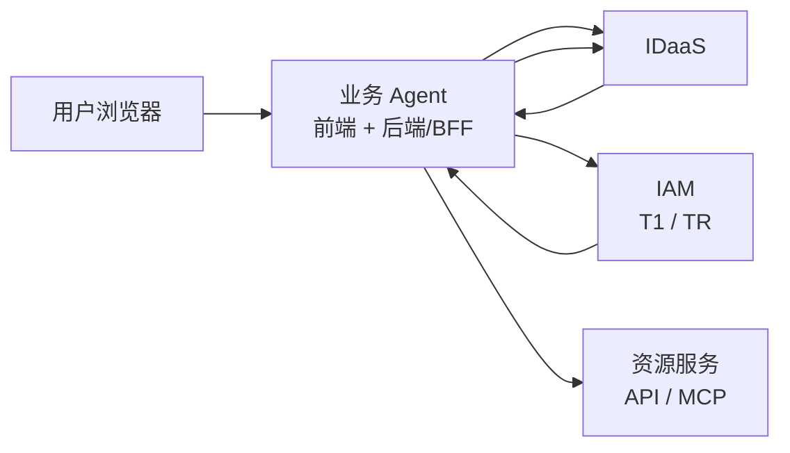
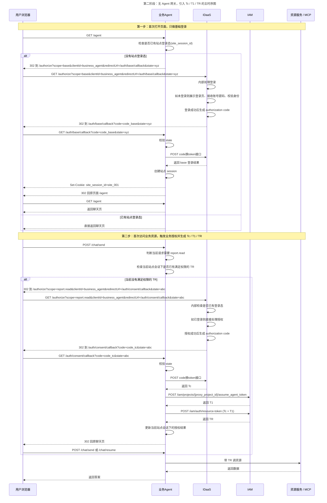
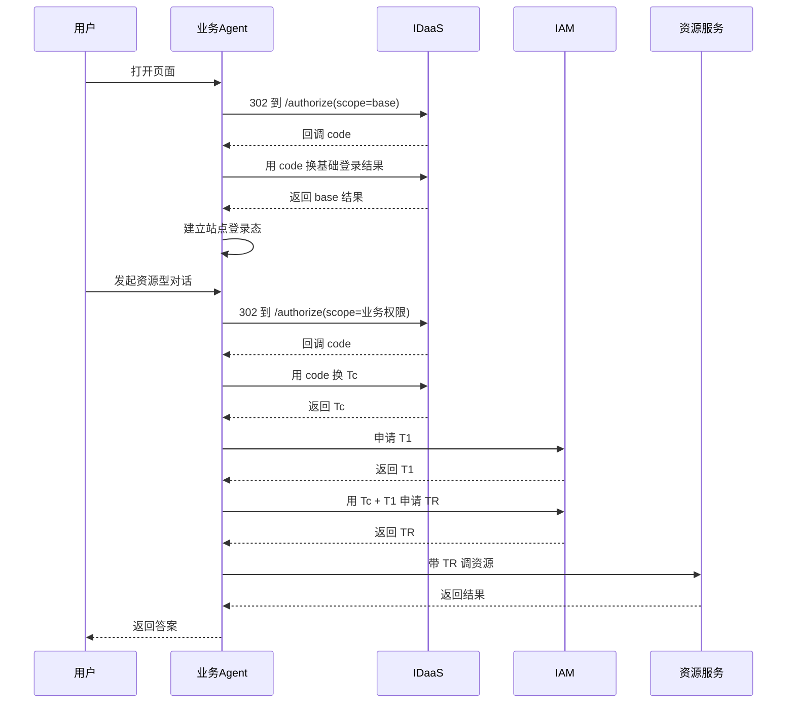

# 第二阶段：无 Agent 网关，引入 `Tc / T1 / TR` 的直连架构

## 0. 相关文档

- [04_令牌设计_策略中心版.md](./04_令牌设计_策略中心版.md)
- [05_phase3_接口设计_Agent网关版.md](./05_phase3_接口设计_Agent网关版.md)

## 1. 目标

这一版方案继续保持：

- 不引入 `Agent网关`
- 业务 Agent 自己作为第三方应用
- 首次打开页面时只做 `scope=base` 基础登录

但在真正访问业务资源时，不再直接拿 IDaaS 返回的业务 access token 去访问资源服务，而是重新引入三令牌模型：

- `Tc`
- `T1`
- `TR`

最终目标是：

- 首次登录只解决“用户是谁”
- 业务授权时再获取 `Tc`
- 业务 Agent 直接向 `IAM` 获取 `T1`
- 业务 Agent 再用 `Tc + T1` 向 `IAM` 获取 `TR`
- 资源服务只认 `TR`

## 2. 关键前提

- `IDaaS` 对外统一暴露 `GET /authorize?...&redirectUrl=...`
- `IDaaS` 提供 code 换 token 接口
- `base` 登录阶段不获取 `Tc`
- 业务授权阶段用 `code` 换取 `Tc`
- 业务 Agent 后端/BFF 直接对接 `IAM`
- 资源服务只接受 `TR`

## 3. 总体架构图



这张图表达的是：

- 浏览器还是只和 `业务 Agent`、`IDaaS /authorize` 交互
- `业务 Agent` 自己接收 `code`
- `业务 Agent` 自己通过 `IDaaS` 的 code 换 token 接口换取 `Tc`
- `业务 Agent` 自己向 `IAM` 申请 `T1` 和 `TR`
- 资源服务最终只接收 `TR`

## 4. 令牌职责

### 4.1 `base` 登录阶段

这一阶段不获取 `Tc`。

它只解决两件事：

- 用户是谁
- 业务 Agent 如何建立自己的网站登录态

### 4.2 `Tc`

`Tc` 只在业务授权阶段出现，表达：

- 用户是谁
- 用户对哪些业务 scope 或策略 code 完成授权

### 4.3 `T1`

`T1` 由业务 Agent 后端/BFF 直接向 `IAM` 申请，表达：

- 当前业务 Agent 身份

### 4.4 `TR`

`TR` 由业务 Agent 后端/BFF 用 `Tc + T1` 向 `IAM` 申请，表达：

- 当前业务 Agent 正在代表当前用户访问资源

资源服务最终只认 `TR`。

## 5. 主时序图



## 6. 逐步说明

### 6.1 首次打开页面：只做基础登录

1. 用户打开 `业务 Agent` 页面。
2. `业务 Agent` 检查浏览器是否已经带了自己的网站登录 cookie，例如 `site_session_id`。
3. 如果没有，就把浏览器 302 到 `IDaaS /authorize`，并带上：
   - `scope=base`
   - `clientId`
   - `redirectUrl=/auth/base/callback`
   - `state`
4. `IDaaS` 在 `/authorize` 内部完成登录处理，并在成功后生成 `authorization code`。
5. `IDaaS` 再把浏览器 302 回 `业务 Agent` 的 `/auth/base/callback`。
6. `业务 Agent` 用这个 `code` 去调用 IDaaS 的 code 换 token 接口，拿到基础登录结果。
7. `业务 Agent` 建立自己的网站 session，并给浏览器写入 `site_session_id`。
8. 这一阶段只解决“用户已经登录网站”，不生成 `Tc / T1 / TR`。

### 6.2 第一次访问业务资源：生成 `Tc / T1 / TR`

1. 用户在聊天页发起真正的业务请求，例如“分析 12 月财报”。
2. `业务 Agent` 判断这次请求需要 `report.read`。
3. `业务 Agent` 再检查当前站点会话下是否已有满足该权限的 `TR`。
4. 如果没有，就再次把浏览器 302 到同一个 `IDaaS /authorize`，但这次带的是业务 scope。
5. `IDaaS` 完成授权后，再把浏览器 302 回 `业务 Agent` 的 `/auth/consent/callback`。
6. `业务 Agent` 拿回新的 `code` 后，先调用 IDaaS 的 code 换 token 接口，换回 `Tc`。
7. `业务 Agent` 再直接向 `IAM` 申请 `T1`。
8. `业务 Agent` 再用 `Tc + T1` 向 `IAM` 申请 `TR`。
9. `业务 Agent` 更新当前站点会话下的授权结果。
10. `业务 Agent` 再带 `TR` 去访问资源服务。

### 6.3 后续同一站点会话下复用

后续请求默认按下面方式复用：

- 复用维度：`user_id + agent_id + site_session_id`
- 若已有有效 `TR` 且权限足够，则直接访问资源服务
- 若当前 `TR` 权限不够，则重新发起新的业务授权，重新申请新的 `Tc` 和 `TR`
- `TR` 刷新设计后续再单独补充，本轮不展开

## 7. 接口最小集合

### 7.1 浏览器 <-> 业务 Agent

- `GET /agent`
  - 页面入口，检查是否已有站点登录态
- `GET /auth/base/callback`
  - 接收 base 登录回跳 code
- `GET /auth/consent/callback`
  - 接收业务授权回跳 code
- `POST /chat/send`
  - 发起聊天请求；如果缺少 `TR` 或 scope 不够，则触发新的业务授权

### 7.2 业务 Agent <-> IDaaS

- `GET /authorize?...&scope=base&redirectUrl=...`
  - 基础登录
- `GET /authorize?...&scope=<业务scope>&redirectUrl=...`
  - 业务授权
- `POST /oauth2/token` 或等价的 code 换 token 接口
  - base 阶段：换基础登录结果
  - 业务授权阶段：换 `Tc`

### 7.3 业务 Agent <-> IAM

- `POST /iam/projects/{proxy_project_id}/assume_agent_token`
  - 申请 `T1`
- `POST /iam/auth/resource-token`
  - 用 `Tc + T1` 申请 `TR`

### 7.4 业务 Agent <-> 资源服务

- 资源服务接口只接受 `TR`
- 不再直接接受 IDaaS 的业务授权 access token

## 8. 本地状态模型

业务 Agent 后端/BFF 至少维护三类本地状态：

### 8.1 `site_session`

```text
site_session_id -> user_id
```

只用于网站登录态识别。

### 8.2 `pending_auth_transaction`

```text
state -> returnUrl / 原始请求 / 申请scope
```

用于：

- base 登录回跳后的恢复
- 业务授权回跳后的恢复

### 8.3 `agent_security_context`

```text
key: user_id + agent_id + site_session_id
value: 当前 Tc 引用 / 当前 TR / 当前 scope 集合 / 过期时间
```

用于同一站点会话下的授权结果复用。

## 9. 简化总图



这张图用于快速理解主线，重点只有四句：

- 第一次打开页面时，只做基础登录。
- 第一次真正访问业务资源时，再按需申请业务授权。
- 业务 Agent 自己用业务授权结果换到 `Tc`，再向 `IAM` 获取 `T1` 和 `TR`。
- 资源服务最终只认 `TR`。

## 10. 当前阶段建议

- `scope` 第一阶段先保持粗粒度，例如：
  - `base`
  - `report`
  - `invoice`
- 不在这一阶段引入 `Agent网关`
- 先把“基础登录”和“业务授权 + Tc/T1/TR”两段闭环跑通
- `TR` 刷新细节、增量授权优化和平台化抽象后续再单独展开
