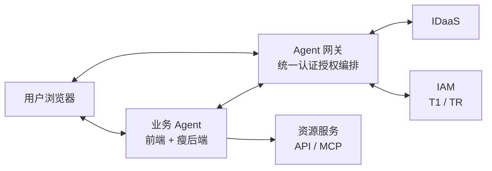
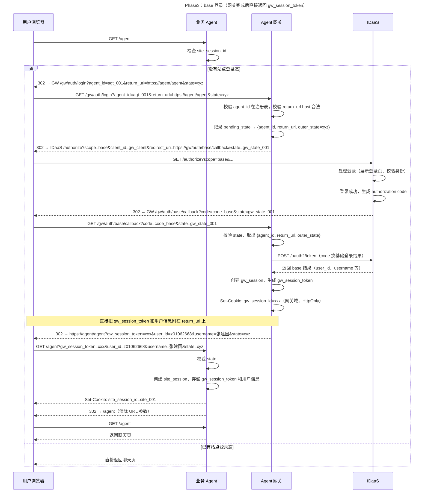
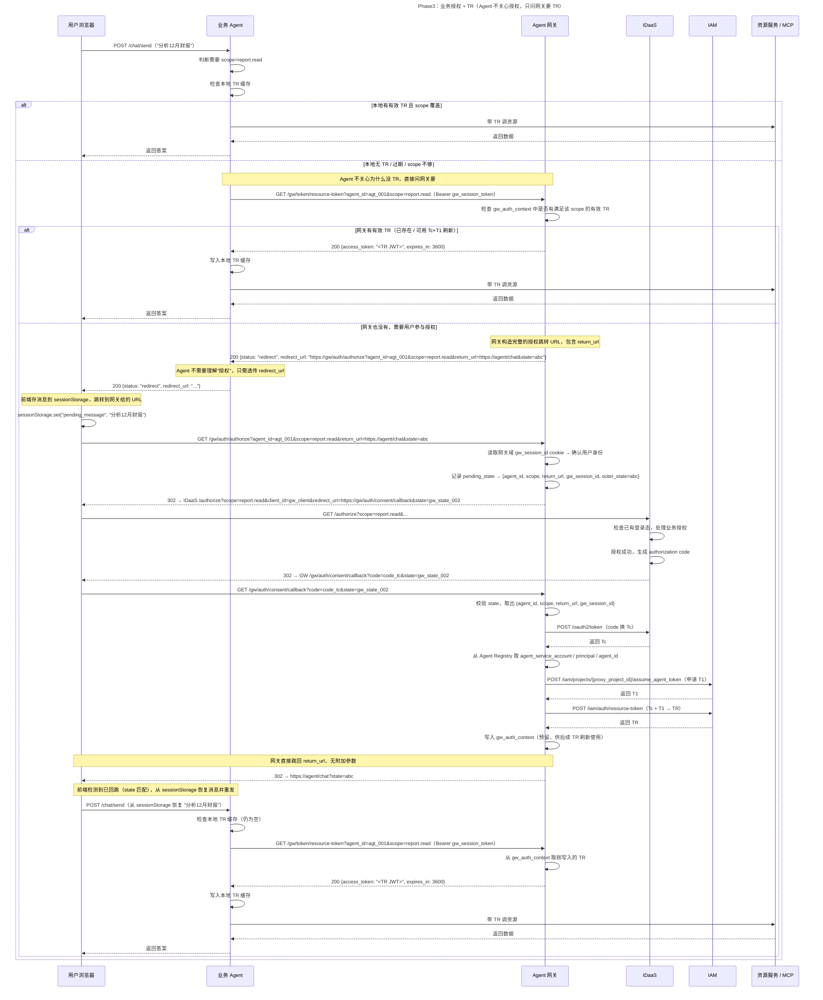
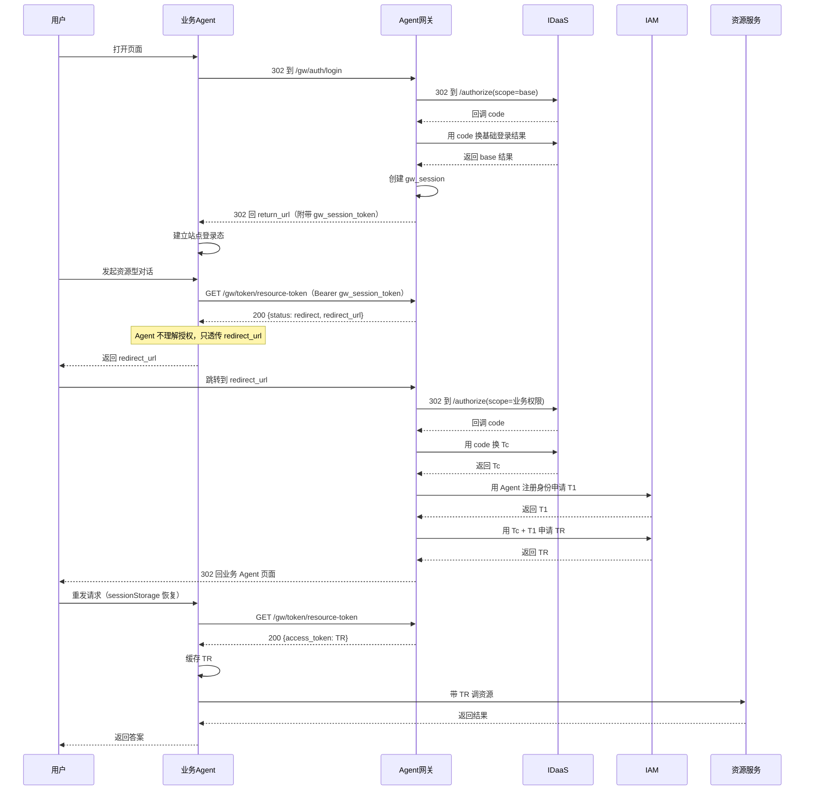

# 第三阶段：引入 Agent 网关，统一对接 IDaaS / IAM

---

## 1. 核心分工变化

| 职责 | phase2 归属 | phase3 归属 |
|---|---|---|
| OAuth2 redirect / callback | 业务 Agent | **Agent 网关** |
| code 换 Tc | 业务 Agent | **Agent 网关** |
| 申请 T1 | 业务 Agent | **Agent 网关** |
| 用 Tc + T1 合成 TR | 业务 Agent | **Agent 网关** |
| Tc / T1 / TR 生命周期管理 | 业务 Agent | **Agent 网关** |
| Agent 注册与身份管理 | 无 | **Agent 网关** |
| 站点登录态（site_session） | 业务 Agent | 业务 Agent（不变） |
| 判断当前请求需要什么 scope | 业务 Agent | 业务 Agent（不变） |
| TR 本地缓存 | 业务 Agent | 业务 Agent（不变） |
| 携带 TR 调用资源服务 | 业务 Agent | 业务 Agent（不变） |

**一句话总结**：网关负责 IDaaS / IAM 的全部编排；业务 Agent 只做"发起跳转 → 问网关要 TR → 缓存 TR → 带 TR 调资源"。

**Agent 不需要理解"授权"概念**，只知道"问网关要 TR，网关给了就用，网关让跳转就跳"。

---

## 2. 总体架构图



- 浏览器 OAuth2 重定向经过网关，callback URL 全部指向网关
- 业务 Agent 与 IDaaS / IAM 之间无直接连线
- 业务 Agent 拿到 TR 后本地缓存，直接调用资源服务（网关不代理资源流量）

---

## 3. 网关内部关键概念

### 3.1 Agent Registry（Agent 注册表）

每个业务 Agent 接入前在网关注册（一次性配置）：

```text
agent_id              → agt_business_001
agent_name            → 业务数据助手
agent_service_account → svc_ai_business_agent
principal             → com.huawei.business.agent
allowed_return_hosts  → [business-agent.huawei.com]
```

网关用注册表中的 `agent_service_account` / `principal` / `agent_id` 向 IAM 申请 T1，防止业务 Agent 伪造身份。`allowed_return_hosts` 用于白名单校验 `return_url`，防 open redirect。

### 3.2 gw_session（网关侧会话）

base 登录成功后由网关创建：

```text
gw_session_id → user_id, username, 创建时间
```

同时向浏览器种 `gw_session_id` cookie（网关域，HttpOnly + Secure），用于后续业务授权时识别用户，无需业务 Agent 传递。

### 3.3 gw_session_token（网关颁发给业务 Agent 的凭证）

base 登录完成后，网关通过 `return_url` 参数将其直接返回给业务 Agent：

```text
gw_session_token → 对应网关侧的 gw_session_id（不透明引用，不含敏感信息）
```

业务 Agent 将其存入站点 session，用于后续调用 `/gw/token/resource-token` 时标识用户。

### 3.4 gw_auth_context（网关侧授权上下文，预留）

业务授权成功后由网关创建，当前阶段 TR 直接发给业务 Agent，此结构为后续 TR 刷新预留：

```text
key:   gw_session_id + agent_id
value: Tc, T1, TR, consented_scopes, 过期时间
```

### 3.5 pending_auth_transaction（临时状态，用后即删）

OAuth2 重定向过程中暂存：

```text
gw_state → agent_id, scope, return_url, gw_session_id, outer_state
```

---

## 4. 主时序图

### 4.1 base 登录阶段



**说明**：

- 网关在 base 登录完成后，直接将 `gw_session_token` 和用户信息附在 `return_url` 上跳回
- 业务 Agent 在已有的 `/agent` handler 里检测 `gw_session_token` 参数，存入 session 后重定向到干净 URL
- 不需要专用 callback 接口，不需要额外的 exchange API 调用

### 4.2 业务授权阶段 + 获取 TR



**说明**：

- **Agent 不需要理解"授权"概念**，只知道"问网关要 TR"
- 网关返回 `200 {status: "redirect", redirect_url}`（不是 403），Agent 只需透传给前端
- `redirect_url` 完全由网关构造，Agent 不需要知道 `/gw/auth/authorize` 接口存在，也不需要知道如何构造授权 URL
- 前端在跳转前将消息存入 `sessionStorage`，授权回来后自动恢复重发，用户感知连贯
- 业务授权完成后，网关跳回原聊天页（`return_url`），无附加参数，Agent 重调 `resource-token` 即可拿到 TR
- Agent 拿到 TR 后写入本地缓存，后续请求直接复用

---

## 5. 接口清单

### 5.1 业务 Agent 视角：phase2 vs phase3

| 业务 Agent 需要做的事 | phase2（直连） | phase3（接入网关） |
|---|---|---|
| 专用 callback 接口 | 2 个 | **0 个** |
| 需要理解的概念 | OAuth2 + IDaaS + IAM + Tc + T1 + TR + 授权 | **只有 TR + redirect_url** |
| 向外部换 token 次数 | IDaaS×2 + IAM×2 | **1 次**（`/gw/token/resource-token`，且按需调用） |
| 本地维护的令牌 | Tc + T1 + TR | **只有 TR**（Agent 不接触 Tc / T1） |
| 状态维护 | site_session + pending_auth + agent_security_context | **site_session（仅 gw_session_token）** |

### 5.2 业务 Agent ↔ Agent 网关（仅 1 个 API）

| 接口 | 方法 | 调用时机 | 说明 |
|---|---|---|---|
| `/gw/token/resource-token` | GET | 本地 TR 缺失 / 过期 / scope 不够时 | Header: `Authorization: Bearer gw_session_token`；Query: `agent_id`, `scope`；返回 TR 或 redirect 指令 |

**响应格式**：

成功返回 TR：
```json
{
  "access_token": "<TR JWT>",
  "expires_in": 3600
}
```

需要用户授权：
```json
{
  "status": "redirect",
  "redirect_url": "https://gw/auth/authorize?agent_id=agt_001&scope=report.read&return_url=https://agent/chat&state=abc"
}
```

### 5.3 浏览器 ↔ Agent 网关（302 经过，网关自有接口）

| 接口 | 方法 | 说明 |
|---|---|---|
| `/gw/auth/login` | GET | 发起 base 登录，网关 302 到 IDaaS |
| `/gw/auth/base/callback` | GET | IDaaS base 登录回调（redirect_uri 指向这里） |
| `/gw/auth/authorize` | GET | 发起业务授权，网关 302 到 IDaaS |
| `/gw/auth/consent/callback` | GET | IDaaS 业务授权回调（redirect_uri 指向这里） |

### 5.4 Agent 网关 ↔ IDaaS（调用方从业务 Agent 变为网关，接口不变）

| 接口 | 方法 | 说明 |
|---|---|---|
| `/authorize` | GET | 统一授权入口（scope=base 或业务 scope） |
| `/oauth2/token` | POST | code 换 token（base 结果或 Tc） |

### 5.5 Agent 网关 ↔ IAM（调用方从业务 Agent 变为网关，接口不变）

| 接口 | 方法 | 说明 |
|---|---|---|
| `/iam/projects/{proxy_project_id}/assume_agent_token` | POST | 申请 T1（使用注册表中的 Agent 身份） |
| `/iam/auth/resource-token` | POST | 用 Tc + T1 申请 TR |

### 5.6 业务 Agent ↔ 资源服务（完全不变）

资源服务只接受 TR，与 phase2 完全一致。

---

## 6. 网关侧状态模型

```text
┌─────────────────────────────────────────────────────┐
│  agent_registry（静态配置，注册时写入）              │
│  agent_id → agent_name, agent_service_account,      │
│             principal, allowed_return_hosts          │
├─────────────────────────────────────────────────────┤
│  gw_session（base 登录后创建）                       │
│  gw_session_id → user_id, username, 创建时间         │
│  （同时以 cookie 形式种在网关域）                    │
├─────────────────────────────────────────────────────┤
│  gw_auth_context（业务授权后写入，预留供 TR 刷新）   │
│  (gw_session_id + agent_id) → Tc, T1, TR,           │
│                               consented_scopes,     │
│                               过期时间               │
├─────────────────────────────────────────────────────┤
│  pending_auth_transaction（临时，用后即删）           │
│  gw_state → agent_id, scope, return_url,            │
│             gw_session_id, outer_state               │
└─────────────────────────────────────────────────────┘
```

业务 Agent 侧状态极简：

```text
site_session: site_session_id → gw_session_token, user_id, username
tr_cache:     (agent_id + scope) → TR JWT, expires_at
```

---

## 7. 对比 phase2 的变化总结

| 维度 | phase2 | phase3 |
|---|---|---|
| IDaaS redirect_uri 指向 | 业务 Agent | Agent 网关 |
| code 换 Tc | 业务 Agent | Agent 网关 |
| T1 / TR 合成 | 业务 Agent | Agent 网关 |
| 业务 Agent 专用 callback 接口 | 2 个 | **0 个** |
| 业务 Agent 对外换 token 次数 | 4 次 | **按需调用 1 个 API** |
| 业务 Agent 维护的令牌 | Tc + T1 + TR | **仅 TR（本地缓存）** |
| 业务 Agent 需要理解的概念 | OAuth2 + 授权 + Tc/T1/TR | **只有 TR + redirect_url** |
| 授权失败时网关响应 | N/A（Agent 自己判断） | **返回 redirect_url，Agent 透传** |
| 新 Agent 接入成本 | 实现完整 OAuth2 + IAM 对接 | 注册到网关 + 页面加几行判断 + 调 1 个 API |
| 三令牌模型 | Tc / T1 / TR | Tc / T1 / TR（不变） |
| 资源服务认什么 | 只认 TR | 只认 TR（不变） |

---

## 8. 安全要点

1. **return_url host 白名单** — 网关根据 `allowed_return_hosts` 校验 return_url，防止 open redirect
2. **gw_session_id cookie 仅网关域，HttpOnly + Secure** — 浏览器无法通过 JS 读取
3. **gw_session_token 通过 HTTPS 传输** — 在 return_url 参数中传输，全程 HTTPS，Agent 收到后立即重定向到干净 URL
4. **网关是 IDaaS 的唯一 OAuth2 Client** — 所有 Agent 共用网关 client_id，网关用 agent_id 区分上下文
5. **T1 身份来自注册表，不由业务 Agent 传入** — 防止伪造

---

## 9. 简化总图



这张图用于快速理解主线，重点只有五句：

- 第一次打开页面时，网关代为完成基础登录，Agent 只收一个 `gw_session_token`。
- 第一次真正访问业务资源时，Agent 问网关要 TR，网关说"需要跳转"，Agent 透传给前端。
- 网关代为完成全部授权流程（IDaaS 授权 → 换 Tc → 申请 T1 → 合成 TR），Agent 全程不参与。
- 授权完成后 Agent 再问一次网关，直接拿到 TR，缓存后调资源。
- **业务 Agent 不需要理解 OAuth2、不需要理解授权、不接触 Tc / T1，只知道 TR 和 redirect_url。**

---

## 10. 当前阶段建议

- 先用 1 个业务 Agent 跑通全流程（base 登录 → 业务授权 → 获取 TR → 调资源）
- scope 粒度继续保持粗粒度（`base` / `report` / `invoice`）
- TR 刷新：`gw_auth_context` 已预留，后续实现时网关用存储的 Tc + T1 自动续期，对 Agent 透明
- 增量授权（scope 追加而非重新全量授权）作为后续优化项