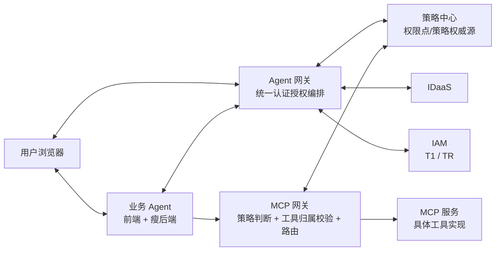
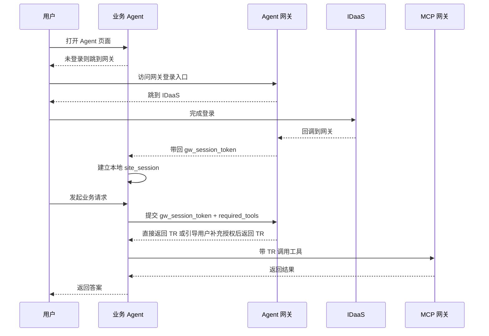
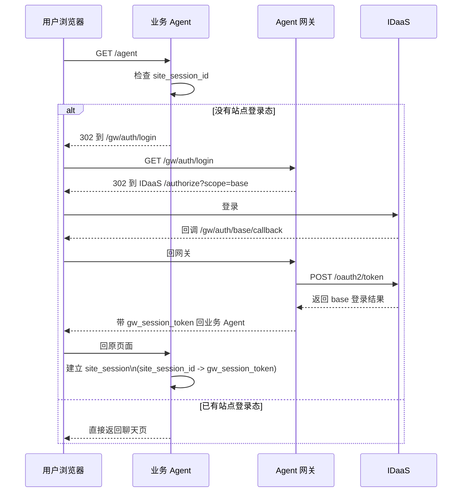
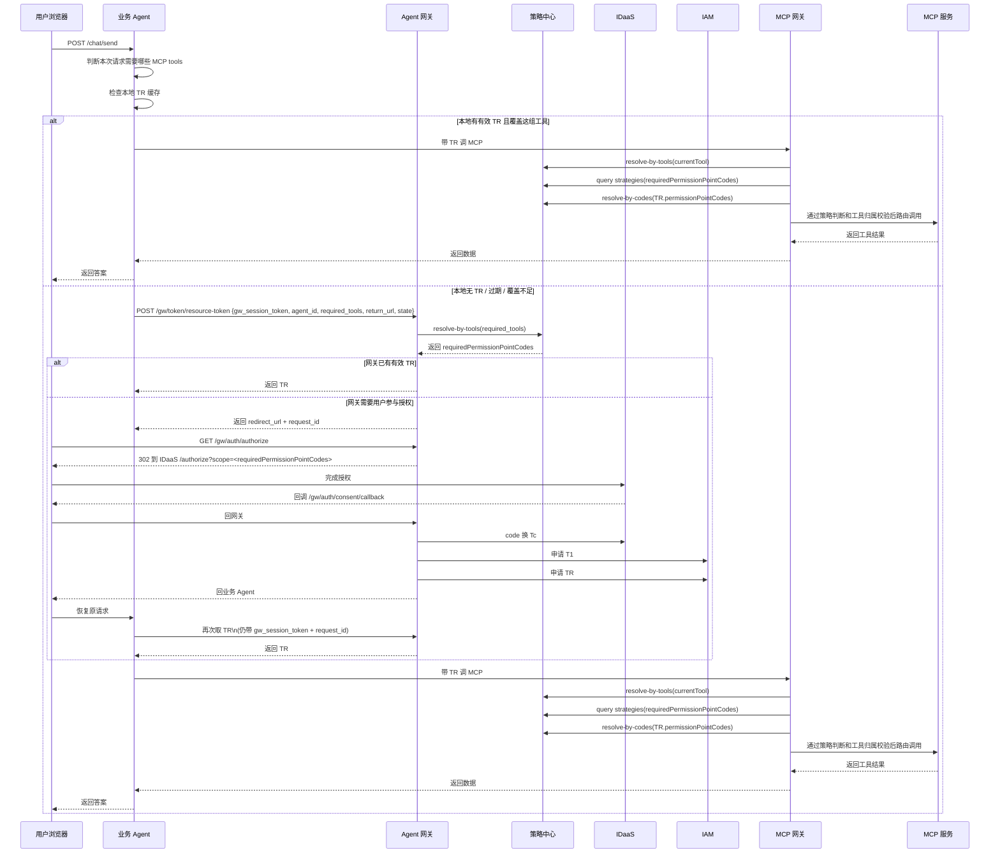

# 引入 Agent 网关最终方案：引入 Agent 网关 + 策略中心，按工具申请 `TR`

`01` 为参考方案，`02/03/04/05` 为当前正式方案。

## 1. 目标

当前正式方案的核心目标是：

- 业务 Agent **不知道权限点内部结构**
- 业务 Agent 只知道：本次要调用哪些 `MCP tool`
- `Agent 网关` 负责把 `required_tools` 反查成 `requiredPermissionPointCodes`
- `策略中心` 负责统一维护：
  - 权限点定义
  - 权限点与工具绑定关系
  - Agent 策略
- `IDaaS` 仍然基于权限点 code 做登录与授权
- `IAM` 仍然基于 `Tc + T1` 生成最终可访问资源的 `TR`
- 业务 Agent 带 `TR` 访问 `MCP 网关`
- `MCP 网关` 运行时先按当前待调用工具反查所需权限点，再结合 Agent 策略判断这些权限点是否对当前用户放行，最后再根据 `TR.authorizedPermissionPoints` 反查工具集合并校验当前请求工具是否在内

一句话总结：

**业务 Agent 面向工具，Agent 网关面向 `tool -> permissionPointCode`，策略中心是权限点与策略的权威源，TR 是用户授权给 Agent 的上限边界，Agent 策略是 Agent 所有者对不同用户功能开放范围的二次控制。**

## 2. 核心分工变化

| 职责 | 01_无Agent网关版方案归属 | 当前归属 |
|---|---|---|
| OAuth2 redirect / callback | 业务 Agent | **Agent 网关** |
| code 换 `Tc` | 业务 Agent | **Agent 网关** |
| 申请 `T1` | 业务 Agent | **Agent 网关** |
| 用 `Tc + T1` 合成 `TR` | 业务 Agent | **Agent 网关** |
| 维护权限点定义与工具绑定关系 | 无 | **策略中心** |
| 维护 Agent 策略 | 无 | **策略中心** |
| 判断本次要访问哪些工具 | 业务 Agent | **业务 Agent** |
| 判断这些工具对应哪些权限点 | 业务 Agent / 人工约定 | **Agent 网关 + 策略中心** |
| 运行时判断当前用户对工具是否可用 | 资源侧零散约定 | **MCP 网关 + 策略中心** |
| 本地站点登录态 `site_session` | 业务 Agent | **业务 Agent** |
| 本地 `TR` 缓存 | 业务 Agent | **业务 Agent** |
| 带 `TR` 调 `MCP 网关` | 业务 Agent | **业务 Agent** |

这版最关键的变化只有一条：

**业务 Agent 不再上传 `scope/code`，而是上传本次请求所需的 `required_tools`。**

## 3. 总体架构图



这张图表达的是：

- 浏览器 OAuth2 重定向经过网关，callback URL 全部指向网关
- 业务 Agent 不再直连 `IDaaS / IAM`
- 业务 Agent 只向网关提交 `required_tools`
- 网关通过策略中心把工具需求翻译成权限点 code
- 业务 Agent 拿到 `TR` 后本地缓存，直接调用 `MCP 网关`
- `MCP 网关` 运行时先把当前待调用工具反查成所需权限点，再执行 Agent 策略判断，最后再根据 `TR.authorizedPermissionPoints` 反查工具集合并校验当前请求工具是否在内
- `MCP 网关` 最终再路由到对应 `MCP 服务`

### 3.1 适合对外讲解的简化主流程

下面这张图故意不展开 `Tc / T1 / TR`、`request_id / gw_state` 等内部细节，只保留对外最容易讲清楚的主链路：



这张图适合开会时先讲清楚三件事：

- 登录统一由网关承接
- 业务 Agent 只上传 `required_tools`
- 业务 Agent 后续找网关申请 `TR` 时，要带上 `gw_session_token`

## 4. 关键概念

### 4.1 Agent Registry（Agent 注册表）

每个业务 Agent 接入前在网关注册：

```text
agent_id              → agt_business_001
agent_name            → 业务数据助手
app_id                → com.huawei.business.agent
agent_service_account → svc_ai_business_agent
allowed_return_hosts  → [business-agent.huawei.com]
status                → ACTIVE
```

这里的 Agent Registry 只维护 Agent 身份、回跳白名单和换取 `T1` 所需身份信息；权限点定义、权限点与工具绑定关系、Agent 策略都统一放在策略中心中维护。

### 4.2 策略中心（Policy Center）

策略中心统一维护三类对象：

#### 权限点定义

```text
permissionPointCode -> displayNameZh, description, boundTools
```

例如：

```text
erp:report:r -> ERP 报表的可读权限
erp:invoice:r -> ERP 发票的可读权限
```

#### 工具定义

```text
tool_id -> server_name, method_name, display_name
```

#### Agent 策略

```text
agent_id + permissionPointCode -> conditions + effect
```

当前版本中，一个策略只绑定一个权限点。

### 4.3 gw_session（网关侧会话）

base 登录成功后由网关创建：

```text
gw_session_id → user_id, username, created_at
```

### 4.4 gw_session_token（网关颁发给业务 Agent 的凭证）

base 登录完成后，网关通过 `return_url` 带回业务 Agent：

```text
gw_session_token → 对应网关侧 gw_session_id 的不透明引用
```

它的作用不是替代 `TR`，而是把“网关已经确认过的登录用户”交接给业务 Agent。业务 Agent 后续建立本地站点会话、以及向网关申请 `TR` 时，都依赖这个值把自己的网站会话和网关侧登录用户绑定起来。

一个最直观的例子如下：

```text
网关侧：
  gw_session_id = gws_123
  gw_session = {
    gw_session_id: gws_123,
    user_id: z01062668,
    username: 张三
  }

  gw_session_token = gwst_abc_xyz
  gw_session_token -> gws_123

业务 Agent 侧：
  site_session_id = site_789
  site_session = {
    site_session_id: site_789,
    gw_session_token: gwst_abc_xyz,
    user_id: z01062668,
    username: 张三
  }
```

浏览器此时会同时持有两套不同域名下的 Cookie：

```text
业务 Agent 域名下：
  site_session_id = site_789

Agent 网关域名下：
  gw_session_id = gws_123
```

它们之间的关系可以概括为：

```text
site_session_id -> site_session
site_session -> gw_session_token -> gw_session
```

所以：

- 业务 Agent 用 `site_session_id` 找到自己的本地站点会话
- 业务 Agent 再通过 `gw_session_token` 让网关找回“这是哪个已登录用户”
- `gw_session_token` 是网关和业务 Agent 之间的登录用户桥接凭证，不是资源访问令牌

### 4.5 gw_auth_context（网关侧授权上下文）

业务授权成功后由网关创建：

```text
key:   gw_session_id + agent_id
value: authorizedPermissionPoints, tc, t1, tr, expires_at
```

### 4.6 pending_base_login（临时状态，用后即删）

```text
gw_state ->
  agent_id,
  return_url,
  outer_state
```

### 4.7 pending_auth_transaction（临时状态，用后即删）

```text
request_id ->
  agent_id,
  required_tools,
  requiredPermissionPointCodes,
  missingPermissionPointCodes,
  return_url,
  gw_session_id,
  outer_state
```

同时，网关在 OAuth2 跳转期间内部维护：

```text
gw_state -> request_id
```

## 5. 主流程

### 5.1 base 登录阶段



### 5.2 业务授权 + 获取 TR 阶段



## 6. 当前设计结论

- 业务 Agent 只上传 `required_tools`
- Agent 网关负责 `required_tools -> requiredPermissionPointCodes`
- `Tc` 和 `TR` 都携带权限点对象数组
- `TR` 是用户授权给 Agent 的权限点上限边界
- MCP 网关运行时先把当前待调用工具反查成所需权限点
- 先结合 Agent 策略判断这些权限点是否对当前用户放行
- 再用 `TR.authorizedPermissionPoints` 反查可访问工具集合，并校验当前请求工具是否在其中
