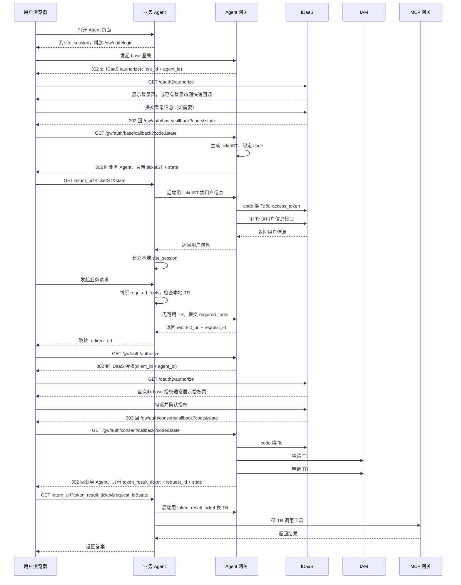
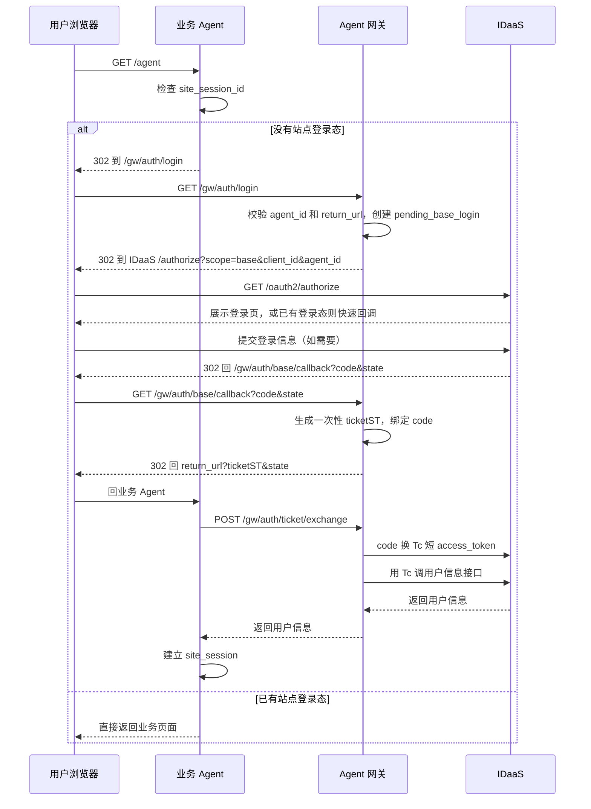
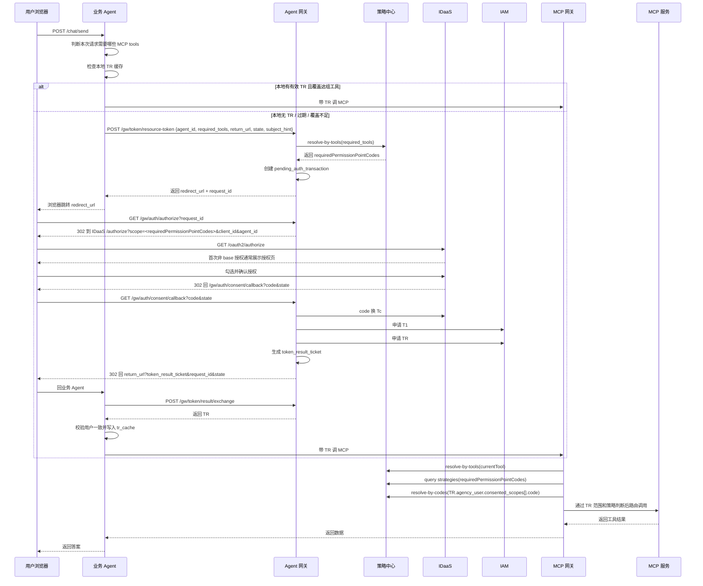

# 引入 Agent 网关版方案

`01` 为参考方案，`02/03/04/05` 为当前正式方案。

## 1. 方案定位

当前正式方案采用模式 A：用户登录态由 `IDaaS` 判断，业务站点登录态由 `业务 Agent` 自己维护，`Agent 网关` 不维护长期用户登录会话。每次需要确认用户身份或补充授权时，浏览器都经过 `IDaaS /authorize`，如果 IDaaS 已有登录 Cookie 或长期授权记录，可以快速回跳；如果没有，则展示登录页或授权确认页。

Agent 网关的核心价值不是“记住用户已经登录”，而是统一承担：

- Agent 接入校验和回跳白名单校验。
- OAuth2 跳转与 callback 编排。
- `code -> Tc -> T1 -> TR` 编排。
- `required_tools -> requiredPermissionPointCodes` 解析。
- 短期一次性凭据交付，避免敏感数据出现在浏览器 URL。

## 2. 设计主线

业务 Agent 只理解 `required_tools`、`site_session`、`TR` 和跳转恢复，不直接理解权限点内部结构，也不直接对接 `IDaaS / IAM`。Agent 网关负责把工具集合解析成权限点并完成令牌编排。MCP 网关在运行时基于 `TR.agency_user.consented_scopes`、策略中心和当前工具做最终放行判断。

其中：

- `TR` 表达用户授权给 Agent 的权限点上限边界。
- Agent 策略表达 Agent 所有者对不同用户功能开放范围的二次控制。
- 即使策略放行，MCP 网关也必须校验当前工具所需权限点已包含在 `TR` 中。
- Agent 网关不复用、不缓存、不判断业务 Agent 的历史 `TR` 覆盖范围，`TR` 复用由业务 Agent 本地 `tr_cache` 决定。

## 2.1 运行前置条件：IDaaS 委托信任

在进入登录和授权运行时流程之前，注册 Agent 阶段已经由另一个系统完成 IDaaS 委托授权：

```text
Agent 网关 IDaaS OAuth client_id -> gw_client_001
业务 Agent agent_id             -> agt_business_001
```

该外部系统会调用 IDaaS 的委托授权接口，建立“Agent 网关 `client_id` 可以代理该业务 Agent `agent_id` 发起 IDaaS OAuth 流程”的信任关系。本方案运行时不负责创建这条信任关系，只依赖它已经存在。

因此，Agent 网关调用 IDaaS `/oauth2/authorize` 时需要表达两类身份：

- `client_id`：Agent 网关在 IDaaS 侧唯一的 OAuth 客户端 ID。
- `agent_id`：当前业务 Agent 标识，该值在 Agent 网关、IDaaS、IAM 等系统中共用。

## 3. 简化主流程

下面这张图故意不展开 `Tc / T1 / TR` 的 payload 细节，只保留对外最容易讲清楚的主链路：



这张图开会时先讲清楚三件事：

- 网关不把 `Tc / TR / 用户信息` 暴露给浏览器 URL。
- 登录结果通过 `ticketST` 后端换取，授权结果通过 `token_result_ticket` 后端换取。
- 用户是否已经登录、授权页是否需要真实展示，由 IDaaS 判断。

## 4. 关键概念

### 4.1 Agent Registry

每个业务 Agent 接入前在网关注册：

```text
agent_id              -> agt_business_001
agent_name            -> 业务数据助手
app_id                -> com.huawei.business.agent
agent_service_account -> svc_ai_business_agent
allowed_return_hosts  -> [business-agent.huawei.com]
status                -> ACTIVE
```

Agent Registry 只维护 Agent 身份、回跳白名单和换取 `T1` 所需身份信息。权限点定义、权限点与工具绑定关系、Agent 策略统一放在策略中心维护。

Agent 网关侧还有一组全局 IDaaS 配置：

```text
idaas_client_id       -> gw_client_001
idaas_client_secret   -> ******
```

其中 `idaas_client_id / idaas_client_secret` 用于 `code -> Tc access_token`。运行时向 IDaaS 表达“Agent 网关代理哪个业务 Agent”时，使用 Agent Registry 中同一个 `agent_id`。

### 4.2 策略中心

策略中心统一维护三类对象：

```text
permissionPointCode -> displayNameZh, description, boundTools
tool_id -> server_name, method_name, display_name
agent_id + permissionPointCode -> conditions + effect
```

示例：

```text
erp:contract:r -> ERP 合同的可读权限
erp:invoice:r  -> ERP 发票的可读权限
```

当前版本中，一个策略只绑定一个权限点。工具与权限点映射不带 `agent` 维度。

### 4.3 site_session

`site_session` 是业务 Agent 自己的网站登录态，只在业务 Agent 域名下生效：

```text
site_session_id -> {
  user_id,
  username,
  created_at
}
```

业务 Agent 创建 `site_session` 的时机是：浏览器带 `ticketST` 回到业务 Agent 后，业务 Agent 后端调用 `/gw/auth/ticket/exchange` 换到可信用户信息，再写入自己的会话和 Cookie。

### 4.4 ticketST

`ticketST` 是 base 登录完成后的一次性票据，用来把用户信息从 Agent 网关安全交付给业务 Agent 后端：

```text
ticketST -> {
  agent_id,
  authorization_code,
  client_id,
  redirect_uri,
  expires_at,
  used
}
```

约束：

- 只在浏览器回跳业务 Agent 时出现。
- 只能由业务 Agent 后端调用网关交换。
- 单次使用，成功交换后立即失效。
- 短 TTL，建议 1 到 5 分钟。
- 绑定 `agent_id` 和原始 `return_url` 所属白名单。
- 绑定 base 登录 callback 带回的 `authorization code`。
- 不等同于登录态，不等同于资源访问令牌。

### 4.5 token_result_ticket

`token_result_ticket` 是授权完成后的一次性取件凭据，用来让业务 Agent 后端从网关换取 `TR`：

```text
token_result_ticket -> {
  request_id,
  agent_id,
  tr,
  agency_user,
  consented_scopes,
  expires_at,
  used
}
```

约束：

- 只在浏览器回跳业务 Agent 时出现。
- 浏览器 URL 中不出现 `TR`。
- 只能由业务 Agent 后端调用网关交换。
- 单次使用，成功交换后立即失效。
- 短 TTL，建议 1 到 5 分钟。
- 业务 Agent 换回 `TR` 后，必须校验 `TR.agency_user` 与当前 `site_session` 用户一致。

### 4.6 pending_base_login

```text
gw_state -> {
  agent_id,
  return_url,
  outer_state,
  created_at,
  expires_at
}
```

`pending_base_login` 只用于恢复 base 登录 callback 上下文。`gw_state` 是网关内部 OAuth state，不对业务 Agent 暴露。

### 4.7 pending_auth_transaction

```text
request_id -> {
  agent_id,
  required_tools,
  requiredPermissionPointCodes,
  return_url,
  outer_state,
  subject_hint,
  created_at,
  expires_at
}
```

`pending_auth_transaction` 只用于恢复一次“申请 TR / 补充授权”流程。`subject_hint` 只作为传给 IDaaS 的登录提示，不能作为可信身份来源。

## 5. 主流程

### 5.1 base 登录阶段



### 5.2 业务授权 + 获取 TR 阶段



## 6. 安全边界

- 浏览器 URL 中不得出现 `Tc`、`TR`、用户信息。
- 业务 Agent 传入的 `subject_hint` 只能帮助 IDaaS 定位用户，不能作为网关侧可信身份。
- 可信用户身份只能来自 IDaaS `code -> token` 的结果。
- `ticketST` 和 `token_result_ticket` 必须一次性使用。
- 业务 Agent 后端交换一次性凭据时必须传入 `agent_id`，网关必须校验票据绑定的 `agent_id` 与请求一致。
- 网关必须校验所有 `return_url` 属于该 Agent 的 `allowed_return_hosts`。
- 业务 Agent 换回 `TR` 后，必须校验 `TR.agency_user` 与当前 `site_session` 用户一致。

## 7. 当前设计结论

- 业务 Agent 只上传 `required_tools`。
- Agent 网关负责 `required_tools -> requiredPermissionPointCodes`。
- `Tc` 和 `TR.agency_user` 都携带 `consented_scopes`。
- `consented_scopes` 是三方约定字段，元素为权限点对象，至少包含 `code + displayNameZh`。
- `TR` 是用户授权给 Agent 的权限点上限边界。
- Agent 网关不维护长期登录态，不再把登录用户桥接成长期网关会话。
- IDaaS 负责判断用户是否已经登录，必要时展示登录页或授权页。
- MCP 网关运行时先校验当前工具所需权限点是否在 `TR` 中，再执行 Agent 策略判断，再校验当前工具是否属于 `TR` 可覆盖工具集合。
