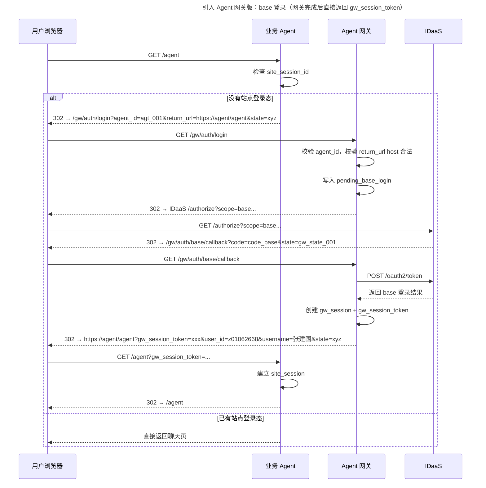
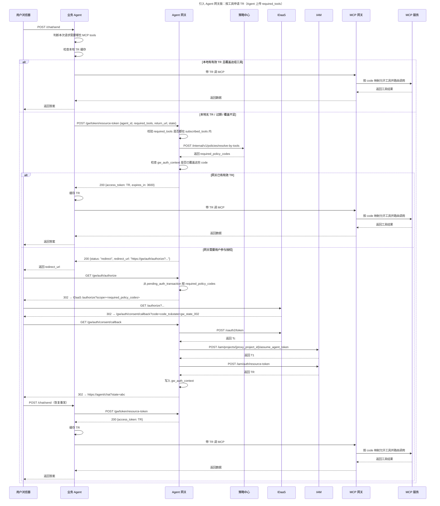

# 引入 Agent 网关 + 策略中心后的接口设计

`01` 为参考方案，`02/03/04` 为当前正式方案。

## 1. 目标

这一版方案在 `Tc / T1 / TR` 三令牌模型基础上，进一步引入：

- `Agent 网关`
- `策略中心`

目标不是改变三令牌模型，而是重新划分模块职责：

- 浏览器 OAuth2 跳转和 callback 全部由 `Agent 网关` 处理
- `Tc / T1 / TR` 的申请、缓存、续期编排都由 `Agent 网关` 处理
- `策略中心` 统一维护 `policy_code <-> MCP tool` 映射
- 业务 Agent 不再上传 `scope/code`
- 业务 Agent 只上传本次请求需要的 `required_tools`
- 网关负责把 `required_tools` 反查成 `required_policy_codes`
- 业务 Agent 带 `TR` 访问 `MCP 网关`
- `MCP 网关` 运行时查询策略中心，基于 `TR` 中的授权 code 映射出允许调用的 `MCP tool`，再路由到对应 `MCP 服务`

一句话总结：**业务 Agent 面向工具，Agent 网关面向授权流程，策略中心面向 `tool/code` 映射。**

---

## 2. 模块边界与开发职责

| 模块 | 需要开发的接口或处理点 | 主要职责 | 不负责什么 |
| --- | --- | --- | --- |
| 业务 Agent 前端 | 页面入口、跳转处理、`sessionStorage` 恢复消息 | 接收后端返回的 `redirect_url` 并跳转；授权回来后恢复消息并重发 | 不直连 `IDaaS / IAM / 策略中心`；不处理 code；不理解 `policy_code` |
| 业务 Agent 后端/BFF | `GET /agent`、`POST /chat/send`、本地 `site_session`、本地 `tr_cache` | 建立站点登录态；判断请求要用哪些 `MCP tool`；按需向网关要 `TR`；带 `TR` 调 `MCP 网关` | 不实现 OAuth2 callback；不构造授权 URL；不申请 `Tc / T1 / TR`；不反查 code |
| Agent 网关 | `/gw/auth/login`、`/gw/auth/base/callback`、`POST /gw/token/resource-token`、`/gw/auth/authorize`、`/gw/auth/consent/callback` | 统一编排登录、授权、code 换 token、T1/TR 申请、状态维护；把 `required_tools` 翻译成 `required_policy_codes` | 不承接业务聊天页流量；不直接代理 `MCP` 调用流量 |
| 策略中心 | `/internal/v1/policies/resolve-by-tools` | 统一维护 `tool <-> policy_code` 映射，并向网关返回本次请求所需的 code 集合 | 不处理浏览器跳转；不保存用户登录态；不申请令牌 |
| IDaaS | `/authorize`、`/oauth2/token` | 用户登录、用户授权、签发基础登录结果与 `Tc` | 不保存 Agent 本地会话；不理解 `required_tools`；不处理 `T1 / TR` |
| IAM | `/iam/projects/{proxy_project_id}/assume_agent_token`、`/iam/auth/resource-token` | 签发 `T1`，基于 `Tc + T1` 签发 `TR` | 不处理页面跳转；不处理工具到 code 的映射 |
| MCP 网关 | MCP 调用入口、code → tool 反查、路由分发 | 接受 `TR`；运行时查询策略中心，基于其中授权 code 反查允许访问的 `MCP tool`；把调用路由到对应 `MCP 服务` | 不处理登录授权跳转；不签发 `Tc / T1 / TR` |
| MCP 服务 | 具体工具实现接口 | 执行实际 `MCP tool` 能力并返回结果 | 不直接处理用户登录授权；不直接接受 `Tc / T1` |

### 2.1 对业务 Agent 的直接影响

相比参考方案，业务 Agent 侧最关键的变化有五个：

1. 不再开发 `/auth/base/callback` 和 `/auth/consent/callback`
2. 不再调用 `IDaaS /oauth2/token`
3. 不再调用 `IAM` 的 `assume_agent_token` 和 `resource-token`
4. 不再上传 `scope/code`
5. 只需要对接 `Agent 网关` 的 1 个运行时接口：`POST /gw/token/resource-token`

### 2.2 对 Agent 网关 的直接影响

Agent 网关成为整条链路里最重的模块，需要统一处理：

- `agent_id` 校验
- `required_tools` 边界校验
- `return_url` 白名单校验
- `state` 生成与校验
- 登录 callback
- 授权 callback
- `required_tools -> required_policy_codes`
- `code -> Tc`
- `Agent Registry -> T1`
- `Tc + T1 -> TR`
- `gw_session / gw_auth_context / pending_base_login / pending_auth_transaction` 状态维护

### 2.3 对策略中心的直接影响

策略中心成为网关的内部能力模块，至少需要维护：

- `policy_code` 定义
- `tool_id` 定义
- `tool_id <-> policy_code` 映射关系

这里建议按**多对多**设计，不要写死成一对一：

- 一个 `policy_code` 可以覆盖多个工具
- 一个工具也可能依赖多个 `policy_code`

---

## 3. 核心时序

### 3.1 base 登录阶段



### 3.2 业务授权 + 获取 TR 阶段



---

## 4. 接口总览

| 调用方 | 被调用方 | 方法 | 路径 | 用途 | 关键输入 | 关键输出 | 状态影响 |
| --- | --- | --- | --- | --- | --- | --- | --- |
| 业务 Agent | Agent 网关 | `POST` | `/gw/token/resource-token` | 按需获取 `TR` 或获取跳转指令 | `Authorization: Bearer gw_session_token`、`agent_id`、`required_tools`、`return_url`、`state` | `TR` 或 `redirect_url + request_id` | 可能读取或写入 `gw_auth_context / pending_auth_transaction` |
| Agent 网关 | 策略中心 | `POST` | `/internal/v1/policies/resolve-by-tools` | 把工具集合翻译成本次所需授权 code 集合 | `agent_id`、`required_tools` | `required_policy_codes`、`policy_items` | 无 |
| 用户浏览器 | Agent 网关 | `GET` | `/gw/auth/login` | 发起 base 登录 | `agent_id`、`return_url`、`state` | 302 到 IDaaS 登录页 | 写入 `pending_base_login` |
| IDaaS | Agent 网关 | `GET` | `/gw/auth/base/callback` | base 登录成功回调 | `code`、`state` | 302 回业务 Agent 页 | 创建 `gw_session` |
| 用户浏览器 | Agent 网关 | `GET` | `/gw/auth/authorize` | 发起业务授权 | `request_id` | 302 到 IDaaS 授权页 | 读取 `pending_auth_transaction` 并生成内部 `gw_state` |
| IDaaS | Agent 网关 | `GET` | `/gw/auth/consent/callback` | 业务授权成功回调 | `code`、`state` | 302 回业务 Agent 页 | 写入 `gw_auth_context` |
| Agent 网关 | IDaaS | `POST` | `/oauth2/token` | 用 code 换基础登录结果或 `Tc` | `grant_type`、`code`、`client_id`、`redirect_uri` | base 结果或 `Tc` | 无 |
| Agent 网关 | IAM | `POST` | `/iam/projects/{proxy_project_id}/assume_agent_token` | 申请 `T1` | `agent_service_account`、`principal`、`agent_id` | `T1` | 无 |
| Agent 网关 | IAM | `POST` | `/iam/auth/resource-token` | 用 `Tc + T1` 生成 `TR` | `Authorization: Bearer <T1>`、`user_token=<Tc>` | `TR` | 无 |
| 业务 Agent | MCP 网关 | `POST/GET` | MCP 调用入口 | 带 `TR` 调 `MCP 网关` | `Authorization: Bearer <TR>` | MCP 执行结果 | 不影响网关状态 |

---

## 5. 接口详细说明

### 5.1 `POST /gw/token/resource-token`

**调用方**：业务 Agent 后端/BFF  
**被调用方**：Agent 网关  
**用途**：当本地 `TR` 缺失、过期或无法覆盖本次所需工具集合时，向网关申请资源令牌；如果网关判断需要用户参与，则返回跳转指令

#### 请求示例

```http
POST /gw/token/resource-token
Authorization: Bearer gwst_001
Content-Type: application/json
```

```json
{
  "agent_id": "agt_business_001",
  "required_tools": [
    "mcp:financial-report-server/query_monthly_report",
    "mcp:financial-report-server/list_report_categories"
  ],
  "return_url": "https://business-agent.huawei.com/chat",
  "state": "st_auth_001"
}
```

#### 成功响应示例：返回 `TR`

```json
{
  "access_token": "eyJhbGciOiJSUzUxMiIsInR5cCI6IkpXVCJ9.<TR-Payload>.signature",
  "expires_in": 3600
}
```

#### 成功响应示例：需要用户参与授权

```json
{
  "status": "redirect",
  "redirect_url": "https://agent-gateway.huawei.com/gw/auth/authorize?request_id=req_sec_001"
}
```

#### 处理规则

- 业务 Agent 只有在本地 `TR` 不可用时才调用这个接口
- 业务 Agent 上传的是 `required_tools`，不是 `scope/code`
- 网关先根据 `gw_session_token` 找到对应的 `gw_session_id`
- 再根据 `agent_registry.subscribed_tools` 校验这些工具是否可申请
- 然后调用策略中心把 `required_tools` 反查成 `required_policy_codes`
- 如果当前 `gw_auth_context` 已覆盖这些 code 且已有有效 `TR`，直接返回 `TR`
- 如果没有，则返回 `redirect_url`
- 对业务 Agent 来说，不需要区分“未授权”“需要重新授权”“TR 刷新失败”等细节，只要处理两种结果：
    - 返回 `TR`
    - 返回 `redirect_url`

#### 状态变化

- 直接返回 `TR` 时：可能读取 `gw_auth_context`
- 返回 `redirect_url` 时：写入 `pending_auth_transaction`

---

### 5.2 `POST /internal/v1/policies/resolve-by-tools`

**调用方**：Agent 网关  
**被调用方**：策略中心  
**用途**：根据本次业务请求需要访问的工具集合，反查需要向用户申请的 `policy_code`

#### 请求示例

```json
{
  "agent_id": "agt_business_001",
  "required_tools": [
    "mcp:financial-report-server/query_monthly_report",
    "mcp:financial-report-server/list_report_categories"
  ]
}
```

#### 响应示例

```json
{
  "required_policy_codes": [
    "erp:report:read",
    "erp:report:category:list"
  ],
  "policy_items": [
    {
      "policy_code": "erp:report:read",
      "display_name": "读取财报数据"
    },
    {
      "policy_code": "erp:report:category:list",
      "display_name": "查看报表分类"
    }
  ]
}
```

#### 处理规则

- 策略中心是 `tool/code` 映射的唯一权威来源
- 返回结果建议去重、排序，保证同一组工具得到稳定的 code 集合
- 若某个工具找不到映射，应直接返回错误，不应由网关自行猜测 code

#### 状态变化

- 无持久状态要求

---

### 5.3 `GET /gw/auth/login`

**调用方**：用户浏览器  
**被调用方**：Agent 网关  
**用途**：统一启动 base 登录流程

#### Query 参数示例

```text
agent_id=agt_business_001
return_url=https://business-agent.huawei.com/agent
state=st_login_outer_001
```

#### 处理结果

- 校验 `agent_id` 是否存在于 `agent_registry`
- 校验 `return_url` 的 host 是否在 `allowed_return_hosts` 白名单内
- 生成内部 `gw_state`
- 写入 `pending_base_login`
- 302 到 IDaaS `scope=base` 的 `/authorize`

#### 状态变化

```text
pending_base_login[gw_state] = {
  agent_id,
  return_url,
  outer_state
}
```

---

### 5.4 `GET /gw/auth/base/callback`

**调用方**：IDaaS  
**被调用方**：Agent 网关  
**用途**：接收 base 登录回调，建立网关侧用户会话，并把 `gw_session_token` 带回业务 Agent

#### Query 参数示例

```text
code=code_base_001
state=gw_state_login_001
```

#### 处理结果

1. 校验 `state`
2. 读取 `pending_base_login`
3. 调用 `POST /oauth2/token` 换基础登录结果
4. 创建 `gw_session`
5. 生成 `gw_session_token`
6. Set-Cookie：`gw_session_id=...; HttpOnly; Secure`
7. 302 回：

```text
https://business-agent.huawei.com/agent?gw_session_token=gwst_001&user_id=z01062668&username=张建国&state=st_login_outer_001
```

#### 状态变化

```text
gw_session[gw_session_id] = {
  user_id,
  username,
  created_at
}
```

---

### 5.5 `GET /gw/auth/authorize`

**调用方**：用户浏览器  
**被调用方**：Agent 网关  
**用途**：统一启动业务授权流程

#### Query 参数示例

```text
request_id=req_sec_001
```

#### 处理结果

- 从网关域 cookie 读取 `gw_session_id`
- 读取 `pending_auth_transaction`
- 取出本次请求对应的 `required_policy_codes`
- 基于 `request_id` 生成内部 `gw_state`
- 统一拼装 IDaaS 授权 URL
- 302 到 IDaaS 业务授权地址

#### 状态变化

- 主要读取 `pending_auth_transaction`
- 不需要再由业务 Agent 提供任何 `scope/code`

---

### 5.6 `GET /gw/auth/consent/callback`

**调用方**：IDaaS  
**被调用方**：Agent 网关  
**用途**：接收业务授权成功回调，生成 `Tc / T1 / TR`，并写入网关侧授权上下文

#### Query 参数示例

```text
code=code_tc_001
state=gw_state_consent_001
```

#### 处理结果

1. 校验 `state`
2. 从 `pending_auth_transaction` 取出 `agent_id / required_tools / required_policy_codes / return_url / gw_session_id`
3. 调用 `POST /oauth2/token` 换 `Tc`
4. 从 `agent_registry` 读取：
    - `agent_service_account`
    - `principal`
    - `agent_id`
5. 调用 `POST /iam/projects/{proxy_project_id}/assume_agent_token` 申请 `T1`
6. 调用 `POST /iam/auth/resource-token` 用 `Tc + T1` 申请 `TR`
7. 写入 `gw_auth_context`
8. 302 回原 `return_url?state=st_auth_outer_001`

#### 状态变化

```text
gw_auth_context[gw_session_id + agent_id] = {
  tc,
  t1,
  tr,
  consented_policy_codes,
  expires_at
}
```

---

### 5.7 `POST /oauth2/token`

**调用方**：Agent 网关  
**被调用方**：IDaaS  
**用途**：用授权码换基础登录结果或 `Tc`

#### 请求体示例（base 登录）

```json
{
  "grant_type": "authorization_code",
  "code": "code_base_001",
  "client_id": "agent_gateway_client",
  "redirect_uri": "https://agent-gateway.huawei.com/gw/auth/base/callback"
}
```

#### 请求体示例（业务授权）

```json
{
  "grant_type": "authorization_code",
  "code": "code_tc_001",
  "client_id": "agent_gateway_client",
  "redirect_uri": "https://agent-gateway.huawei.com/gw/auth/consent/callback"
}
```

#### 响应说明

- base 登录阶段：返回基础登录结果（`user_id`、`username` 等）
- 业务授权阶段：返回 `Tc`

---

### 5.8 `POST /iam/projects/{proxy_project_id}/assume_agent_token`

**调用方**：Agent 网关  
**被调用方**：IAM  
**用途**：基于 Agent 注册表里的身份信息申请 `T1`

#### 请求体示例

```json
{
  "data": {
    "type": "assume_agent_token",
    "attributes": {
      "agent_service_account": "svc_ai_business_agent",
      "principal": "com.huawei.business.agent",
      "agent_id": "agt_business_001"
    }
  }
}
```

#### 响应说明

- 返回 `T1`
- `T1` 表达的是“当前 Agent 的身份”
- 这里的 Agent 身份只来自网关注册表，不接受业务 Agent 运行时上送

---

### 5.9 `POST /iam/auth/resource-token`

**调用方**：Agent 网关  
**被调用方**：IAM  
**用途**：用 `Tc + T1` 换取最终资源令牌 `TR`

#### 请求示例

```http
POST /iam/auth/resource-token
Authorization: Bearer <T1>
Content-Type: application/json
```

```json
{
  "data": {
    "type": "resource_token",
    "attributes": {
      "user_token": "<Tc>"
    }
  }
}
```

#### 响应说明

- 返回 `TR`
- `TR` 是业务 Agent 后续访问 `MCP 网关` 时唯一应该持有和使用的令牌

---

### 5.10 业务 Agent → MCP 网关 / MCP 服务

**调用方**：业务 Agent 后端/BFF  
**被调用方**：`MCP 网关`  
**用途**：带 `TR` 访问 `MCP 网关`，由 `MCP 网关` 运行时查询策略中心，基于授权 code 反查允许访问的 `MCP tool`，再路由到对应 `MCP 服务`

#### 说明

- 业务 Agent 只和 `MCP 网关` 交互，不直接面向具体 `MCP 服务`
- `MCP 网关` 接受 `TR`
- `MCP 网关` 运行时查询策略中心，基于 `TR` 中的授权 code 识别允许调用的 `MCP tool`
- `MCP 网关` 再把请求路由到对应 `MCP 服务`
- 网关不代理业务 `MCP` 流量

---

## 6. 业务 Agent 处理细节

### 6.1 页面首次打开时怎么处理

用户首次打开页面时，业务 Agent 按下面顺序处理：

- 用户打开 `/agent`
- 业务 Agent 检查本地 `site_session_id`
- 如果没有站点登录态，直接 302 到：

  ```text
  /gw/auth/login?agent_id=agt_business_001&return_url=https://business-agent.huawei.com/agent&state=st_login_outer_001
  ```

- 网关登录完成后回跳 `/agent?gw_session_token=...&user_id=...&username=...&state=...`
- 业务 Agent 在已有页面入口 handler 中做四件事：
    - 校验 `state`
    - 读取 `gw_session_token`
    - 创建 `site_session`
    - 302 到干净 URL，清掉查询参数

### 6.2 用户发起资源请求时怎么处理

1. 业务 Agent 判断这次请求要调用哪些 `MCP tool`
2. 先检查本地 `tr_cache`
3. 如果本地已有有效且能覆盖这组工具的 `TR`，直接访问 `MCP 网关`
4. 如果没有，再调用 `POST /gw/token/resource-token`

### 6.3 收到 `redirect_url` 时怎么处理

业务 Agent 后端不要自己发 302 去打断原始 POST，而是：

- 返回 `200 {status: "redirect", redirect_url}` 给前端
- 前端在跳转前把当前消息写入 `sessionStorage`
- 前端跳到 `redirect_url`
- 授权完成后浏览器回到原聊天页
- 前端检测 `state` 后从 `sessionStorage` 恢复消息并重新发起请求

### 6.4 收到 `TR` 时怎么处理

- 把 `TR` 写入本地 `tr_cache`
- 缓存键按“当前会话 + agent_id”设计
- 本地缓存对象统一包含：`current_tr + covered_tools + covered_policy_codes + expires_at`
- 新请求进入时比较 `required_tools` 是否被 `covered_tools` 覆盖
- 覆盖且未过期则直接复用当前 `TR`
- 不覆盖或已过期则重新向网关申请
- 后续请求优先复用本地缓存，不必每次都访问网关

### 6.5 业务 Agent 明确不用做什么

- 不开发 `/auth/base/callback`
- 不开发 `/auth/consent/callback`
- 不调用 `IDaaS /oauth2/token`
- 不调用 `IAM /assume_agent_token`
- 不调用 `IAM /resource-token`
- 不构造业务授权 code 列表
- 不理解 `policy_code`
- 不保存 `Tc / T1`

一句话总结：**业务 Agent 只处理自己的站点 session、本地 TR 缓存、工具需求判断和 `MCP` 访问。**

---

## 7. Agent 网关处理细节

### 7.1 登录入口 `/gw/auth/login`

网关需要做：

- 校验 `agent_id`
- 根据注册表校验 `return_url` host 是否允许
- 生成内部 `gw_state`
- 把外层 `state` 和 `return_url` 保存到 `pending_base_login`
- 统一拼装 IDaaS base 登录地址
- 302 到 IDaaS

### 7.2 登录回调 `/gw/auth/base/callback`

网关需要做：

- 校验 `gw_state`
- 用 code 换基础登录结果
- 创建 `gw_session`
- 生成 `gw_session_token`
- 向浏览器写 `gw_session_id` cookie
- 把 `gw_session_token + 用户信息` 拼回业务 Agent 的 `return_url`

### 7.3 运行时取 TR `POST /gw/token/resource-token`

网关需要做：

- 解析 `gw_session_token`
- 找到对应 `gw_session_id`
- 校验 `required_tools` 是否都属于当前 Agent 的 `subscribed_tools`
- 调策略中心把 `required_tools` 解析成 `required_policy_codes`
- 检查当前 `gw_session_id + agent_id` 下是否已有满足这些 code 的授权上下文
- 有可用 `TR` 就直接返回
- 没有就统一返回 `redirect_url`

这里的关键原则是：

- 网关关注“为什么现在拿不到 `TR`”
- 业务 Agent 不关注原因，只关注下一步动作

### 7.4 授权入口 `/gw/auth/authorize`

网关需要做：

- 从网关域 cookie 中取 `gw_session_id`
- 校验当前用户已在网关侧登录
- 读取 `pending_auth_transaction`
- 取出这次请求对应的 `required_policy_codes`
- 统一拼装 IDaaS 授权 URL
- 302 到 IDaaS

### 7.5 授权回调 `/gw/auth/consent/callback`

网关需要做：

- 校验 `gw_state`
- 用 code 换 `Tc`
- 从注册表读取 Agent 身份
- 向 IAM 申请 `T1`
- 用 `Tc + T1` 申请 `TR`
- 写入 `gw_auth_context`
- 302 回业务 Agent 原页面

### 7.6 后续透明复用

后续业务 Agent 再次调用 `POST /gw/token/resource-token` 时，网关优先：

- 直接返回已缓存的 `TR`
- 或基于 `gw_auth_context` 做透明续取（本阶段先预留，不展开底层实现）

一句话总结：**网关内部负责整个 OAuth2 / 策略解析 / IAM 链路和全部安全状态编排。**

---

## 8. 状态模型

### 8.1 Agent 网关侧状态

#### `agent_registry`

```text
agent_id -> agent_name, agent_service_account, principal, subscribed_tools, allowed_return_hosts
```

- 创建者：平台配置 / 网关初始化
- 读取者：`/gw/auth/login`、`POST /gw/token/resource-token`、`/gw/auth/consent/callback`
- 用途：Agent 身份、工具边界与回跳白名单校验

#### `gw_session`

```text
gw_session_id -> user_id, username, created_at
```

- 创建者：`/gw/auth/base/callback`
- 读取者：`/gw/auth/authorize`、`POST /gw/token/resource-token`
- 用途：网关侧识别当前用户

#### `gw_auth_context`

```text
(gw_session_id + agent_id) -> Tc, T1, TR, consented_policy_codes, expires_at
```

- 创建者：`/gw/auth/consent/callback`
- 读取者：`POST /gw/token/resource-token`
- 用途：后续直接返回 `TR` 或做透明续期

#### `pending_base_login`

```text
gw_state -> agent_id, return_url, outer_state
```

- 创建者：`/gw/auth/login`
- 读取者：`/gw/auth/base/callback`
- 删除时机：base 登录回调完成即删
- 用途：基础登录回调期间恢复登录前上下文

#### `pending_auth_transaction`

```text
request_id -> agent_id, required_tools, required_policy_codes, missing_policy_codes, return_url, gw_session_id, outer_state
```

同时，网关内部维护：

```text
gw_state -> request_id
```

- 创建者：`POST /gw/token/resource-token`
- 读取者：`/gw/auth/authorize`、`/gw/auth/consent/callback`
- 删除时机：授权回调用完即删
- 用途：对外以 `request_id` 恢复获取 `TR` 流程，对内以 `gw_state` 关联 OAuth2 callback

### 8.2 业务 Agent 侧状态

#### `site_session`

```text
site_session_id -> gw_session_token, user_id, username
```

- 创建者：`GET /agent` 页面入口 handler
- 读取者：页面访问、聊天接口
- 用途：业务网站自身登录态

#### `tr_cache`

```text
(site_session_id + agent_id) -> current_tr, covered_tools, covered_policy_codes, expires_at
```

- 创建者：`POST /chat/send` 等资源型接口
- 读取者：同类资源访问请求
- 用途：减少对网关的重复调用

---

## 9. 安全约束

1. `return_url` 必须按 `allowed_return_hosts` 做 host 白名单校验，防 open redirect
2. 所有跳转都必须带 `state`，并在回调时校验，防 CSRF
3. `gw_session_id` 只存在于网关域 cookie 中，必须 `HttpOnly + Secure`
4. `gw_session_token` 是不透明引用，不直接暴露敏感信息
5. `T1` 身份必须来自 `agent_registry`，不能信任业务 Agent 运行时上传
6. `required_tools` 必须先经过 `subscribed_tools` 校验，防止业务 Agent 越权申请未接入工具
7. 策略中心是唯一 `tool/code` 映射来源，网关不应自行拼接或猜测 code
8. 业务 Agent 接收 `gw_session_token` 后应尽快写入 `site_session` 并重定向到干净 URL，避免 URL 长时间暴露敏感参数
9. 业务 Agent 与 Agent 网关、Agent 网关与策略中心、IDaaS、IAM 之间都必须走 HTTPS

---

## 10. 一页结论

如果只记住这一版最关键的 6 句话，可以压成下面这几句：

1. 当前正式方案里，`OAuth2 redirect / callback`、`Tc / T1 / TR` 编排全部从业务 Agent 收敛到 `Agent 网关`
2. 业务 Agent 不再上传 `scope/code`，而是只上传本次请求需要的 `required_tools`
3. `tool -> code` 的翻译全部由 `策略中心` 统一维护，由 `Agent 网关` 在运行时调用
4. 对业务 Agent 来说，真正新增且唯一需要长期对接的核心网关接口就是 `POST /gw/token/resource-token`
5. 网关返回 `TR` 就直接用；网关返回 `redirect_url` 就透传给前端跳转
6. **业务 Agent 只理解工具、`TR` 和 `redirect_url`，其余认证授权复杂度全部留在网关和策略中心内部**
