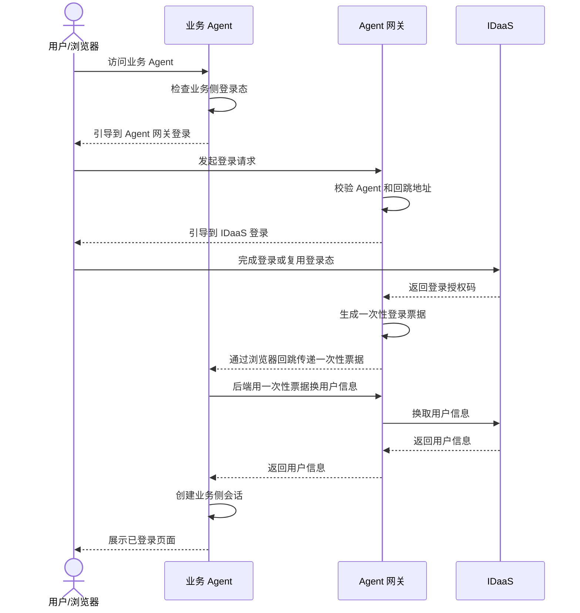
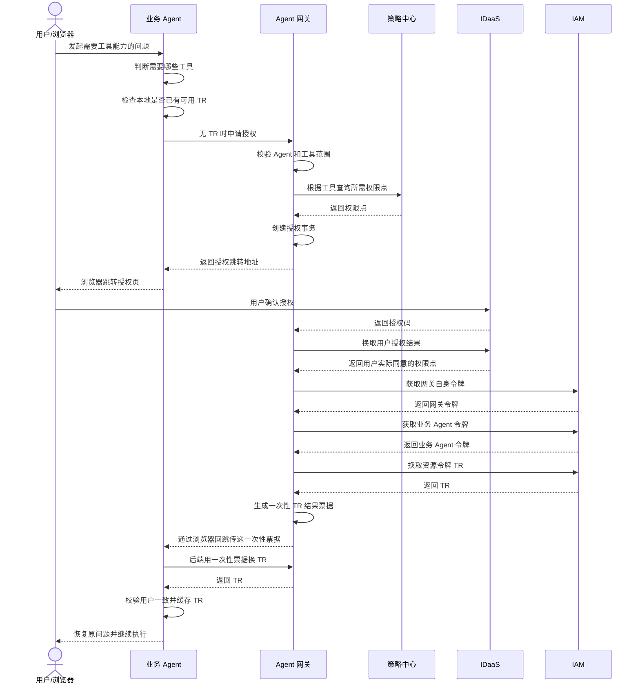
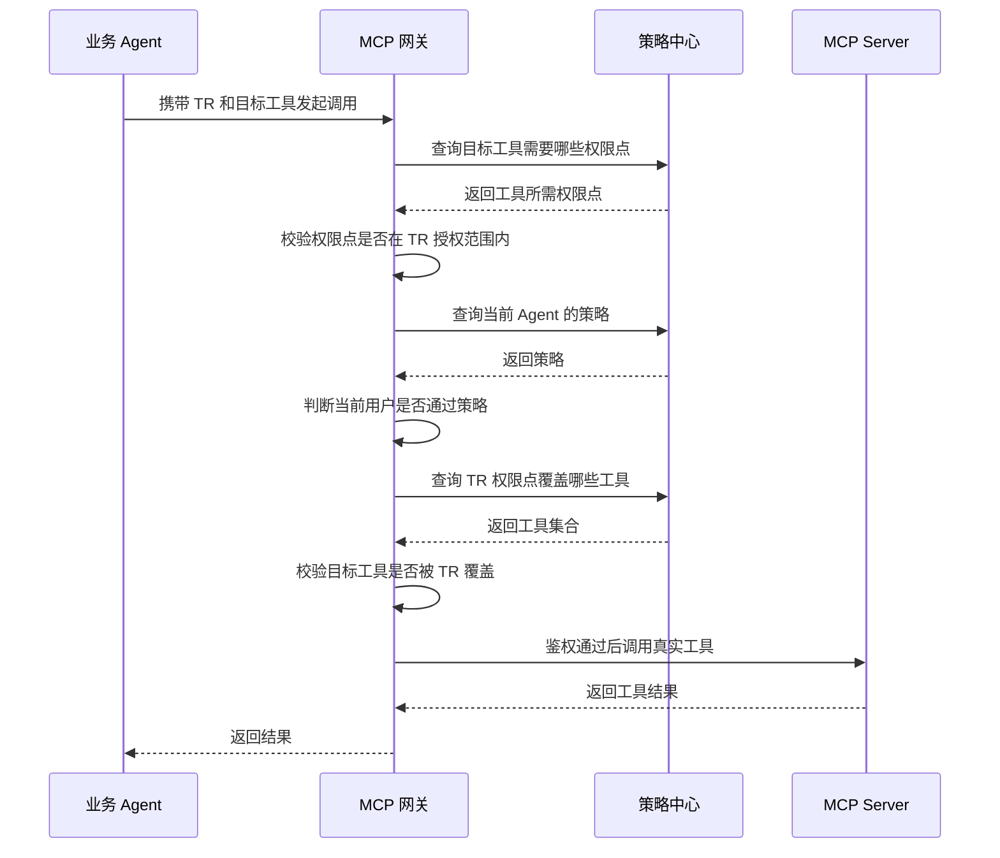
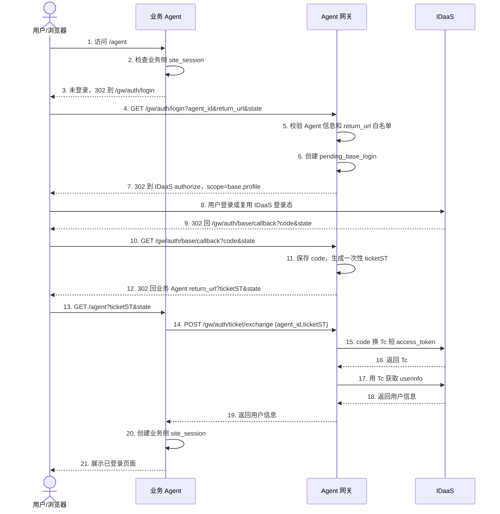
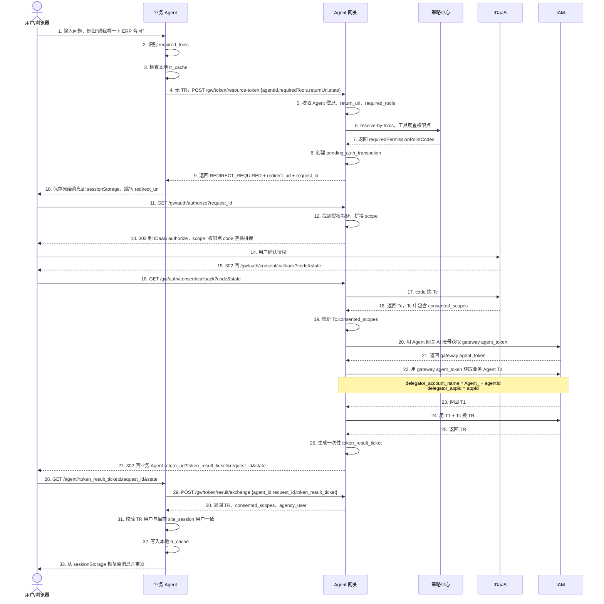
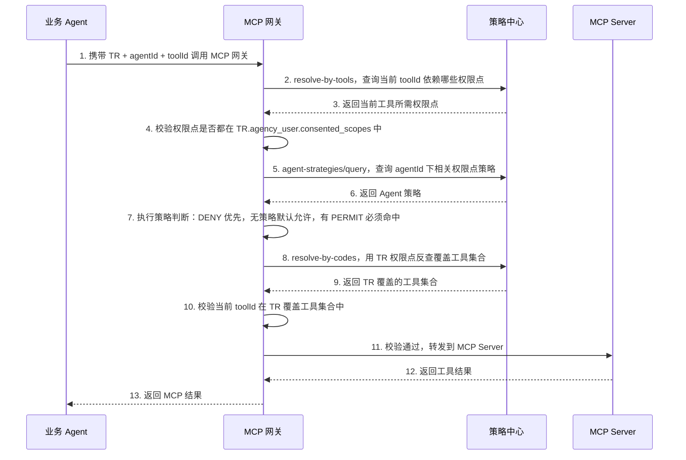

# 登录鉴权流程领导讲解版

本文用于会议讲解 Agent 网关登录、授权、获取 `TR`、运行时鉴权的主流程。

一句话主线：

业务 Agent 维护自己的登录会话，IDaaS 负责用户登录和授权确认，Agent 网关负责安全编排和换取令牌，MCP 网关负责最终运行时鉴权。

## 角色分工

- 用户/浏览器：负责页面访问、登录确认、授权确认，不直接接触 `Tc`、`TR` 等敏感令牌。
- 业务 Agent：维护业务侧 `site_session`，保存本地 `tr_cache`，根据用户消息判断需要调用哪些 MCP 工具。
- Agent 网关：校验 Agent 信息和回跳地址，编排 IDaaS/IAM 流程，使用一次性票据把敏感结果交给业务 Agent 后端。
- IDaaS：负责用户登录态判断、登录页、授权页、`code -> Tc`、用户信息查询。
- IAM：负责三段式令牌链路：网关自身 `agent_token`、业务 Agent `T1`、资源令牌 `TR`。
- 策略中心：维护权限点、权限点与工具映射、Agent 策略。
- MCP 网关：运行时校验 `TR.agency_user.consented_scopes`、Agent 策略和工具覆盖关系。
- MCP Server：真正执行业务工具调用。

## 简化版图一：登录建会话



## 简化版图二：授权并换取 TR



## 简化版图三：MCP 运行时鉴权



## 图一：登录建会话

这张图只讲“用户如何登录业务 Agent”。核心点是：浏览器只拿到一次性 `ticketST`，业务 Agent 后端再用它换用户信息，最终由业务 Agent 创建自己的 `site_session`。



## 图二：授权并换取 TR

这张图只讲“用户要调用工具时，业务 Agent 如何拿到 `TR`”。核心点是：用户同意授权后，浏览器也不接触 `TR`，只拿到一次性 `token_result_ticket`。



## 图三：MCP 运行时鉴权

这张图只讲“拿到 `TR` 后，MCP 网关如何判断工具能不能真正调用”。核心点是：运行时不是只看 `TR`，还要结合 Agent 策略和工具映射做最终校验。



## 讲解重点

### 1. 为什么要引入一次性票据

浏览器 URL 中不出现 `Tc`、`TR`、用户信息、`gw_session_token` 这类敏感数据。

登录完成后，Agent 网关只把一次性 `ticketST` 放到 URL 中。业务 Agent 后端拿 `ticketST` 向 Agent 网关换用户信息，然后创建自己的 `site_session`。

授权完成后，Agent 网关只把一次性 `token_result_ticket` 放到 URL 中。业务 Agent 后端拿 `token_result_ticket` 向 Agent 网关换 `TR`，再写入自己的 `tr_cache`。

### 2. 为什么 Agent 网关不维护用户长期登录态

用户是否已经登录，由 IDaaS 判断。

业务 Agent 是否已经有自己的登录会话，由业务 Agent 的 `site_session` 判断。

Agent 网关只维护短事务和一次性票据，不长期保存用户登录态，也不替业务 Agent 管理会话。

### 3. TR 和策略分别解决什么问题

`TR` 是用户授权给 Agent 的权限上限，表示用户同意这个 Agent 可以访问哪些权限点。

Agent 策略是 Agent 应用所有者对不同用户开放功能的二次控制，例如某些用户不能使用某个权限点对应的能力。

最终 MCP 工具能不能调用，需要同时满足：

- 当前工具依赖的权限点在 `TR.agency_user.consented_scopes` 中。
- 当前用户通过 Agent 策略判断。
- 当前工具属于 `TR` 权限点反查得到的工具集合。

### 4. IAM 三段式令牌关系

第一段：Agent 网关用自己的 AI 账号获取 `gateway agent_token`。

第二段：Agent 网关用 `gateway agent_token` 获取业务 Agent 的 `T1`。

第三段：Agent 网关用业务 Agent 的 `T1` 和用户授权得到的 `Tc` 换取 `TR`。

其中业务 Agent 的 IAM AI 账号名规则为：

```text
delegator_account_name = Agent_ + agentId
delegator_appid = appId
```

## 汇报版总结

这套方案把登录、授权、令牌、运行时鉴权拆成清晰边界：

- 登录态归业务 Agent 和 IDaaS 管。
- 授权编排归 Agent 网关管。
- 权限点和策略归策略中心管。
- 最终工具调用裁决归 MCP 网关管。

核心安全收益是：敏感令牌不进浏览器 URL，业务 Agent 后端通过一次性票据换取结果；运行时不只看 `TR`，还会结合 Agent 策略和工具映射做最终校验。
