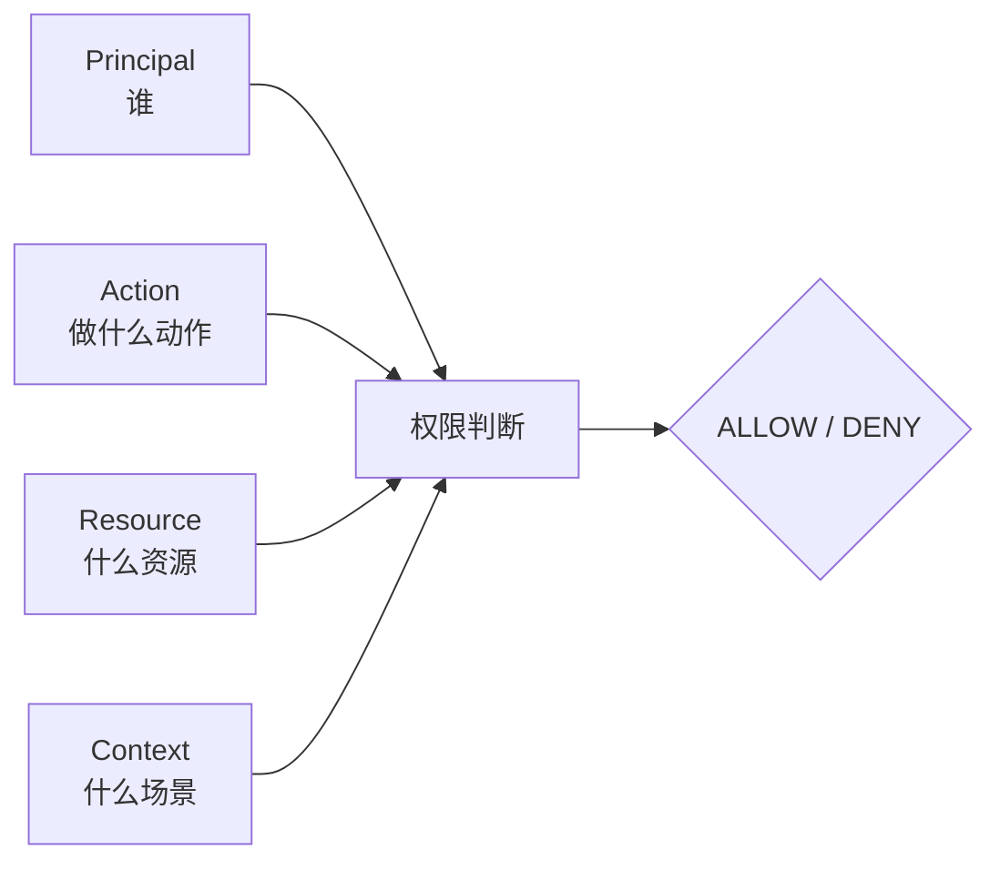
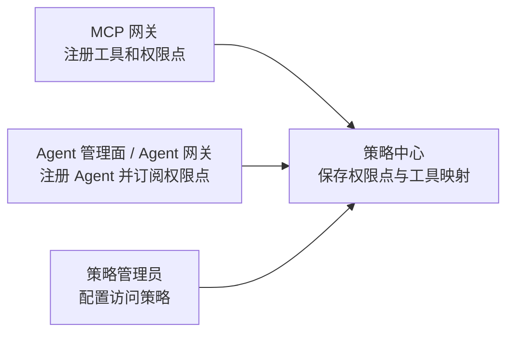
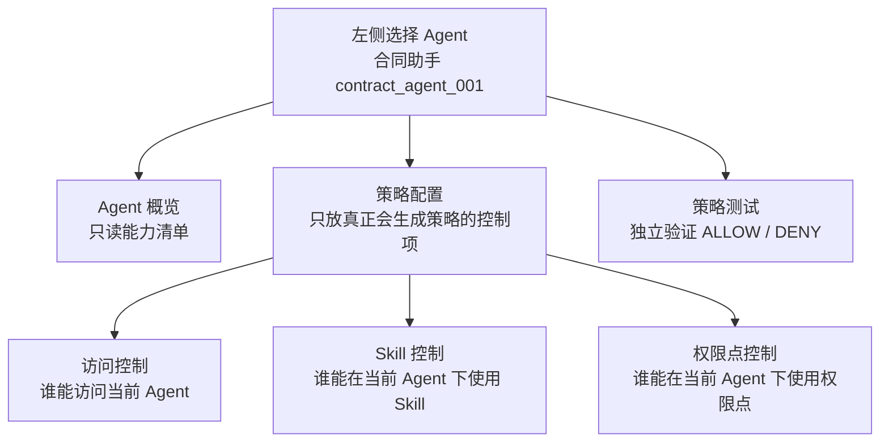
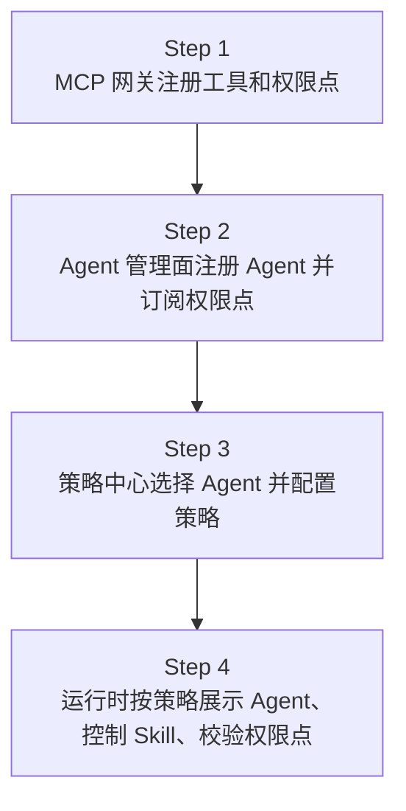
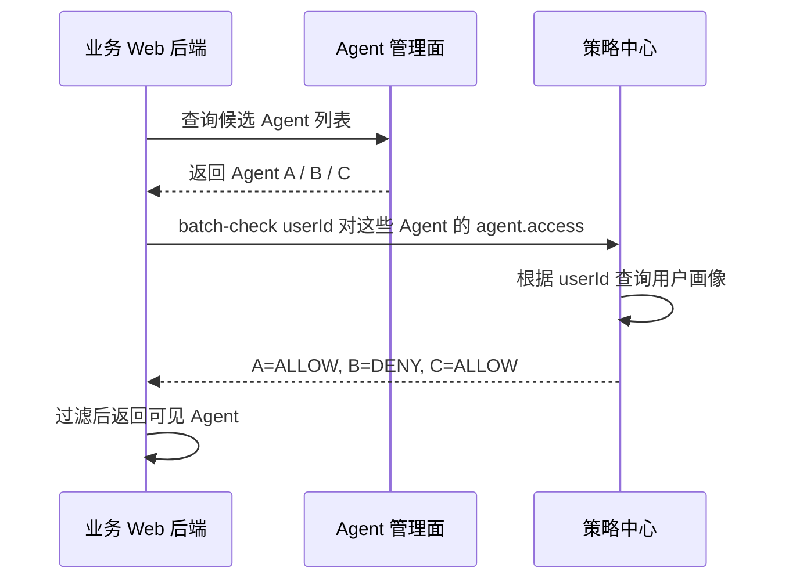
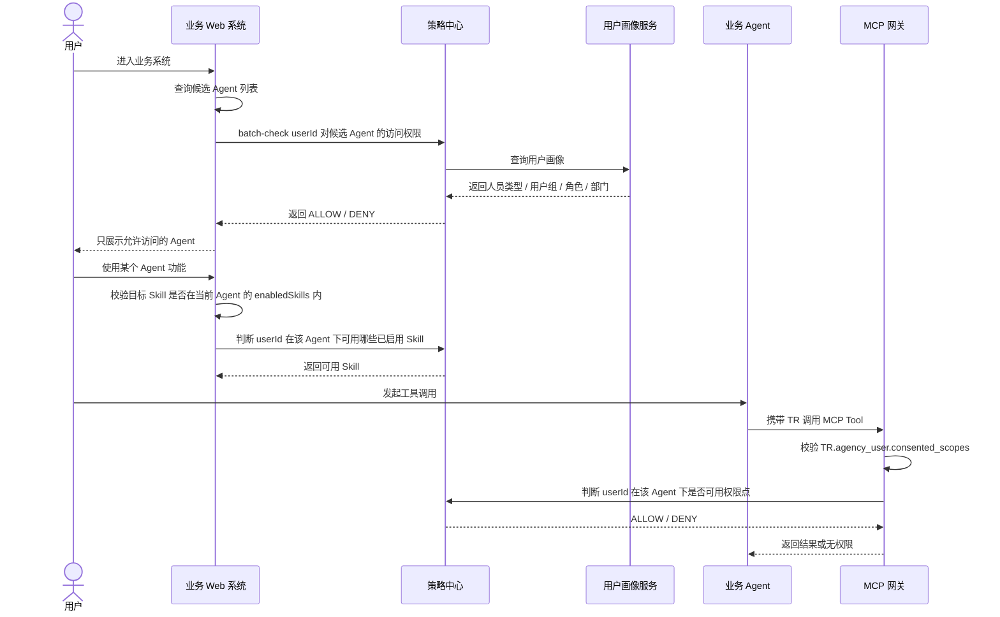

# 通用权限模型与管理员旅程

策略中心统一回答：谁，在什么场景下，能不能执行某个动作，并作用到某个资源。

本文用于说明策略中心从当前“Agent + 权限点策略”向通用权限管理演进的模型和管理员操作旅程。当前 `05_策略中心设计.md` 仍描述已落地的权限点、Agent 订阅和策略模型；本文描述下一阶段如何把 Agent、Skill、权限点、MCP 工具统一纳入一套权限判断心智。

本文同时明确一个重要分层：`enabledSkills` 和 `subscribedPermissionPoints` 是 Agent 注册或 Agent 管理面维护的静态能力清单；策略中心策略只在这些能力边界内，控制“谁能使用”。

## 1. 一句话理解这套模型

通用权限模型不是让管理员去写复杂 JSON，而是把所有权限问题都统一成一个判断：

```text
Principal 主体 + Action 动作 + Resource 资源 + Context 场景 => ALLOW / DENY
```

例如：

```text
用户 Y30037812 能不能访问合同助手？
Principal = USER:Y30037812
Action = agent.access
Resource = AGENT:contract_agent_001
```

```text
用户 Y30037812 能不能在合同助手下使用合同总结 Skill？
Principal = USER:Y30037812
Action = skill.invoke
Resource = SKILL:contract_summary
Context = agentId:contract_agent_001
```

```text
用户 Y30037812 能不能在合同助手下使用合同权限点？
Principal = USER:Y30037812
Action = permissionPoint.use
Resource = PERMISSION_POINT:erp:contract:r
Context = agentId:contract_agent_001
```

管理面上不要求管理员理解 `context.agentId`。管理员只需要先选择一个 Agent，后续所有策略都自动围绕这个 Agent 生效。

## 2. 为什么需要通用权限模型

当前策略中心已经可以管理：

- Agent 是否订阅某个权限点。
- 某个人在某个 Agent 下，是否可以使用某个权限点。
- MCP 网关运行时基于 `TR.agency_user.consented_scopes` 和策略中心结果做最终裁决。

但业务继续发展后，还会出现更多问题：

- 某个人是否可以访问某个 Agent。
- 某个人是否可以在某个 Agent 下使用某个 Skill。
- 某个人是否可以在某个 Agent 下触发某个 MCP 工具。

如果每出现一种对象就单独设计一套权限表和接口，策略中心会越来越碎。因此下一阶段建议收口成统一模型。

## 3. 策略中心统一模型



建模和页面操作都建议先确定 `Action`，再选择 `Resource`。原因是动作会决定可选资源范围：选择 `agent.access` 时资源只能是 Agent，选择 `skill.invoke` 时资源只能是当前 Agent 已启用的 Skill，选择 `permissionPoint.use` 时资源只能是当前 Agent 已订阅的权限点。

举一个完整例子：管理员想配置“用户 `Y30037812` 不允许在合同助手下使用某个权限点”。

| 属性 | 示例值 | 含义 |
| --- | --- | --- |
| `Principal` | `USER:Y30037812` | 谁发起使用，这里是具体用户 `Y30037812`。 |
| `Action` | `permissionPoint.use` | 要做什么动作，这里是使用权限点。 |
| `Resource` | `PERMISSION_POINT:erp:contract:r` | 要使用什么资源，这里是 ERP 合同可读权限点。 |
| `Context` | `agentId=contract_agent_001` | 这次判断发生在哪个 Agent 场景下，这里是合同助手。 |

底层策略可以表达为：

```json
{
  "principal": {
    "type": "USER",
    "id": "Y30037812"
  },
  "action": "permissionPoint.use",
  "resource": {
    "type": "PERMISSION_POINT",
    "id": "erp:contract:r"
  },
  "context": {
    "agentId": "contract_agent_001",
    "enterprise": "11111111111111111111111111111111"
  },
  "effect": "DENY"
}
```

策略中心收到权限点使用判断请求时，会把这四部分放在一起判断；如果命中这条 `DENY`，就返回 `DENY`，MCP 网关拒绝本次合同权限点对应工具的调用。

### Principal：谁

`Principal` 表示发起动作的主体。

| 类型 | 说明 |
| --- | --- |
| `USER` | 具体用户，例如 `Y30037812`。 |
| `USER_GROUP` | 用户组，例如财务组、法务组。 |
| `ROLE` | 角色，例如管理员、审计员。 |
| `AGENT` | Agent 自身。当前阶段主要用于表达系统主体，是否启用 Skill 仍由 Agent 管理面维护。 |

对外调用策略中心时，业务方只需要传 `principal.type + principal.id`。

```json
{
  "principal": {
    "type": "USER",
    "id": "Y30037812"
  }
}
```

业务 Web 或业务 Agent 不需要传 `employeeType`、`groups`、`roles`、`department` 这类用户属性。策略中心如果需要这些信息，应通过内部 `UserProfileResolver` 查询统一用户中心、组织中心或角色系统后再做条件匹配。

这样可以避免两个问题：

- 接入方不需要理解策略中心需要哪些用户属性。
- 用户属性不从浏览器或业务方透传，避免被伪造。

### Action：做什么动作

`Action` 表示主体想做的动作。策略中心先看动作，再确定这个动作下允许选择哪些资源。

| 动作 | 可选资源范围 | 说明 |
| --- | --- |
| `agent.access` | `AGENT` | 访问或展示某个 Agent。 |
| `skill.invoke` | `SKILL` | 调用某个 Skill。 |
| `permissionPoint.use` | `PERMISSION_POINT` | 在某个 Agent 场景下使用某个权限点。 |
| `tool.invoke` | `MCP_TOOL` | 调用某个 MCP 工具。 |

管理面不建议让管理员手填 `Action`。在 Agent 优先页面里，管理员点进“访问控制”时，页面自动使用 `agent.access`；点进“Skill 控制”时，页面自动使用 `skill.invoke`；点进“权限点控制”时，页面自动使用 `permissionPoint.use`。

### Resource：什么资源

`Resource` 表示被访问、被调用或被管理的对象。

| 类型 | 说明 |
| --- | --- |
| `AGENT` | 所有业务 Agent 都是平铺的 `AGENT`。策略中心不区分父子 Agent。 |
| `SKILL` | Agent 可调用的能力，例如合同总结、发票校验。 |
| `PERMISSION_POINT` | MCP 工具背后的权限点，例如 `erp:contract:r`。 |
| `MCP_TOOL` | MCP 工具，例如 `mcp:contract-server/get_contract`。 |

Web 门面不是 Agent，也不进入策略中心资源模型。它只是业务后端系统，负责拿候选 Agent 或候选功能列表，再调用策略中心做过滤。

当前阶段不建议把“Agent 是否能调用 Skill”作为主策略来配置。Agent 能使用哪些 Skill 应由 Agent 注册或 Agent 管理面维护为 `enabledSkills`；策略中心只控制用户是否能在该 Agent 下使用这些已启用 Skill。

### Context：什么场景

`Context` 表示本次判断的上下文。最重要的是 `agentId`。

```json
{
  "context": {
    "agentId": "contract_agent_001"
  }
}
```

`context.agentId` 的含义是：这次权限判断发生在哪个 Agent 场景下。

例如同一个 `erp:contract:r` 权限点，可以在合同助手下允许，在另一个 Agent 下拒绝。管理面会把当前选中的 Agent 自动写入 `context.agentId`，管理员不需要手动填写。

## 4. 未命中策略时：OPEN 和 RESTRICTED

`OPEN / RESTRICTED` 不是单条策略的字段，而是某个管控目标在“没有命中任何策略”时的默认裁决。

管控目标由三部分确定：

```text
Context + Action + Resource
```

在管理页面上，管理员不需要进入单独页面批量维护它；选择某个 Agent、某个控制入口和某个资源后，页面只在资源旁边提示：

```text
未命中策略时：默认允许 / 默认拒绝
```

如果需要修改，管理员可以在该提示旁边直接调整当前资源的默认裁决模式。

### OPEN：默认开放

`OPEN` 表示未命中任何策略时默认允许，适合普通 Agent、普通 Skill 或普通权限点。

```text
OPEN + 无策略 = 允许
OPEN + 命中 DENY = 拒绝
```

典型场景：

```text
合同助手大部分员工都能用，只想禁止外包。
配置：合同助手 = OPEN，再加一条外包 DENY 策略。
```

### RESTRICTED：默认受控

`RESTRICTED` 表示未命中任何策略时默认拒绝，适合敏感 Agent、敏感 Skill 或敏感权限点。

```text
RESTRICTED + 无策略 = 拒绝
RESTRICTED + 命中 PERMIT = 允许
RESTRICTED + 命中 DENY = 拒绝
```

典型场景：

```text
发票助手只有财务组能用。
配置：发票助手 = RESTRICTED，再加一条财务组 PERMIT 策略。
```

无论 `OPEN` 还是 `RESTRICTED`，`DENY` 永远优先。

### 与 Cedar 兼容的内部 JSON 形态

为了后续平滑接入 Cedar，策略中心内部建议从现在开始保持一层稳定的结构化 JSON，不让页面直接生成 Cedar 表达式。页面表单只负责生成下面两类对象。

第一类是管控目标，用来描述“某个 Agent 场景下，对某类资源执行某个动作时，未命中策略应该怎么裁决”：

```json
{
  "targetId": "target_contract_agent_permission_erp_contract_r",
  "enterprise": "11111111111111111111111111111111",
  "action": "permissionPoint.use",
  "resource": {
    "type": "PERMISSION_POINT",
    "id": "erp:contract:r"
  },
  "context": {
    "agentId": "contract_agent_001"
  },
  "accessMode": "OPEN"
}
```

第二类是具体策略，用来描述该目标下的黑名单或白名单规则：

```json
{
  "policyId": "policy_deny_y30037812_contract_r",
  "targetId": "target_contract_agent_permission_erp_contract_r",
  "principal": {
    "type": "USER",
    "id": "Y30037812"
  },
  "effect": "DENY",
  "condition": null,
  "status": "ACTIVE"
}
```

这样做的好处是：短期可以由策略中心自己执行这套 JSON；未来如果接入 Cedar，只需要把这层 JSON 编译成 Cedar policy、schema、entities 和 request，不需要重做管理页面。

## 5. 三个管理入口的职责

通用权限模型不要求所有东西都在策略中心创建。推荐继续保留三个管理入口，各做自己最擅长的事。



### MCP 网关

MCP 网关负责定义资源能力：

- 注册 MCP 工具。
- 创建权限点。
- 维护权限点和 MCP 工具的映射。
- 将权限点、工具和映射关系上报策略中心。

示例：

```text
工具：mcp:contract-server/get_contract
权限点：erp:contract:r
含义：ERP 合同的可读权限
映射：erp:contract:r 覆盖 mcp:contract-server/get_contract
```

### Agent 管理面 / Agent 网关

Agent 管理面或 Agent 网关负责 Agent 接入：

- 注册 Agent。
- 配置 Agent 的回跳域名。
- 配置 Agent 可订阅的权限点。
- 配置 Agent 已启用的 Skill。
- 将 Agent 的权限点订阅关系和 Skill 能力清单同步到策略中心。

示例：

```text
Agent：合同助手
agentId：contract_agent_001
订阅权限点：
- erp:contract:r
- erp:invoice:r
已启用 Skill：
- contract_summary
```

订阅权限点和已启用 Skill 都表示 Agent 的能力边界：

- `subscribedPermissionPoints` 表示这个 Agent 最多能向用户申请哪些权限点。
- `enabledSkills` 表示这个 Agent 最多能使用哪些 Skill。

能力边界不代表用户已经授权，也不代表所有用户都能使用。用户最终能不能用，还要看 TR 和策略判断。

### 策略中心

策略中心负责使用规则：

- 哪些用户可以访问哪些 Agent。
- 哪些用户可以在某个 Agent 下使用哪些 Skill。
- 哪些用户可以在某个 Agent 下使用哪些权限点。

## 6. 管理员真实操作路径

策略中心管理面建议采用“Agent 优先”的操作心智。

```text
策略中心
  -> Agent 权限管理
  -> 选择一个 Agent
  -> 先看该 Agent 的能力清单
  -> 配置访问控制、Skill 控制、权限点控制
  -> 使用策略测试验证结果
```

管理员不是进入一个全局策略列表到处填写 `agentId`，而是先选择要管理的 Agent。



### 页面区域建议

| 区域 | 作用 |
| --- | --- |
| 左侧 Agent 列表 | 选择当前要管理的 Agent。 |
| 顶部 Agent 概览 | 展示 Agent 名称、`agentId`、已启用 Skill、订阅权限点等只读能力清单，来源于 Agent 注册面或同步数据。 |
| 策略配置 | 只承载真正会生成策略的配置项，建议做成三个 Tab：访问控制、Skill 控制、权限点控制。每个 Tab 会自动确定 `Action`，再按 `Action` 筛选可选 `Resource`。 |
| 访问控制 | 配置谁能访问当前 Agent。 |
| Skill 控制 | 配置谁能在当前 Agent 下使用某个 Skill。 |
| 权限点控制 | 配置谁能在当前 Agent 下使用某个权限点。 |
| 策略测试 | 独立区域。输入 `userId` 和目标资源，查看最终 `ALLOW / DENY`，用于验证策略效果，不直接创建策略。 |

策略配置区选择具体资源后，只需要在资源旁轻量展示当前默认裁决模式，例如“未命中策略时：默认允许”。如果管理员要修改，就在这个提示旁边提供修改入口；不要把 `OPEN / RESTRICTED` 做成一个占用大量页面空间的独立配置模块。

这样页面上会形成三个清晰层次：

```text
Agent 概览：我正在管哪个 Agent，它有哪些能力。
策略配置：我要限制谁使用这些能力。
策略测试：我配置完后，某个用户最终能不能用。
```

底层策略仍然会生成统一模型。例如管理员在合同助手的“权限点控制”里配置“禁止用户 Y30037812 使用 ERP 合同可读权限”，底层策略是：

```json
{
  "principal": {
    "type": "USER",
    "id": "Y30037812"
  },
  "action": "permissionPoint.use",
  "resource": {
    "type": "PERMISSION_POINT",
    "id": "erp:contract:r"
  },
  "context": {
    "agentId": "contract_agent_001"
  },
  "effect": "DENY"
}
```

管理员看到的是“当前正在配置合同助手”，不需要理解 `context.agentId`。

## 7. 业务管理员完整操作旅程



### Step 1：在 MCP 网关注册工具和权限点

业务管理员或 MCP 管理员先在 MCP 网关创建工具：

```text
toolId：mcp:contract-server/get_contract
displayNameZh：查询合同详情
```

再创建权限点：

```text
permissionPointCode：erp:contract:r
displayNameZh：ERP 合同的可读权限
description：允许读取 ERP 合同数据
boundTools：
- mcp:contract-server/get_contract
```

MCP 网关将这些信息上报策略中心。之后策略中心就知道：调用 `mcp:contract-server/get_contract` 需要 `erp:contract:r`。

### Step 2：在 Agent 管理面注册 Agent 并订阅权限点

业务管理员在 Agent 管理面注册 Agent：

```text
agentId：contract_agent_001
agentName：合同助手
accessMode：OPEN
allowedReturnHosts：
- contract.example.com
subscriptionPermissionPoints：
- erp:contract:r
- erp:invoice:r
enabledSkills：
- contract_summary
```

Agent 管理面或 Agent 网关将权限点订阅关系和 Skill 能力清单同步给策略中心。之后 Agent 网关在申请 TR 时，可以校验当前 Agent 是否订阅了本次工具所需权限点；业务 Web 或 Skill 网关做 Skill 展示和调用前，也可以先校验目标 Skill 是否在该 Agent 的 `enabledSkills` 内。

### Step 3：在策略中心选择 Agent 并配置策略

管理员进入：

```text
策略中心 -> Agent 权限管理 -> 合同助手
```

然后根据需求配置：

- 访问控制：谁能访问合同助手。
- Skill 控制：谁能使用合同助手下的合同总结 Skill。
- 权限点控制：谁能使用合同助手订阅的 `erp:contract:r`。

### Step 4：运行时按策略展示和调用

业务 Web 系统进入页面时，先从 Agent 管理面拿到自己准备展示的候选 Agent 列表，然后调用策略中心批量判断当前用户可访问哪些 Agent。Web 系统只展示允许访问的 Agent。

用户真正调用 MCP 工具时，MCP 网关仍然先校验 `TR.agency_user.consented_scopes`，再调用策略中心判断当前用户在当前 Agent 下是否允许使用对应权限点。

## 8. 典型策略配置示例

### 不限制 Agent

如果某个 Agent 企业内所有用户都可以访问，可以使用 `OPEN` 模式并且不配置策略。

```text
Agent：合同助手
未命中策略时：默认允许
策略：无
结果：默认允许
```

### 禁止外包访问当前 Agent

页面操作：

```text
Agent 权限管理 -> 合同助手 -> 访问控制 -> 新建策略
主体：用户属性 employeeType = WX
动作：agent.access
资源：当前 Agent
效果：DENY
```

底层策略：

```json
{
  "principal": {
    "type": "USER",
    "selector": {
      "field": "principal.employeeType",
      "operator": "equals",
      "values": ["WX"]
    }
  },
  "action": "agent.access",
  "resource": {
    "type": "AGENT",
    "id": "contract_agent_001"
  },
  "context": {
    "agentId": "contract_agent_001"
  },
  "effect": "DENY"
}
```

`principal.employeeType` 由策略中心通过 `UserProfileResolver` 查询，不由业务方传入。

### 仅允许财务组访问当前 Agent

页面操作：

```text
Agent 权限管理 -> 发票助手 -> 访问控制 -> 新建策略
主体：用户组 finance_group
动作：agent.access
资源：当前 Agent
效果：PERMIT
```

适合配合：

```text
发票助手未命中策略时：默认拒绝
```

底层策略：

```json
{
  "principal": {
    "type": "USER_GROUP",
    "id": "finance_group"
  },
  "action": "agent.access",
  "resource": {
    "type": "AGENT",
    "id": "invoice_agent_001"
  },
  "context": {
    "agentId": "invoice_agent_001"
  },
  "effect": "PERMIT"
}
```

### 禁止某人在当前 Agent 下使用某权限点

页面操作：

```text
Agent 权限管理 -> 合同助手 -> 权限点控制 -> 新建策略
主体：用户 Y30037812
动作：permissionPoint.use
资源：erp:contract:r
效果：DENY
```

底层策略：

```json
{
  "principal": {
    "type": "USER",
    "id": "Y30037812"
  },
  "action": "permissionPoint.use",
  "resource": {
    "type": "PERMISSION_POINT",
    "id": "erp:contract:r"
  },
  "context": {
    "agentId": "contract_agent_001"
  },
  "effect": "DENY"
}
```

### 限制某人在当前 Agent 下使用 Skill

页面操作：

```text
Agent 权限管理 -> 合同助手 -> Skill 控制 -> 新建策略
主体：用户属性 employeeType = REGULAR
动作：skill.invoke
资源：contract_summary
效果：PERMIT
```

底层策略：

```json
{
  "principal": {
    "type": "USER",
    "selector": {
      "field": "principal.employeeType",
      "operator": "equals",
      "values": ["REGULAR"]
    }
  },
  "action": "skill.invoke",
  "resource": {
    "type": "SKILL",
    "id": "contract_summary"
  },
  "context": {
    "agentId": "contract_agent_001"
  },
  "effect": "PERMIT"
}
```

### Agent 启用 Skill 不是策略

如果要让合同助手具备合同总结能力，应在 Agent 管理面配置：

```text
Agent：合同助手
enabledSkills：
- contract_summary
```

这表示合同助手的静态能力清单里包含 `contract_summary`。策略中心后续只负责判断“某个用户能不能在合同助手下使用 `contract_summary`”，不通过策略来表达“合同助手是否绑定了这个 Skill”。

## 9. 业务 Web 如何查询当前用户可见 Agent

业务 Web 不应该让策略中心直接返回全量 Agent。推荐流程是：

```text
1. 业务 Web 或业务后端先从 Agent 管理面拿候选 Agent 列表。
2. 业务 Web 后端调用策略中心 batch-check。
3. 策略中心返回每个 Agent 的 ALLOW / DENY。
4. 业务 Web 只展示 ALLOW 的 Agent。
```



接口示例：

```http
POST /internal/v1/authz/batch-check
Content-Type: application/json
```

请求体：

```json
{
  "enterprise": "11111111111111111111111111111111",
  "principal": {
    "type": "USER",
    "id": "Y30037812"
  },
  "checks": [
    {
      "action": "agent.access",
      "resource": {
        "type": "AGENT",
        "id": "contract_agent_001"
      }
    },
    {
      "action": "agent.access",
      "resource": {
        "type": "AGENT",
        "id": "invoice_agent_001"
      }
    },
    {
      "action": "agent.access",
      "resource": {
        "type": "AGENT",
        "id": "report_agent_001"
      }
    }
  ]
}
```

策略中心内部处理：

```text
1. 根据 principal.id 查询用户画像。
2. 得到人员类型、用户组、角色、部门等属性。
3. 按每个 check 匹配策略。
4. 返回 ALLOW / DENY 和原因。
```

响应示例：

```json
{
  "results": [
    {
      "action": "agent.access",
      "resource": {
        "type": "AGENT",
        "id": "contract_agent_001"
      },
      "decision": "ALLOW",
      "reason": "RESOURCE_OPEN_NO_DENY"
    },
    {
      "action": "agent.access",
      "resource": {
        "type": "AGENT",
        "id": "invoice_agent_001"
      },
      "decision": "ALLOW",
      "reason": "MATCHED_PERMIT_POLICY"
    },
    {
      "action": "agent.access",
      "resource": {
        "type": "AGENT",
        "id": "report_agent_001"
      },
      "decision": "DENY",
      "reason": "MATCHED_DENY_POLICY"
    }
  ]
}
```

## 10. 运行时生效链路



运行时要注意：业务 Web 系统可以调用策略中心做页面展示过滤，但真正调用 MCP 工具时，MCP 网关仍必须执行最终运行时校验。

## 11. 关键原则

- Web 门面不进策略中心，它只是普通业务后端系统。
- Agent 不分父子，全部按普通 `AGENT` 管理。
- 管理员先选 Agent，再配置该 Agent 的访问控制、Skill 控制和权限点控制。
- 业务系统自己决定候选 Agent 和候选功能列表，策略中心只负责判断是否允许。
- 业务方调用策略中心只传 `principal.type + principal.id`，不传用户属性。
- 用户人员类型、角色、部门、用户组由策略中心通过 `UserProfileResolver` 查询。
- MCP 网关负责工具和权限点映射。
- Agent 管理面或 Agent 网关负责 Agent 注册、权限点订阅和 Skill 启用清单。
- 策略中心负责用户、Agent、Skill、权限点之间的使用规则。
- `enabledSkills` 和 `subscribedPermissionPoints` 是 Agent 的能力边界，策略只能在能力边界内限制用户使用。
- `TR` 是用户授权给 Agent 的资源上限，策略中心不能扩权。
- 策略中心可以在 `TR` 已授权范围内进一步限制 Agent、Skill、权限点的使用。
- 不想限制的 Agent 或 Skill 保持 `OPEN`；敏感 Agent 或 Skill 使用 `RESTRICTED`。
- MCP 工具运行时必须同时满足：Agent 订阅权限点、`TR` 包含权限点、策略中心放行、工具属于权限点覆盖范围。
