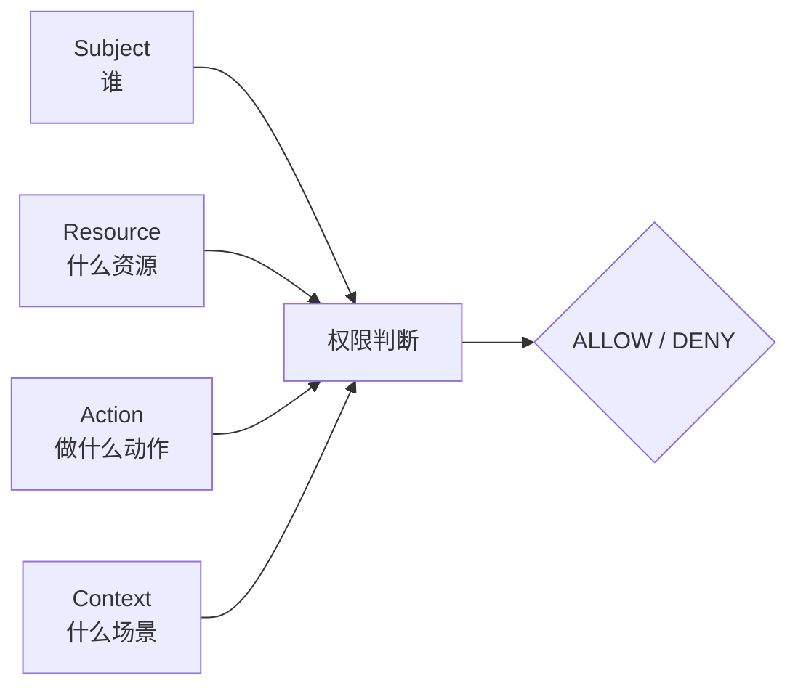
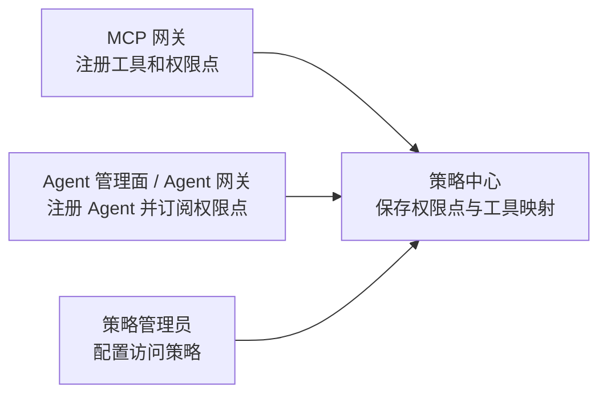
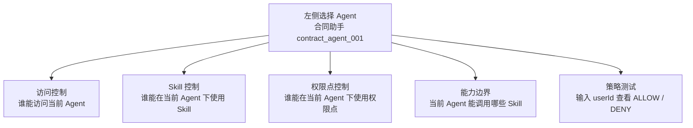
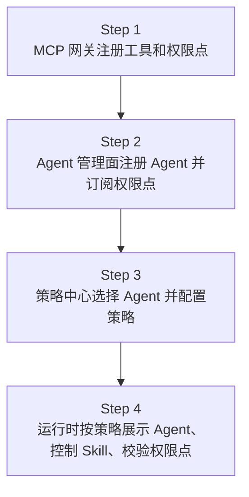
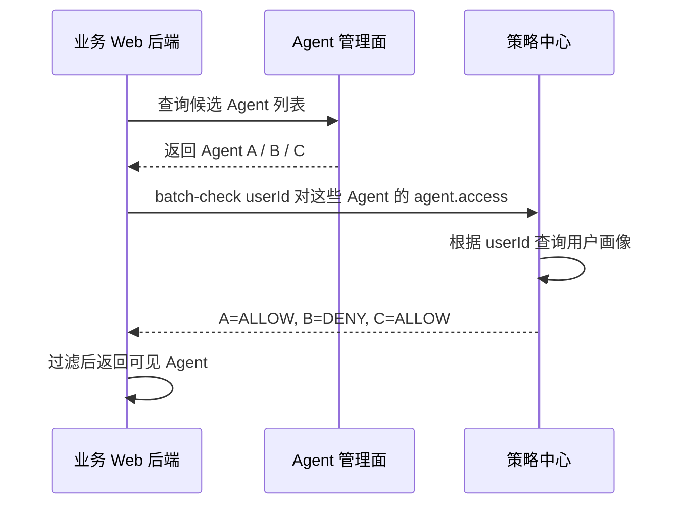
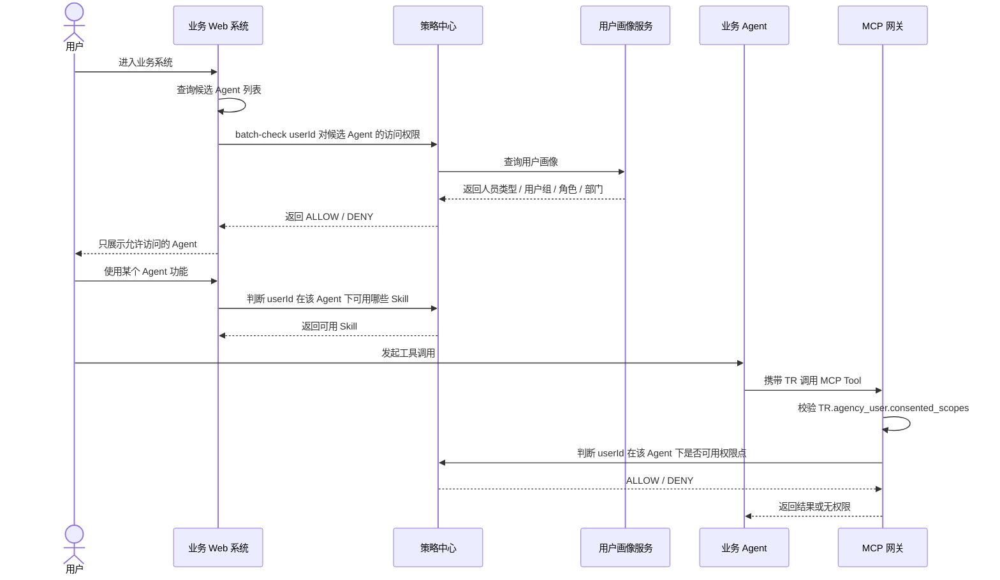

# 通用权限模型与管理员旅程

策略中心统一回答：谁，在什么场景下，能不能对某个资源执行某个动作。

本文用于说明策略中心从当前“Agent + 权限点策略”向通用权限管理演进的模型和管理员操作旅程。当前 `05_策略中心设计.md` 仍描述已落地的权限点、Agent 订阅和策略模型；本文描述下一阶段如何把 Agent、Skill、权限点、MCP 工具统一纳入一套权限判断心智。

## 1. 一句话理解这套模型

通用权限模型不是让管理员去写复杂 JSON，而是把所有权限问题都统一成一个判断：

```text
Subject 主体 + Resource 资源 + Action 动作 + Context 场景 => ALLOW / DENY
```

例如：

```text
用户 Y30037812 能不能访问合同助手？
Subject = USER:Y30037812
Resource = AGENT:contract_agent_001
Action = agent.access
```

```text
用户 Y30037812 能不能在合同助手下使用合同总结 Skill？
Subject = USER:Y30037812
Resource = SKILL:contract_summary
Action = skill.invoke
Context = agentId:contract_agent_001
```

```text
用户 Y30037812 能不能在合同助手下使用合同权限点？
Subject = USER:Y30037812
Resource = PERMISSION_POINT:erp:contract:r
Action = permissionPoint.use
Context = agentId:contract_agent_001
```

管理面上不要求管理员理解 `context.agentId`。管理员只需要先选择一个 Agent，后续所有策略都自动围绕这个 Agent 生效。

## 2. 为什么需要通用权限模型

当前策略中心已经可以管理：

- Agent 是否订阅某个权限点。
- 某个人在某个 Agent 下，是否可以使用某个权限点。
- MCP 网关运行时基于 `TR.agency_user.consented_scopes` 和策略中心结果做最终裁决。

但业务继续发展后，还会出现更多问题：

- 某个人是否可以访问某个 Agent。
- 某个人是否可以在某个 Agent 下使用某个 Skill。
- 某个 Agent 是否可以调用某个 Skill。
- 某个人是否可以在某个 Agent 下触发某个 MCP 工具。

如果每出现一种对象就单独设计一套权限表和接口，策略中心会越来越碎。因此下一阶段建议收口成统一模型。

## 3. 策略中心统一模型



举一个完整例子：管理员想配置“用户 `Y30037812` 不允许在合同助手下使用某个权限点”。

| 属性 | 示例值 | 含义 |
| --- | --- | --- |
| `Subject` | `USER:Y30037812` | 谁发起使用，这里是具体用户 `Y30037812`。 |
| `Resource` | `PERMISSION_POINT:erp:contract:r` | 要使用什么资源，这里是 ERP 合同可读权限点。 |
| `Action` | `permissionPoint.use` | 要做什么动作，这里是使用权限点。 |
| `Context` | `agentId=contract_agent_001` | 这次判断发生在哪个 Agent 场景下，这里是合同助手。 |

底层策略可以表达为：

```json
{
  "subject": {
    "type": "USER",
    "id": "Y30037812"
  },
  "resource": {
    "type": "PERMISSION_POINT",
    "id": "erp:contract:r"
  },
  "action": "permissionPoint.use",
  "context": {
    "agentId": "contract_agent_001",
    "enterprise": "11111111111111111111111111111111"
  },
  "effect": "DENY"
}
```

策略中心收到权限点使用判断请求时，会把这四部分放在一起判断；如果命中这条 `DENY`，就返回 `DENY`，MCP 网关拒绝本次合同权限点对应工具的调用。

### Subject：谁

`Subject` 表示发起动作的主体。

| 类型 | 说明 |
| --- | --- |
| `USER` | 具体用户，例如 `Y30037812`。 |
| `USER_GROUP` | 用户组，例如财务组、法务组。 |
| `ROLE` | 角色，例如管理员、审计员。 |
| `AGENT` | Agent 自身。Agent 调用 Skill 时，Agent 就是主体。 |

对外调用策略中心时，业务方只需要传 `subject.type + subject.id`。

```json
{
  "subject": {
    "type": "USER",
    "id": "Y30037812"
  }
}
```

业务 Web 或业务 Agent 不需要传 `employeeType`、`groups`、`roles`、`department` 这类用户属性。策略中心如果需要这些信息，应通过内部 `UserProfileResolver` 查询统一用户中心、组织中心或角色系统后再做条件匹配。

这样可以避免两个问题：

- 接入方不需要理解策略中心需要哪些用户属性。
- 用户属性不从浏览器或业务方透传，避免被伪造。

### Resource：什么资源

`Resource` 表示被访问、被调用或被管理的对象。

| 类型 | 说明 |
| --- | --- |
| `AGENT` | 所有业务 Agent 都是平铺的 `AGENT`。策略中心不区分父子 Agent。 |
| `SKILL` | Agent 可调用的能力，例如合同总结、发票校验。 |
| `PERMISSION_POINT` | MCP 工具背后的权限点，例如 `erp:contract:r`。 |
| `MCP_TOOL` | MCP 工具，例如 `mcp:contract-server/get_contract`。 |

Web 门面不是 Agent，也不进入策略中心资源模型。它只是业务后端系统，负责拿候选 Agent 或候选功能列表，再调用策略中心做过滤。

### Action：做什么动作

| 动作 | 说明 |
| --- | --- |
| `agent.access` | 访问或展示某个 Agent。 |
| `skill.invoke` | 调用某个 Skill。 |
| `permissionPoint.use` | 在某个 Agent 场景下使用某个权限点。 |
| `tool.invoke` | 调用某个 MCP 工具。 |

### Context：什么场景

`Context` 表示本次判断的上下文。最重要的是 `agentId`。

```json
{
  "context": {
    "agentId": "contract_agent_001"
  }
}
```

`context.agentId` 的含义是：这次权限判断发生在哪个 Agent 场景下。

例如同一个 `erp:contract:r` 权限点，可以在合同助手下允许，在另一个 Agent 下拒绝。管理面会把当前选中的 Agent 自动写入 `context.agentId`，管理员不需要手动填写。

## 4. 访问模式：OPEN 和 RESTRICTED

Agent 或 Skill 可以有访问模式，用来决定“没有策略时默认怎么处理”。

### OPEN：默认开放

`OPEN` 适合普通 Agent 或普通 Skill。

```text
OPEN + 无策略 = 允许
OPEN + 命中 DENY = 拒绝
```

典型场景：

```text
合同助手大部分员工都能用，只想禁止外包。
配置：合同助手 = OPEN，再加一条外包 DENY 策略。
```

### RESTRICTED：默认受控

`RESTRICTED` 适合敏感 Agent 或敏感 Skill。

```text
RESTRICTED + 无策略 = 拒绝
RESTRICTED + 命中 PERMIT = 允许
RESTRICTED + 命中 DENY = 拒绝
```

典型场景：

```text
发票助手只有财务组能用。
配置：发票助手 = RESTRICTED，再加一条财务组 PERMIT 策略。
```

无论 `OPEN` 还是 `RESTRICTED`，`DENY` 永远优先。

## 5. 三个管理入口的职责

通用权限模型不要求所有东西都在策略中心创建。推荐继续保留三个管理入口，各做自己最擅长的事。



### MCP 网关

MCP 网关负责定义资源能力：

- 注册 MCP 工具。
- 创建权限点。
- 维护权限点和 MCP 工具的映射。
- 将权限点、工具和映射关系上报策略中心。

示例：

```text
工具：mcp:contract-server/get_contract
权限点：erp:contract:r
含义：ERP 合同的可读权限
映射：erp:contract:r 覆盖 mcp:contract-server/get_contract
```

### Agent 管理面 / Agent 网关

Agent 管理面或 Agent 网关负责 Agent 接入：

- 注册 Agent。
- 配置 Agent 的回跳域名。
- 配置 Agent 可订阅的权限点。
- 将 Agent 和权限点订阅关系同步到策略中心。

示例：

```text
Agent：合同助手
agentId：contract_agent_001
订阅权限点：
- erp:contract:r
- erp:invoice:r
```

订阅关系只表示 Agent 的能力边界：这个 Agent 最多能向用户申请这些权限点。它不代表用户已经授权，也不代表所有用户都能使用。

### 策略中心

策略中心负责使用规则：

- 哪些用户可以访问哪些 Agent。
- 哪些用户可以在某个 Agent 下使用哪些 Skill。
- 哪些 Agent 可以调用哪些 Skill。
- 哪些用户可以在某个 Agent 下使用哪些权限点。

## 6. 管理员真实操作路径

策略中心管理面建议采用“Agent 优先”的操作心智。

```text
策略中心
  -> Agent 权限管理
  -> 选择一个 Agent
  -> 配置该 Agent 的访问控制、Skill 控制、权限点控制、能力边界
```

管理员不是进入一个全局策略列表到处填写 `agentId`，而是先选择要管理的 Agent。



### 页面区域建议

| 区域 | 作用 |
| --- | --- |
| 左侧 Agent 列表 | 选择当前要管理的 Agent。 |
| 顶部 Agent 概览 | 展示 Agent 名称、`agentId`、访问模式、已启用 Skill、订阅权限点。 |
| 访问控制 | 配置谁能访问当前 Agent。 |
| Skill 控制 | 配置谁能在当前 Agent 下使用某个 Skill。 |
| 权限点控制 | 配置谁能在当前 Agent 下使用某个权限点。 |
| 能力边界 | 配置当前 Agent 自身能调用哪些 Skill。 |
| 策略测试 | 输入 `userId` 和目标资源，查看最终 `ALLOW / DENY`。 |

底层策略仍然会生成统一模型。例如管理员在合同助手的“权限点控制”里配置“禁止用户 Y30037812 使用 ERP 合同可读权限”，底层策略是：

```json
{
  "subject": {
    "type": "USER",
    "id": "Y30037812"
  },
  "resource": {
    "type": "PERMISSION_POINT",
    "id": "erp:contract:r"
  },
  "action": "permissionPoint.use",
  "context": {
    "agentId": "contract_agent_001"
  },
  "effect": "DENY"
}
```

管理员看到的是“当前正在配置合同助手”，不需要理解 `context.agentId`。

## 7. 业务管理员完整操作旅程



### Step 1：在 MCP 网关注册工具和权限点

业务管理员或 MCP 管理员先在 MCP 网关创建工具：

```text
toolId：mcp:contract-server/get_contract
displayNameZh：查询合同详情
```

再创建权限点：

```text
permissionPointCode：erp:contract:r
displayNameZh：ERP 合同的可读权限
description：允许读取 ERP 合同数据
boundTools：
- mcp:contract-server/get_contract
```

MCP 网关将这些信息上报策略中心。之后策略中心就知道：调用 `mcp:contract-server/get_contract` 需要 `erp:contract:r`。

### Step 2：在 Agent 管理面注册 Agent 并订阅权限点

业务管理员在 Agent 管理面注册 Agent：

```text
agentId：contract_agent_001
agentName：合同助手
accessMode：OPEN
allowedReturnHosts：
- contract.example.com
subscriptionPermissionPoints：
- erp:contract:r
- erp:invoice:r
enabledSkills：
- contract_summary
```

Agent 管理面或 Agent 网关将订阅关系同步给策略中心。之后 Agent 网关在申请 TR 时，可以校验当前 Agent 是否订阅了本次工具所需权限点。

### Step 3：在策略中心选择 Agent 并配置策略

管理员进入：

```text
策略中心 -> Agent 权限管理 -> 合同助手
```

然后根据需求配置：

- 访问控制：谁能访问合同助手。
- Skill 控制：谁能使用合同助手下的合同总结 Skill。
- 权限点控制：谁能使用合同助手订阅的 `erp:contract:r`。
- 能力边界：合同助手自身能不能调用某个 Skill。

### Step 4：运行时按策略展示和调用

业务 Web 系统进入页面时，先从 Agent 管理面拿到自己准备展示的候选 Agent 列表，然后调用策略中心批量判断当前用户可访问哪些 Agent。Web 系统只展示允许访问的 Agent。

用户真正调用 MCP 工具时，MCP 网关仍然先校验 `TR.agency_user.consented_scopes`，再调用策略中心判断当前用户在当前 Agent 下是否允许使用对应权限点。

## 8. 典型策略配置示例

### 不限制 Agent

如果某个 Agent 企业内所有用户都可以访问，可以使用 `OPEN` 模式并且不配置策略。

```text
Agent：合同助手
访问模式：OPEN
策略：无
结果：默认允许
```

### 禁止外包访问当前 Agent

页面操作：

```text
Agent 权限管理 -> 合同助手 -> 访问控制 -> 新建策略
主体：用户属性 employeeType = WX
资源：当前 Agent
动作：agent.access
效果：DENY
```

底层策略：

```json
{
  "subject": {
    "type": "USER",
    "selector": {
      "field": "subject.employeeType",
      "operator": "equals",
      "values": ["WX"]
    }
  },
  "resource": {
    "type": "AGENT",
    "id": "contract_agent_001"
  },
  "action": "agent.access",
  "context": {
    "agentId": "contract_agent_001"
  },
  "effect": "DENY"
}
```

`subject.employeeType` 由策略中心通过 `UserProfileResolver` 查询，不由业务方传入。

### 仅允许财务组访问当前 Agent

页面操作：

```text
Agent 权限管理 -> 发票助手 -> 访问控制 -> 新建策略
主体：用户组 finance_group
资源：当前 Agent
动作：agent.access
效果：PERMIT
```

适合配合：

```text
发票助手访问模式：RESTRICTED
```

底层策略：

```json
{
  "subject": {
    "type": "USER_GROUP",
    "id": "finance_group"
  },
  "resource": {
    "type": "AGENT",
    "id": "invoice_agent_001"
  },
  "action": "agent.access",
  "context": {
    "agentId": "invoice_agent_001"
  },
  "effect": "PERMIT"
}
```

### 禁止某人在当前 Agent 下使用某权限点

页面操作：

```text
Agent 权限管理 -> 合同助手 -> 权限点控制 -> 新建策略
主体：用户 Y30037812
资源：erp:contract:r
动作：permissionPoint.use
效果：DENY
```

底层策略：

```json
{
  "subject": {
    "type": "USER",
    "id": "Y30037812"
  },
  "resource": {
    "type": "PERMISSION_POINT",
    "id": "erp:contract:r"
  },
  "action": "permissionPoint.use",
  "context": {
    "agentId": "contract_agent_001"
  },
  "effect": "DENY"
}
```

### 限制某人在当前 Agent 下使用 Skill

页面操作：

```text
Agent 权限管理 -> 合同助手 -> Skill 控制 -> 新建策略
主体：用户属性 employeeType = REGULAR
资源：contract_summary
动作：skill.invoke
效果：PERMIT
```

底层策略：

```json
{
  "subject": {
    "type": "USER",
    "selector": {
      "field": "subject.employeeType",
      "operator": "equals",
      "values": ["REGULAR"]
    }
  },
  "resource": {
    "type": "SKILL",
    "id": "contract_summary"
  },
  "action": "skill.invoke",
  "context": {
    "agentId": "contract_agent_001"
  },
  "effect": "PERMIT"
}
```

### 限制当前 Agent 是否能调用某 Skill

页面操作：

```text
Agent 权限管理 -> 合同助手 -> 能力边界 -> 新建策略
主体：当前 Agent
资源：contract_summary
动作：skill.invoke
效果：PERMIT
```

底层策略：

```json
{
  "subject": {
    "type": "AGENT",
    "id": "contract_agent_001"
  },
  "resource": {
    "type": "SKILL",
    "id": "contract_summary"
  },
  "action": "skill.invoke",
  "context": {
    "agentId": "contract_agent_001"
  },
  "effect": "PERMIT"
}
```

## 9. 业务 Web 如何查询当前用户可见 Agent

业务 Web 不应该让策略中心直接返回全量 Agent。推荐流程是：

```text
1. 业务 Web 或业务后端先从 Agent 管理面拿候选 Agent 列表。
2. 业务 Web 后端调用策略中心 batch-check。
3. 策略中心返回每个 Agent 的 ALLOW / DENY。
4. 业务 Web 只展示 ALLOW 的 Agent。
```



接口示例：

```http
POST /internal/v1/authz/batch-check
Content-Type: application/json
```

请求体：

```json
{
  "enterprise": "11111111111111111111111111111111",
  "subject": {
    "type": "USER",
    "id": "Y30037812"
  },
  "checks": [
    {
      "resource": {
        "type": "AGENT",
        "id": "contract_agent_001"
      },
      "action": "agent.access"
    },
    {
      "resource": {
        "type": "AGENT",
        "id": "invoice_agent_001"
      },
      "action": "agent.access"
    },
    {
      "resource": {
        "type": "AGENT",
        "id": "report_agent_001"
      },
      "action": "agent.access"
    }
  ]
}
```

策略中心内部处理：

```text
1. 根据 subject.id 查询用户画像。
2. 得到人员类型、用户组、角色、部门等属性。
3. 按每个 check 匹配策略。
4. 返回 ALLOW / DENY 和原因。
```

响应示例：

```json
{
  "results": [
    {
      "resource": {
        "type": "AGENT",
        "id": "contract_agent_001"
      },
      "action": "agent.access",
      "decision": "ALLOW",
      "reason": "RESOURCE_OPEN_NO_DENY"
    },
    {
      "resource": {
        "type": "AGENT",
        "id": "invoice_agent_001"
      },
      "action": "agent.access",
      "decision": "ALLOW",
      "reason": "MATCHED_PERMIT_POLICY"
    },
    {
      "resource": {
        "type": "AGENT",
        "id": "report_agent_001"
      },
      "action": "agent.access",
      "decision": "DENY",
      "reason": "MATCHED_DENY_POLICY"
    }
  ]
}
```

## 10. 运行时生效链路



运行时要注意：业务 Web 系统可以调用策略中心做页面展示过滤，但真正调用 MCP 工具时，MCP 网关仍必须执行最终运行时校验。

## 11. 关键原则

- Web 门面不进策略中心，它只是普通业务后端系统。
- Agent 不分父子，全部按普通 `AGENT` 管理。
- 管理员先选 Agent，再配置该 Agent 的访问控制、Skill 控制、权限点控制和能力边界。
- 业务系统自己决定候选 Agent 和候选功能列表，策略中心只负责判断是否允许。
- 业务方调用策略中心只传 `subject.type + subject.id`，不传用户属性。
- 用户人员类型、角色、部门、用户组由策略中心通过 `UserProfileResolver` 查询。
- MCP 网关负责工具和权限点映射。
- Agent 管理面或 Agent 网关负责 Agent 注册和权限点订阅。
- 策略中心负责用户、Agent、Skill、权限点之间的使用规则。
- `TR` 是用户授权给 Agent 的资源上限，策略中心不能扩权。
- 策略中心可以在 `TR` 已授权范围内进一步限制 Agent、Skill、权限点的使用。
- 不想限制的 Agent 或 Skill 保持 `OPEN`；敏感 Agent 或 Skill 使用 `RESTRICTED`。
- MCP 工具运行时必须同时满足：Agent 订阅权限点、`TR` 包含权限点、策略中心放行、工具属于权限点覆盖范围。
