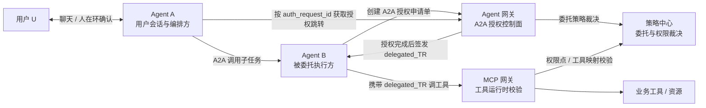
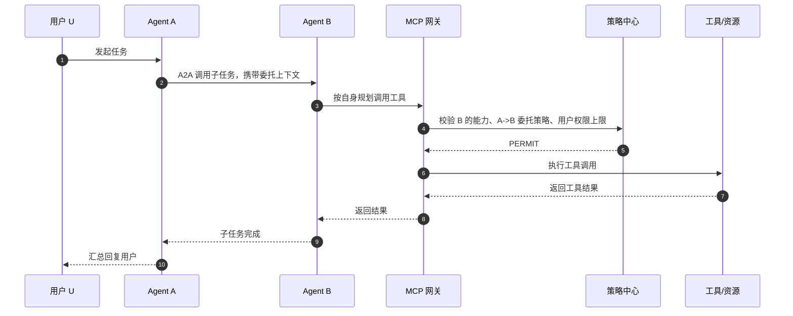
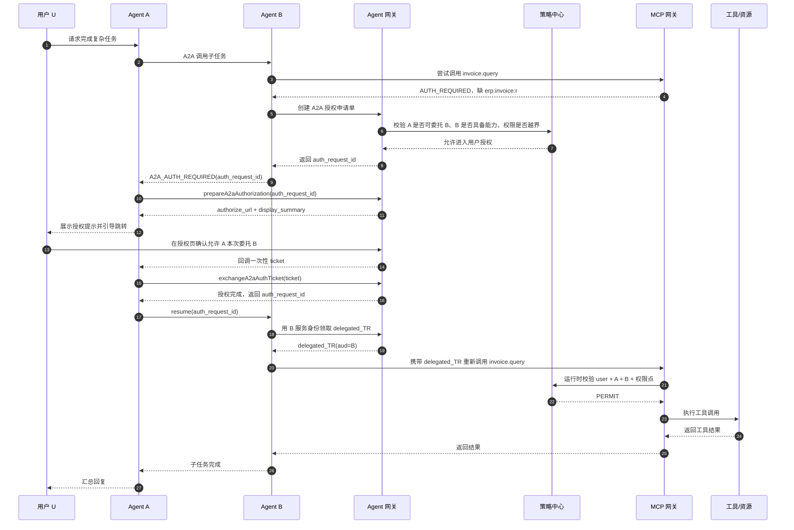
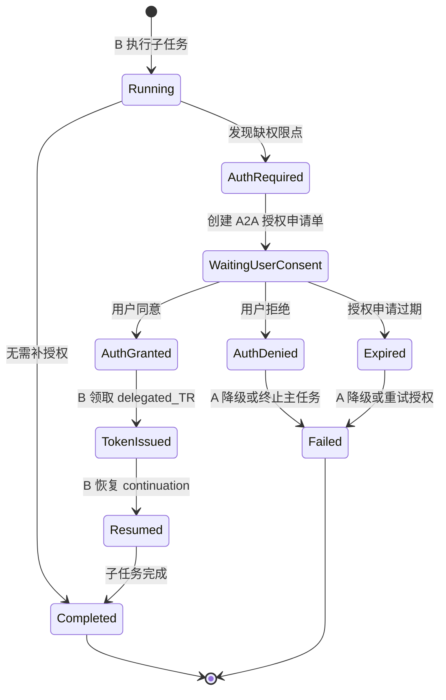

# A2A 委托授权与 Agent 安全方案

本文面向方案讲解，重点说明从“用户授权单个 Agent”扩展到“Agent A 委托 Agent B 执行子任务”时，如何处理人在环授权、委托凭据、运行时鉴权和审计。

## 1. 领导版结论

A2A 不是让 Agent A 把自己的 `TR` 直接转发给 Agent B，而是由 Agent 网关统一生成、校验和审计一条清晰的委托链路：

```text
用户 U -> Agent A -> Agent B -> MCP 工具/资源
```

核心口径：

- 用户授权仍然是根权限来源。
- Agent A 是用户当前会话和人在环交互的承接方。
- Agent B 是被委托执行者，不直接跳转用户浏览器。
- Agent B 不需要在调用前拿到全量工具权限；它在运行时规划工具，发现缺权限后创建 `A2A 授权申请单`。
- Agent 网关负责授权申请单、授权页、授权结果、委托策略校验、短期 `delegated_TR` 签发和审计。
- 最终 `delegated_TR` 只发给 Agent B，`aud=B`，不经过浏览器，也不由 Agent A 转交。

## 2. 为什么单 Agent 授权不能直接套用 A2A

当前单 Agent 场景比较清晰：

```text
用户 U 授权 Agent A 使用某些权限点，Agent A 持有 aud=A 的 TR 调 MCP。
```

A2A 场景多了一层委托关系：

```text
用户 U 正在使用 Agent A，但具体子任务由 Agent B 执行。
```

如果 Agent A 直接把自己的 `TR` 交给 Agent B，会产生问题：

- `TR.aud=A`，但真实执行者是 B，身份语义错位。
- MCP 和资源侧只能看到 `用户 -> A`，看不到 `用户 -> A -> B`。
- 无法限制 B 只能在本次子任务、指定权限范围内执行。
- 审计、风控、责任归属会失真。

因此 A2A 必须引入短期、定向、可审计的委托凭据。

## 3. 核心对象

| 对象 | 含义 | 主要职责 |
| --- | --- | --- |
| 用户 U | 最终资源访问权限来源 | 在 Agent A 会话中完成补充授权 |
| Agent A | 发起委托的 Agent | 承接用户会话、调用 B、处理 A2A SDK 授权钩子 |
| Agent B | 被委托执行的 Agent | 规划子任务、发现缺权限、创建授权申请单、恢复执行 |
| Agent 网关 | A2A 授权控制面 | 生成授权页、保存授权结果、签发 `delegated_TR`、审计 |
| 策略中心 | 策略裁决中心 | 判断 A 是否可委托 B、B 是否具备能力、权限是否越界 |
| MCP 网关 | 工具运行时网关 | 将工具映射到权限点，校验 `delegated_TR` 和权限点 |

## 4. 总体架构



## 5. A2A 授权申请单是什么

`A2A 授权申请单` 是 Agent B 在运行时创建的一张标准化记录，用来表达：

```text
我在执行 Agent A 委托的某个子任务时，发现继续执行需要用户补充授权。
```

它不是最终授权结果，也不是 `TR`。它的作用是把缺权限事件登记到 Agent 网关，形成后续授权、恢复和审计的锚点。

建议字段：

```json
{
  "auth_request_id": "a2a_auth_req_123",
  "delegation_id": "dlg_456",
  "task_id": "task_789",
  "user_id": "user_001",
  "caller_agent_id": "agt_a",
  "callee_agent_id": "agt_b",
  "required_permission_points": ["erp:invoice:r"],
  "reason": "Agent B needs invoice read permission to complete invoice analysis.",
  "continuation_ref": "cont_b_001",
  "expires_in": 300
}
```

Agent B 创建申请单的目的：

- 固化“谁委托谁、为哪个用户、缺什么权限、哪个任务需要恢复”。
- 让 Agent 网关统一生成授权页和跳转信息。
- 让策略中心先判断该授权请求是否允许被提交给用户。
- 授权完成后，Agent B 可以基于 `auth_request_id` 领取短期 `delegated_TR` 并恢复执行。

## 6. 正常 A2A 调用流程

如果 Agent B 执行过程中没有缺少额外授权，流程如下：



## 7. 缺权限时的人在环流程

缺权限时，Agent B 不直接找用户，也不直接生成授权页。它创建 `A2A 授权申请单`，再把标准 `AUTH_REQUIRED` 中间态返回给 Agent A。Agent A 通过固定 SDK/钩子引导用户到 Agent 网关完成授权。



## 8. Agent A 为什么需要固定钩子

Agent A 不应该靠大模型自然语言理解 Agent B 返回的“我缺权限”。A2A 必须是协议级中间态。

Agent B 返回：

```json
{
  "type": "A2A_AUTH_REQUIRED",
  "auth_request_id": "a2a_auth_req_123",
  "delegation_id": "dlg_456",
  "caller_agent_id": "agt_a",
  "callee_agent_id": "agt_b",
  "task_id": "task_789",
  "required_permission_points": ["erp:invoice:r"],
  "resume_mode": "agent_callback"
}
```

Agent A 的 A2A SDK 钩子固定处理：

```text
收到 A2A_AUTH_REQUIRED
-> 调 Agent 网关 prepareA2aAuthorization
-> 拿 authorize_url 和展示摘要
-> 返回前端需要用户处理
-> 授权完成后 resume Agent B
```

这样 Agent A 不需要理解 Agent B 的具体工具细节，也不需要自己拼授权页。

## 9. delegated_TR 的生成维度和内容

`delegated_TR` 按一次 A2A 授权结果生成，不是按 Agent B 全量能力生成。

生成维度：

```text
user + caller_agent + callee_agent + delegation_id + auth_request_id + task_id + granted_permission_points + ttl
```

示例：

```json
{
  "iss": "agent-gateway",
  "aud": "agt_b",
  "sub": "user_001",
  "token_type": "delegated_tr",
  "iat": 1710000000,
  "exp": 1710000300,
  "agency_user": {
    "user": {
      "uid": "user_001"
    },
    "consented_scopes": ["erp:invoice:r"]
  },
  "delegation": {
    "caller_agent_id": "agt_a",
    "callee_agent_id": "agt_b",
    "delegation_id": "dlg_456",
    "auth_request_id": "a2a_auth_req_123",
    "task_id": "task_789",
    "grant_type": "one_time",
    "actor_chain": [
      {"type": "user", "id": "user_001"},
      {"type": "agent", "id": "agt_a"},
      {"type": "agent", "id": "agt_b"}
    ]
  }
}
```

关键规则：

- `aud` 必须是 Agent B。
- `consented_scopes` 是本次 A 委托 B 可使用的权限点交集。
- `delegated_TR` 不经过浏览器。
- Agent A 不接触 Agent B 的最终 `delegated_TR`。
- Agent B 必须使用自身服务身份从 Agent 网关领取。

## 10. Agent 网关职责边界

Agent 网关在 A2A 中承担授权控制面职责：

| 职责 | 说明 |
| --- | --- |
| 创建授权申请单 | 保存 user、A、B、task、required scopes、continuation_ref |
| 生成授权页信息 | 返回 `authorize_url`、展示摘要、过期时间 |
| 承接用户授权 | 展示“允许 A 本次委托 B 使用某权限点”的授权页 |
| 保存授权结果 | 记录本次/长期授权、授权范围、有效期 |
| 校验委托策略 | 调策略中心判断 A 是否可委托 B、权限是否越界 |
| 签发 `delegated_TR` | 只向 B 签发短期、定向、可审计的运行时令牌 |
| 恢复编排 | 支持 A 回调 B resume，或后续演进为网关通知/轮询 |
| 审计 | 记录 `用户 -> A -> B -> 权限点/工具/资源` 完整链路 |

## 11. 状态机



## 12. 策略裁决口径

A2A 运行时有效权限取交集：

```text
effective_scopes =
  用户对 A 的原始授权
  ∩ A 可委托 B 的策略范围
  ∩ B 已订阅/具备的能力范围
  ∩ 本次用户同意的授权范围
  ∩ MCP 工具映射出的权限点
```

策略中心可继续沿用 PARC 思路：

| PARC | A2A 中的含义 |
| --- | --- |
| Principal | 用户 U，或发起委托的 Agent A |
| Action | `DELEGATE_AGENT`、`USE_PERMISSION_POINT`、`CALL_MCP_TOOL` |
| Resource | Agent B、权限点、MCP 工具 |
| Context | callerAgentId、calleeAgentId、taskType、delegationDepth、enterprise |

## 13. 安全底线

- 禁止 Agent A 直接转发 `aud=A` 的 `TR` 给 Agent B。
- `delegated_TR` 必须短期有效，并绑定 `aud=B`。
- 权限只能收敛，不能扩张。
- Agent B 领取 `delegated_TR` 时必须使用自身服务身份。
- 用户授权页必须明确展示“Agent A 正在委托 Agent B”。
- 默认只允许一跳委托；多跳委托需要显式策略开启。
- 所有运行时调用必须能审计到 `user -> A -> B -> tool/resource`。

## 14. 对领导可讲的三句话

1. 单 Agent 授权解决的是“用户能不能让这个 Agent 访问资源”；A2A 解决的是“这个 Agent 能不能再委托另一个 Agent 替用户做事”。
2. 我们不让 Agent 之间互相转发用户令牌，而是由 Agent 网关生成一次性、短期、定向的委托凭据，确保权限不扩张、链路可审计。
3. Agent B 只有在真正规划到具体工具时才知道缺什么权限；这时它创建授权申请单，Agent A 负责把用户带入授权，Agent 网关负责最终授权结果和凭据签发。
