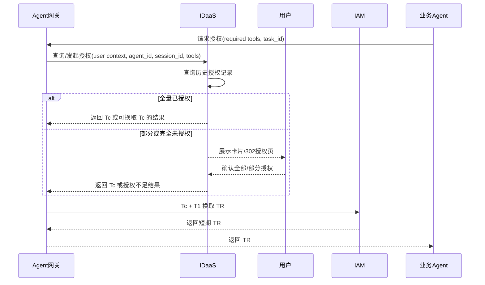

# IDaaS 授权方案讨论材料

本文用于和 IDaaS、IAM、MCP 网关、Agent 网关共同讨论 Agent 安全授权方案。重点是授权失效性、授权隔离度、`Tc` 设计、工具追加授权和运行时校验边界。

本文是讨论材料，不作为最终正式口径。讨论确认后，再同步正式设计文档和接口实现。

## 1. 讨论目标

Agent 安全方案希望建立一条清晰的用户授权链路：

```text
用户确认授权 -> IDaaS 发放 Tc -> IAM 基于 Tc + T1 颁发 TR -> MCP 网关运行时校验 -> 工具合法调用
```

其中：

- IDaaS 负责用户授权确认、授权记录保存、授权查询和 `Tc` 发放。
- IAM 负责根据 `Tc + T1` 颁发短期 `TR`。
- MCP 网关负责 `TR` 真实性校验、工具权限校验和策略中心校验。
- Agent 网关负责统一入口、授权编排、卡片/302 对接和链路可观测。

当前需要讨论清楚的问题集中在三类：

- 授权隔离度：用户授权应该按用户 + Agent 隔离，是否还要按会话隔离。
- 授权失效性：临时授权、长期授权记录、`Tc` 与 `TR` 的有效期如何协同。
- 授权追加：用户在 Agent 引导式任务中不断追加工具时，`Tc` 和历史授权如何设计。

## 2. 当前推荐边界

### 2.1 `agent_id` 必须进入授权维度

工具是公共能力，不同 Agent 可能复用相同工具。用户对某个工具的授权，不应该天然对所有 Agent 都有效。

因此，IDaaS 保存授权记录和发放 `Tc` 时，必须包含 `agent_id`。

推荐授权维度：

```text
tenant_id + user_id + agent_id + permission_point_codes/tool_ids
```

这样可以保证：

- 用户授权 Agent A 使用某工具，不等于授权 Agent B 使用同一工具。
- MCP 网关和 IAM 能基于 `TR.aud` 或 Agent 身份判断工具调用是否属于被授权 Agent。
- 授权记录能解释“用户授权了哪个 Agent 使用哪些工具”。

### 2.2 会话级隔离作为待讨论增强项

会话级隔离能进一步提升安全边界：

```text
tenant_id + user_id + agent_id + session_id + permission_point_codes/tool_ids
```

但它会带来体验问题：

- 用户在不同会话中调用同一个 Agent 和同一批工具，可能需要重复授权。
- 多轮任务、跨 Tab、重新进入会话时，需要判断是否还能复用授权。
- 如果每个新任务都要求重新授权，Agent 使用体验会明显下降。

建议讨论三种模式：

| 模式 | 授权维度 | 优点 | 风险/代价 | 适用场景 |
| --- | --- | --- | --- | --- |
| Agent 级授权 | `user + agent + tool` | 用户体验最好，重复授权少。 | 隔离度较弱。 | 低风险、常用工具。 |
| 会话级授权 | `user + agent + session + tool` | 隔离度强，适合明确任务边界。 | 用户可能频繁授权。 | 高风险工具、敏感数据。 |
| 混合授权 | 默认 Agent 级，高风险工具启用会话级。 | 平衡安全和体验。 | 需要工具风险分级和授权策略。 | 推荐作为默认讨论方向。 |

建议默认方案：

```text
默认按 user + agent + tool 授权；
高风险工具或策略要求时，再增加 session_id 隔离；
如果启用 session_id 隔离，需要提供跨会话授权同步或一键复用能力。
```

## 3. 授权失效性设计

### 3.1 区分用户授权有效期和 TR 令牌有效期

IDaaS 控制的是用户授权是否有效，IAM 控制的是运行时 `TR` 是否过期。

两者不能混在一起：

- 用户授权有效期：表示用户是否允许某个 Agent 使用某些工具。
- `TR` 有效期：表示某次资源访问令牌的技术有效期。

推荐关系：

```text
只要 IDaaS 用户授权仍有效，Agent 网关可以重新向 IDaaS 获取 Tc；
IAM 每次基于 Tc + T1 颁发短期 TR；
TR 过期后可以重新颁发，但不能突破 IDaaS 用户授权有效期。
```

### 3.2 临时授权和长期授权记录

IDaaS 需要支持两类授权：

| 类型 | 含义 | 建议失效方式 |
| --- | --- | --- |
| 临时授权 | 用户只允许当前任务、当前会话或指定时间内使用工具。 | 到期自动失效，也可被用户/管理员撤销。 |
| 长期授权记录 | 用户允许某 Agent 长期使用某些工具，直到撤销或策略变化。 | 默认长期有效，但遇到撤销、Agent 下架、权限点停用、用户冻结等事件失效。 |

授权页建议提供时效选择：

- 仅本次任务有效。
- 当前会话有效。
- 临时有效到指定时间。
- 长期有效，直到撤销。

需要 IDaaS 讨论确认：

- 临时授权是否允许用户在授权页自定义时间。
- 长期授权是否默认永久有效，还是固定周期后要求重新确认。
- 高风险工具是否强制临时授权或固定周期复核。

### 3.3 `Tc` 与历史授权记录的关系

`Tc` 是 IDaaS 对本次授权结果的令牌表达，历史授权记录是 IDaaS 的授权账本。

推荐关系：

- `Tc` 可以是短期令牌，用于本次与 IAM 换取 `TR`。
- 长期授权不表现为长期 `Tc` 或长期 `TR`，而是 IDaaS 保存的授权记录。
- 当历史授权命中时，IDaaS 可以静默发放新的短期 `Tc`。

这样可以同时满足：

- 用户体验：历史授权命中时不反复弹窗。
- 安全边界：运行时访问仍依赖短期 `TR`。
- 管理能力：用户或管理员撤销后，IDaaS 不再静默发放 `Tc`。

## 4. IDaaS 授权查询与响应路线

Agent 网关在发起授权确认时，不应该自己保存和判断长期授权。正确路线是由 IDaaS 基于授权元信息做权威判断。

推荐流程：



IDaaS 响应建议包含：

```text
auth_status: fully_granted / partially_missing / denied / expired
already_granted_tools
missing_tools
denied_tools
tc_or_code
grant_type
grant_expires_at
audit_id
```

## 5. 授权页内容设计

授权页或卡片需要让用户明白三个问题：

```text
哪个 Agent 正在申请授权？
本次 task 需要调用哪些工具？
这次授权的有效期和范围是什么？
```

建议页面信息：

| 区域 | 内容 |
| --- | --- |
| 标题 | `当前 Agent 请求调用以下工具` |
| Agent 信息 | Agent 名称、Agent ID、Agent 描述 |
| 任务信息 | task_id、会话信息、任务摘要 |
| 工具列表 | 中文工具名、英文工具名、工具描述、权限点说明 |
| 授权范围 | 仅本次 task、当前会话、自定义临时有效期、长期有效直到撤销 |
| 用户动作 | 全部授权、勾选部分授权、取消 |
| 安全提示 | 授权仅对当前 Agent 生效；未授权工具不会被调用；授权记录可撤销 |

部分授权示例：

```text
本次申请 3 个工具：
- 工具 A：用户勾选授权
- 工具 B：用户不勾选
- 工具 C：用户勾选授权

IDaaS 只为 A、C 发放授权。
业务 Agent 调用 B 时应得到授权不足结果。
```

## 6. 工具追加授权方案

Agent 使用过程往往不是一次性列出所有工具，而是在多轮对话中逐步引导用户使用工具。因此需要支持补充授权。

### 6.1 推荐方案：并集申请，新增展示

业务 Agent 本地缓存当前有效 `TR` 覆盖的工具列表和权限点列表。

当本次任务需要新工具时，业务 Agent 计算：

```text
desired_scope = current_valid_tr_scope ∪ current_required_scope
```

然后把 `desired_scope` 发给 Agent 网关和 IDaaS。

IDaaS 基于历史授权记录计算：

```text
already_granted = desired_scope ∩ valid_saved_grants
new_required = desired_scope - valid_saved_grants
```

授权页展示：

- 已授权部分：弱展示或折叠展示，避免用户误以为重复授权。
- 新增部分：重点展示，让用户确认。

最终返回：

- `Tc` 覆盖当前仍有效且用户确认的完整授权范围。
- IAM 基于 `Tc + T1` 颁发新的短期 `TR`。
- 业务 Agent 校验新 `TR` 后整体替换旧 `TR`。

### 6.2 为什么不推荐多个 TR

如果每次新增工具都发一个只覆盖新增工具的 `TR`，业务 Agent 会缓存多个 `TR`。

这会带来复杂度：

- MCP 调用时不知道该带哪个 `TR`。
- 一次工具调用可能需要合并多个 `TR` 的范围。
- 多 `TR` 过期、撤销、调试成本高。
- MCP 网关当前更适合校验单个 `TR`。

因此，推荐保持“一个会话下一个当前最佳 `TR`”，补充授权后用新 `TR` 替换旧 `TR`。

## 7. MCP 网关与 IAM 待对齐事项

本次 IDaaS 方案讨论还需要同步确认 IAM 和 MCP 网关的能力边界。

### 7.1 IAM

IAM 需要明确：

- `Tc + T1 -> TR` 的输入字段。
- IAM 如何校验 `Tc` 的真实性、有效期、Agent 身份和授权范围。
- `TR.aud` 是否稳定表达业务 Agent 身份。
- `TR.agency_user.consented_scopes` 是否稳定表达权限点 code。
- `TR` 的有效期如何设置，以及过期后如何重新颁发。

### 7.2 MCP 网关

MCP 网关需要补齐或明确：

- 是否已经具备 `TR` 真实性校验能力。
- 是否已经具备 `TR` 中授权范围与当前工具调用的校验能力。
- 是否调用 Agent 策略中心完成运行时策略判断。
- 是否具备将 `TR` 解析为必要用户身份上下文的能力。
- 调用真实人机接口工具时，如何携带用户身份上下文。

需要特别注意：

```text
MCP 网关不能只相信业务 Agent 声称用户已授权；
必须基于 TR 和策略中心结果进行运行时校验。
```

## 8. 待讨论决策清单

| 编号 | 决策项 | 推荐方向 |
| --- | --- | --- |
| D1 | 授权记录是否必须包含 `agent_id` | 必须包含。用户授权只对当前 Agent 有效。 |
| D2 | 是否启用 `session_id` 隔离 | 混合模式：默认 Agent 级，高风险工具会话级。 |
| D3 | 启用会话级隔离后如何减少重复授权 | 支持跨会话一键同步或授权复用确认。 |
| D4 | 临时授权是否允许用户选择有效期 | 建议支持，至少支持“本次/当前会话/长期”。 |
| D5 | 长期授权如何表达 | IDaaS 历史授权记录长期有效，直到撤销或失效事件触发。 |
| D6 | `Tc` 是否包含工具列表和权限点列表 | 建议都包含；工具用于展示和审计，权限点用于 IAM/TR。 |
| D7 | 部分授权如何表达 | IDaaS 返回已授权、拒绝、缺失工具列表。 |
| D8 | 工具追加授权如何处理 | 并集申请，新增展示，返回完整可用范围的 `Tc`。 |
| D9 | `TR` 过期与用户授权过期如何协同 | `TR` 可短期过期重发，但不得超过 IDaaS 授权有效边界。 |
| D10 | MCP 网关是否具备 `TR` 校验和转用户上下文能力 | 需要 MCP 网关给出明确方案和排期。 |

## 9. 建议落地路线

### 第一阶段：打通可用闭环

- IDaaS 支持 `user + agent + tool/permission_point` 授权查询。
- IDaaS 支持全量已授权静默返回 `Tc`。
- IDaaS 支持部分未授权时展示授权页。
- IDaaS 支持用户部分授权。
- IAM 支持基于 `Tc + T1` 颁发短期 `TR`。
- MCP 网关完成 `TR` 真实性和工具权限校验。

### 第二阶段：补齐体验和治理

- IDaaS 支持临时授权和长期授权记录。
- IDaaS 支持会话级隔离配置。
- IDaaS 支持跨会话授权同步或授权复用确认。
- IDaaS 支持授权撤销和审计查询。
- MCP 网关支持完整策略中心联动和用户身份上下文传递。

### 第三阶段：风险治理增强

- 高风险工具强制临时授权或会话级授权。
- 权限点风险等级变化后触发重新授权。
- Agent 下架、权限点停用、用户冻结时批量失效历史授权。
- 建立用户授权管理页，支持用户查询和撤销历史授权。

## 10. 对 IDaaS 的核心诉求

IDaaS 需要给出一份明确方案，回答以下问题：

- 授权记录模型如何设计。
- `Tc` 字段如何设计。
- 授权查询接口如何设计。
- 卡片弹窗和 302 授权页如何承接。
- 临时授权和长期授权如何保存、发放和失效。
- 会话级隔离是否支持，默认策略是什么。
- 工具追加授权和部分授权如何返回。
- 授权撤销、授权审计和历史授权查询如何实现。

Agent 网关侧会基于 IDaaS 的明确方案，完成授权编排、前端授权交互承接、`Tc + T1 -> TR` 编排和链路可观测。
