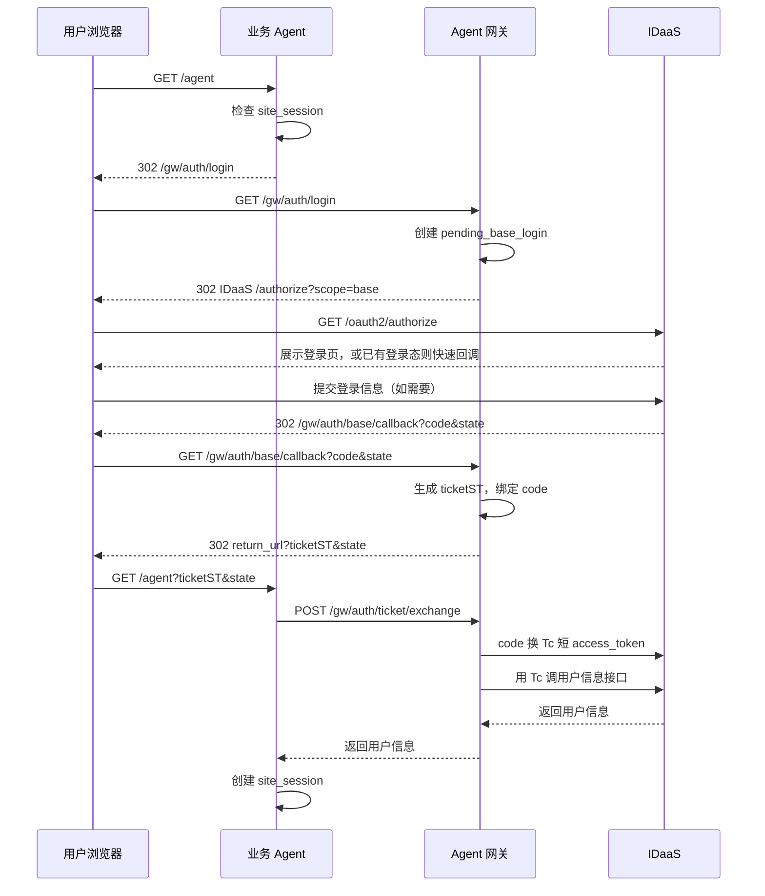

# base 登录与 ticketST

## 1. 目标

让业务 Agent 在不直连 IDaaS、不在浏览器 URL 暴露用户信息的前提下，拿到可信登录用户信息并创建自己的 `site_session`。

## 2. 流程



## 3. 关键数据

`pending_base_login`：

```text
gw_state -> agent_id, return_url, outer_state, expires_at
```

`ticketST`：

```text
ticketST -> agent_id, authorization_code, client_id, redirect_uri, used, expires_at
```

## 4. 关键约束

- `ticketST` 单次使用。
- `ticketST` 短 TTL。
- `ticketST` 绑定 `agent_id`。
- `ticketST` 绑定本次 base callback 的 `authorization code`。
- `ticketST` 绑定本次换 token 所需的 `client_id` 和可选 `redirect_uri`。
- 回跳业务 Agent 时只带 `ticketST + state`。
- 用户信息只通过后端交换接口返回，不进入浏览器 URL。
- `code + client_id + client_secret + 可选 redirect_uri -> Tc access_token -> 用户信息` 发生在 `/gw/auth/ticket/exchange`，不是发生在 `/gw/auth/base/callback`。
- 业务 Agent 成功交换后创建自己的 `site_session`。
