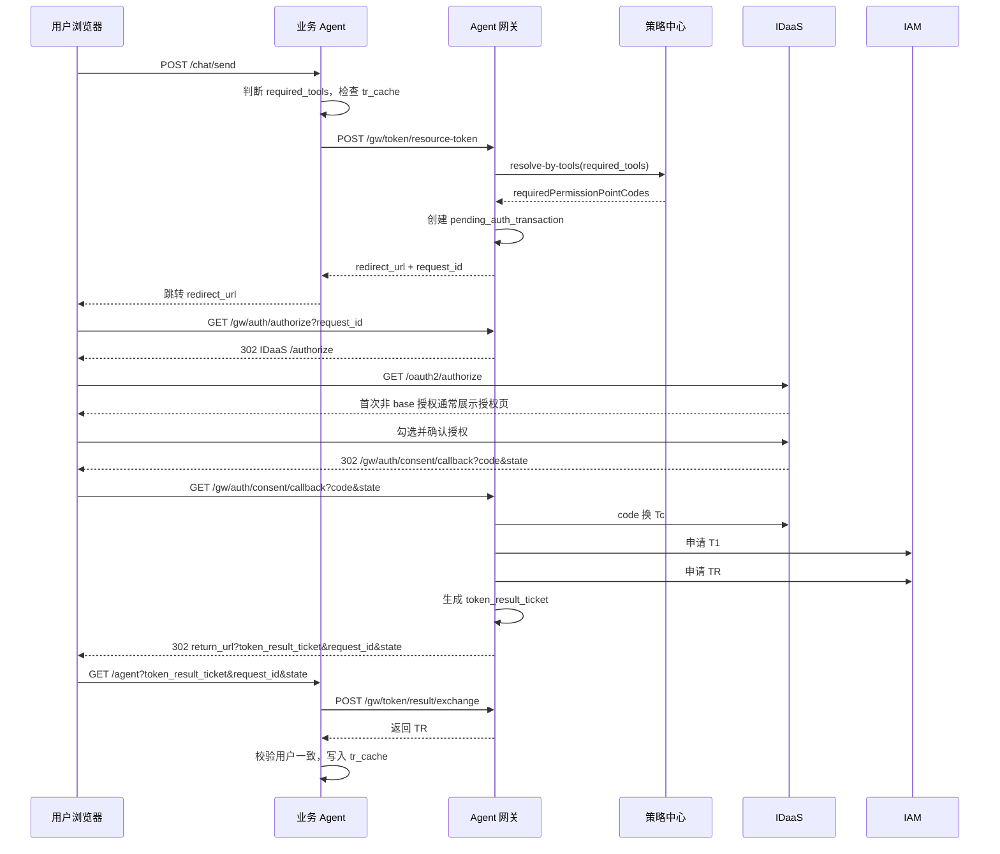

# 业务授权与 token_result_ticket

## 1. 目标

让业务 Agent 在本地没有可复用 `TR` 时，通过 Agent 网关完成用户授权和 `TR` 获取，同时避免 `TR` 出现在浏览器 URL 中。

## 2. 流程



## 3. 关键数据

`pending_auth_transaction`：

```text
request_id -> agent_id, required_tools, requiredPermissionPointCodes, return_url, outer_state, subject_hint, expires_at
```

`token_result_ticket`：

```text
token_result_ticket -> request_id, agent_id, tr, agency_user, consented_scopes, used, expires_at
```

## 4. 关键约束

- `POST /gw/token/resource-token` 不接收长期网关登录凭证。
- `POST /gw/token/resource-token` 不直接返回 `TR`。
- `subject_hint` 只作为 IDaaS 登录提示。
- `token_result_ticket` 单次使用、短 TTL、绑定 `agent_id` 和 `request_id`。
- 业务 Agent 换回 `TR` 后，必须校验 `TR.agency_user` 与当前 `site_session` 用户一致。
- `TR` 复用由业务 Agent 本地 `tr_cache` 决定。
