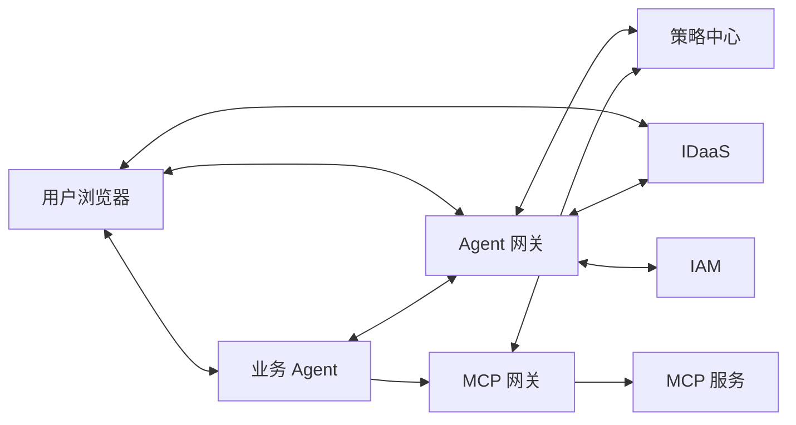

# 01_方案总览

快速阅读摘要。正式定义以 [02_引入Agent网关版方案.md](../02_引入Agent网关版方案.md)、[03_令牌设计.md](../03_令牌设计.md)、[04_接口设计.md](../04_接口设计.md) 和 [05_策略中心设计.md](../05_策略中心设计.md) 为准。

## 一句话主线

- 当前采用模式 A：IDaaS 判断用户是否已登录，Agent 网关不维护长期用户登录态。
- 业务 Agent 维护自己的 `site_session` 和本地 `TR` 缓存。
- Agent 网关负责登录/授权跳转、`code -> Tc -> T1 -> TR` 编排，以及一次性票据交付。
- 策略中心负责维护权限点定义、权限点与工具绑定关系、Agent 策略。
- MCP 网关先做 `TR` 范围校验，再做 Agent 策略判断。

## 整体架构

## 当前正式方案的 5 个关键点

1. `ticketST` 用于 base 登录后换取用户信息。
2. `token_result_ticket` 用于授权完成后换取 `TR`。
3. `Tc` 和 `TR.agency_user` 都带 `consented_scopes`。
4. `TR` 是用户授权给 Agent 的上限边界。
5. 当前工具是否可调用，必须同时通过 `TR` 权限点范围校验和 Agent 策略判断。
