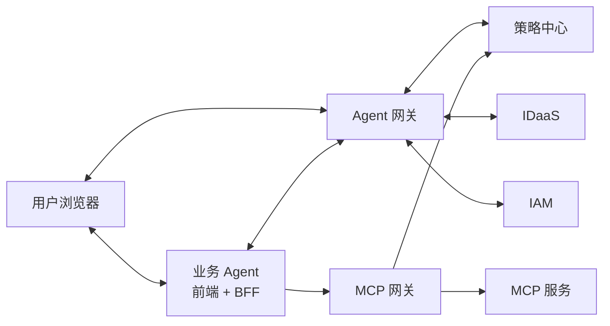

# 01_方案总览

快速阅读摘要。**正式定义以** [02_引入Agent网关版方案.md](../02_引入Agent网关版方案.md)、[03_令牌设计.md](../03_令牌设计.md)、[04_接口设计.md](../04_接口设计.md) **为准**。

## 一句话主线

业务 Agent 只理解 `required_tools`、`TR` 和 `redirect_url`；`Agent 网关` 统一负责登录、授权、`Tc / T1 / TR` 编排；`策略中心` 负责 `tool -> code`；`MCP 网关` 运行时负责 `code -> tool`。

## 当前文档地位

- [01_无Agent网关版方案.md](../01_无Agent网关版方案.md) 是参考方案
- [02_引入Agent网关版方案.md](../02_引入Agent网关版方案.md)、[03_令牌设计.md](../03_令牌设计.md)、[04_接口设计.md](../04_接口设计.md) 是当前正式方案

## 总体架构图

## 模块职责速记

| 模块 | 主要做什么 | 不做什么 |
| --- | --- | --- |
| 业务 Agent 前端 | 页面入口、跳转、回原页面后恢复消息 | 不直连 `IDaaS / IAM / 策略中心` |
| 业务 Agent 后端/BFF | 判断 `required_tools`、维护本地 `site_session` 和 `TR` 缓存、调用 `/gw/token/resource-token`、带 `TR` 调 `MCP 网关` | 不实现 OAuth callback；不申请 `Tc / T1 / TR` |
| Agent 网关 | 统一处理登录、授权、`code -> Tc`、`T1`、`TR`、状态维护、`required_tools -> required_policy_codes` | 不代理业务 `MCP` 流量 |
| 策略中心 | 维护 `tool <-> policy_code` 映射 | 不做浏览器跳转和令牌签发 |
| IDaaS | 登录、授权、签发基础登录结果与 `Tc` | 不处理 `T1 / TR` |
| IAM | 签发 `T1`、基于 `Tc + T1` 签发 `TR` | 不处理页面跳转和工具映射 |
| MCP 网关 | 接受 `TR`，运行时查询策略中心完成 `code -> tool`，再路由到具体 `MCP 服务` | 不处理登录授权跳转 |

## 当前固定口径

- 业务 Agent 上传的是 `required_tools`，不是 `scope/code`
- `Agent 网关` 负责 `tool -> code`
- `MCP 网关` 负责运行时 `code -> tool`
- `TR` 是资源访问唯一令牌
- `request_id` 是业务 Agent 可见的“获取 `TR`”流程号
- `gw_state` 是网关内部 OAuth/browser callback 事务号
- 业务 Agent 本地 `TR` 缓存采用覆盖式模型：
  - `current_tr`
  - `covered_tools`
  - `covered_policy_codes`
  - `expires_at`
