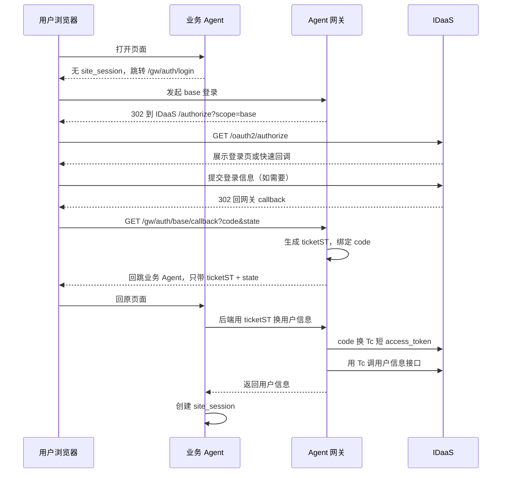
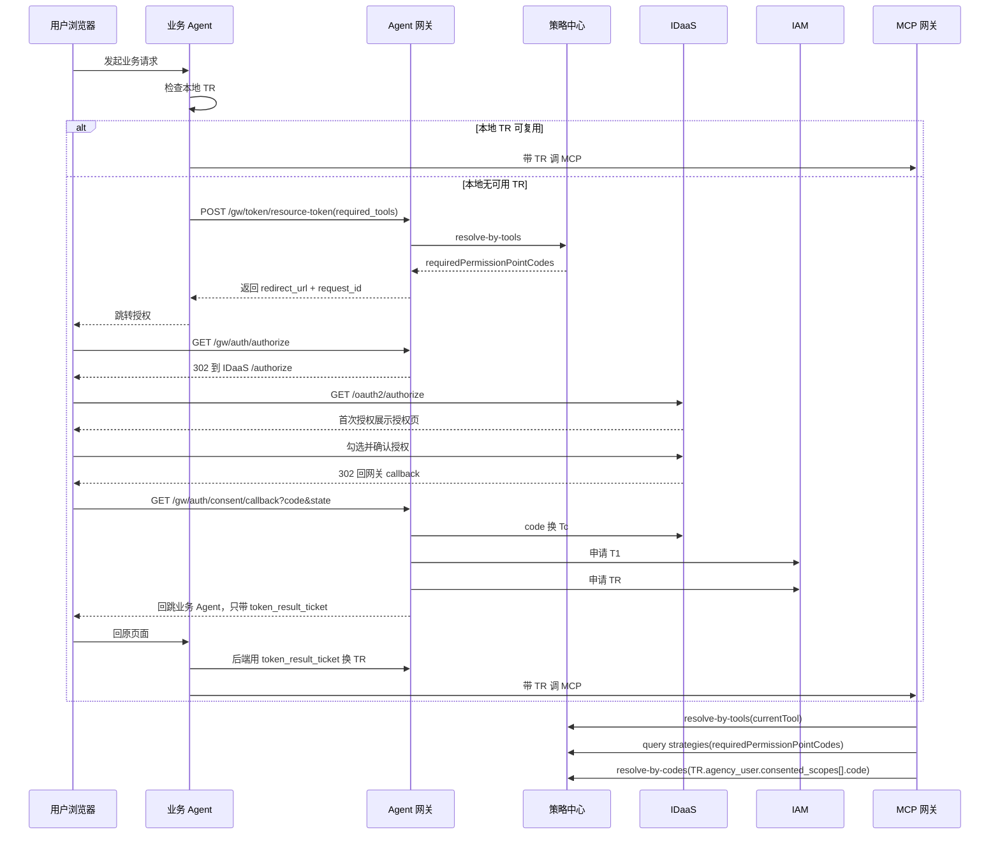

# 02_主流程速记

快速阅读摘要。正式定义以 [02_引入Agent网关版方案.md](../02_引入Agent网关版方案.md)、[04_接口设计.md](../04_接口设计.md) 和 [05_策略中心设计.md](../05_策略中心设计.md) 为准。

## 1. base 登录

## 2. 资源请求 / 获取 TR

## 3. MCP 网关运行时判定

当前工具可调用，必须同时满足：

1. 当前工具所需权限点已经在 `TR.agency_user.consented_scopes` 中。
2. 当前用户通过这些权限点对应的 Agent 策略判断。
3. 当前请求工具包含在 `TR` 权限点反查出的工具集合中。

如果任一条件不满足，当前请求直接失败。
