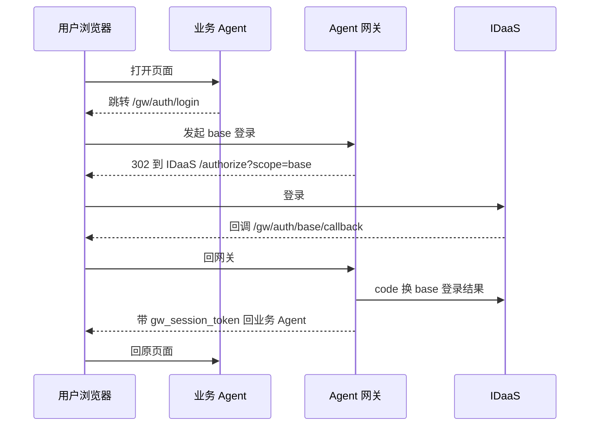
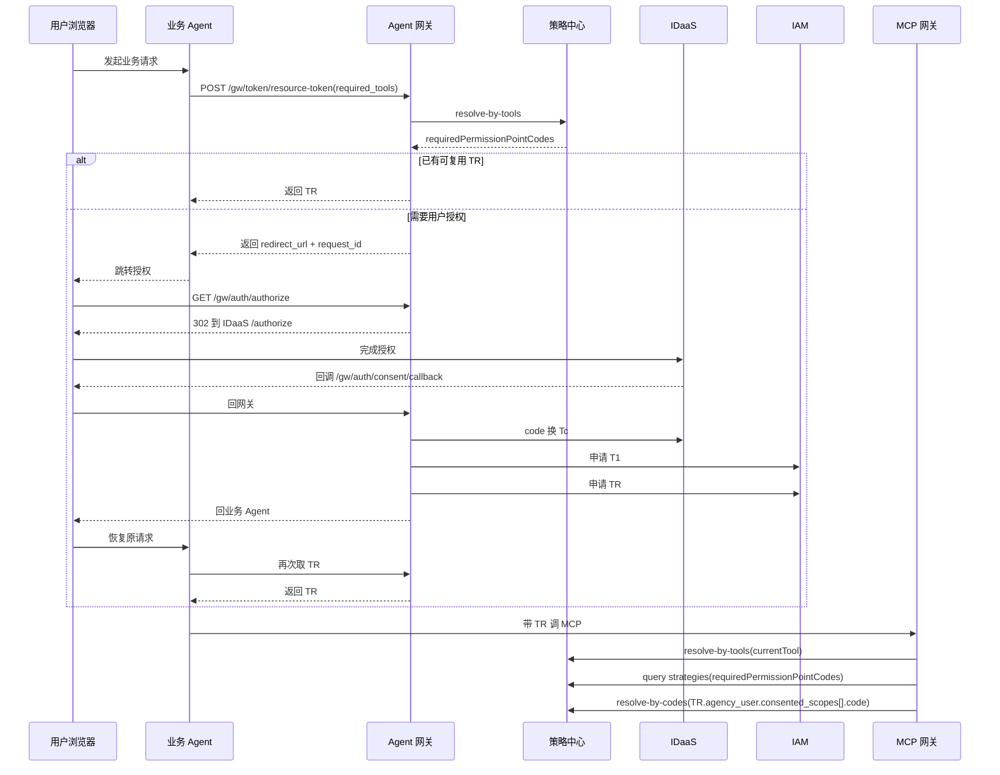

# 02_主流程速记

快速阅读摘要。**正式定义以** [02_引入Agent网关版方案.md](../02_引入Agent网关版方案.md) **、** [04_接口设计.md](../04_接口设计.md) **和** [05_策略中心设计.md](../05_策略中心设计.md) **为准**。

## 1. base 登录

## 2. 资源请求 / 获取 TR

## 3. MCP 网关运行时判定

当前工具可调用，必须同时满足：

1. 先按当前待调用工具反查所需权限点
2. 这些权限点必须已经在 `TR.agency_user.consented_scopes` 中
3. 当前用户还必须通过这些权限点对应的 Agent 策略判断
4. 当前请求工具还必须包含在 `TR` 对应的工具集合中

如果任一条件不满足，当前请求直接失败。
