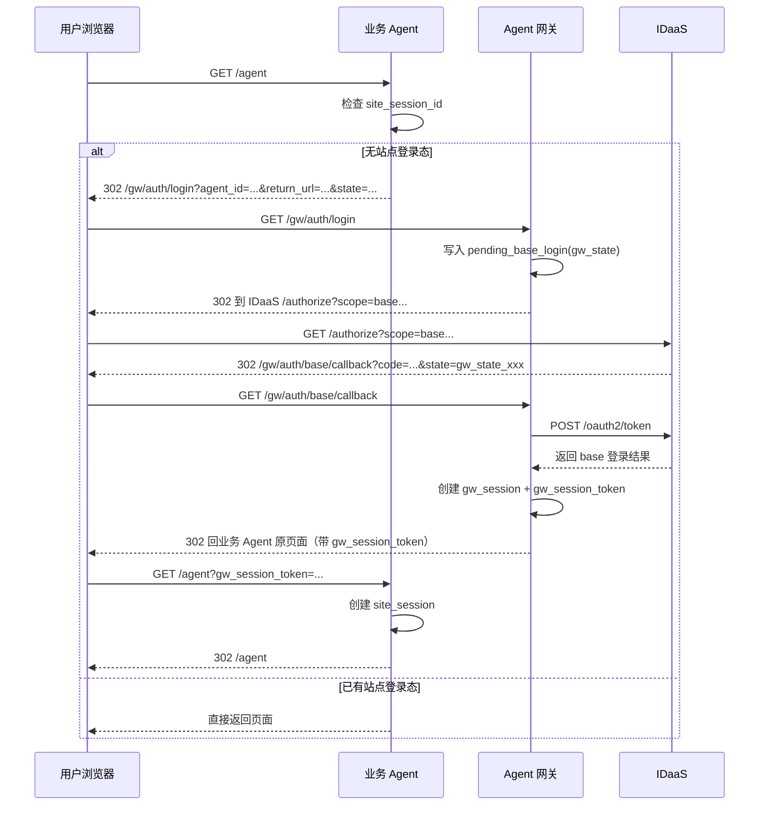
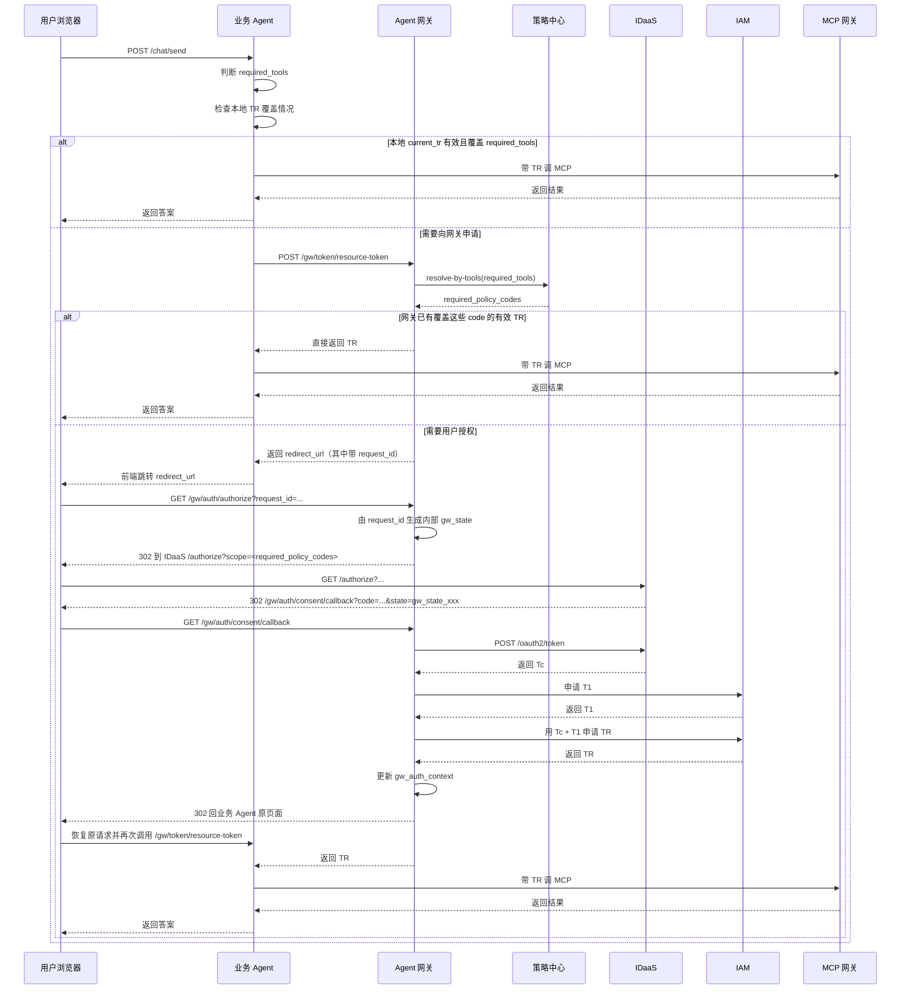

# 02_主流程速记

快速阅读摘要。**正式定义以** [02_引入Agent网关版方案.md](../02_引入Agent网关版方案.md) **和** [04_接口设计.md](../04_接口设计.md) **为准**。

## 流程 A：base 登录

目标：

- 用户先拿到业务 Agent 的站点登录态
- 业务 Agent 不自己做 OAuth callback
- 网关完成 base 登录后，把 `gw_session_token` 带回业务 Agent

业务 Agent 在这段里只需要记住：

1. 没登录就跳 `/gw/auth/login`
2. 网关回原页面时会带 `gw_session_token`
3. BFF 用 `gw_session_token` 建本地 `site_session`

## 流程 B：资源请求 / 获取 `TR`

目标：

- 业务 Agent 只上传 `required_tools`
- 网关决定是直接给 `TR`，还是先让用户授权
- 授权完成后，业务 Agent 重放原请求，再拿最终 `TR`

## 关键状态怎么理解

| 对象 | 谁看得到 | 作用 |
| --- | --- | --- |
| `gw_session_token` | 业务 Agent 可见 | 业务 Agent 调网关时的会话引用 |
| `request_id` | 业务 Agent 可见 | 一次“获取 `TR`”流程的外部流程号；通常体现在 `redirect_url` 中 |
| `gw_state` | 仅网关内部 | OAuth/browser callback 事务号，用于关联 IDaaS 回调 |
| `TR` | 业务 Agent、MCP 网关 | 最终资源访问令牌 |

## 业务 Agent 最小心智

- 只判断：
  - 本次要哪些 `required_tools`
  - 本地 `current_tr` 能不能覆盖
- 只处理两种结果：
  - 网关直接返回 `TR`
  - 网关返回 `redirect_url`
- 不自己处理：
  - OAuth callback
  - `Tc / T1 / TR` 编排
  - `policy_code`
