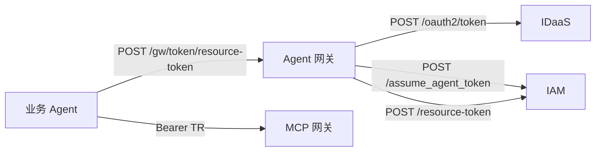

# 04_接口速查

快速阅读摘要。**正式定义以** [04_接口设计.md](../04_接口设计.md) **为准**。

这份速查只保留跨模块最值得记住的接口。  
浏览器 callback 详细契约仍在原文中，这里不展开逐字段说明。

## 最重要的 6 个接口

| 调用方 | 被调用方 | 方法 | 路径 | 关键输入 | 关键输出 | 说明 |
| --- | --- | --- | --- | --- | --- | --- |
| 业务 Agent | Agent 网关 | `POST` | `/gw/token/resource-token` | `Authorization: Bearer gw_session_token`、`agent_id`、`required_tools`、`return_url`、`state` | `TR` 或 `redirect_url + request_id` | 业务 Agent 真正长期对接的核心运行时接口 |
| 用户浏览器 | Agent 网关 | `GET` | `/gw/auth/login` | `agent_id`、`return_url`、`state` | 302 到 IDaaS 登录页 | base 登录入口 |
| 用户浏览器 | Agent 网关 | `GET` | `/gw/auth/authorize` | `request_id` | 302 到 IDaaS 授权页 | 业务授权入口 |
| Agent 网关 | IDaaS | `POST` | `/oauth2/token` | `grant_type`、`code`、`client_id`、`redirect_uri` | base 结果或 `Tc` | 网关内部换 token |
| Agent 网关 | IAM | `POST` | `/iam/projects/{proxy_project_id}/assume_agent_token` | `agent_service_account`、`principal`、`agent_id` | `T1` | 网关向 IAM 申请 Agent 令牌 |
| Agent 网关 | IAM | `POST` | `/iam/auth/resource-token` | `Authorization: Bearer <T1>`、`user_token=<Tc>` | `TR` | 网关用 `Tc + T1` 生成最终资源令牌 |

## 业务 Agent 最小接口心智

### 1. `POST /gw/token/resource-token`

业务 Agent 只需要理解两种结果：

- **直接返回 `TR`**
  - 说明网关已有可复用授权上下文
- **返回 `redirect_url + request_id`**
  - 说明这次必须让浏览器去做登录或业务授权

业务 Agent 不需要理解：

- 为什么缺授权
- 缺的是哪些 `policy_code`
- `Tc / T1 / TR` 内部是怎么编排出来的

### 2. `/gw/auth/login`

用户首次打开业务 Agent 页面、还没有站点登录态时，业务 Agent 只需要把浏览器跳到这个地址。

### 3. `/gw/auth/authorize`

这个入口通常由网关返回的 `redirect_url` 承载。  
业务 Agent 一般不自己手拼，只负责透传或跳转。

## 网关内部但值得记住的接口

虽然业务 Agent 不直接调用下面 3 个接口，但理解它们有助于看懂主链路：

1. `POST /oauth2/token`
   - 网关向 IDaaS 换基础登录结果或 `Tc`
2. `POST /iam/projects/{proxy_project_id}/assume_agent_token`
   - 网关向 IAM 申请 `T1`
3. `POST /iam/auth/resource-token`
   - 网关用 `Tc + T1` 申请 `TR`

## 一眼看懂整条链路

## 阅读建议

- 想看整体流程：回 [02_主流程速记.md](./02_主流程速记.md)
- 想看令牌和状态：回 [03_令牌与状态速记.md](./03_令牌与状态速记.md)
- 想看正式接口细节：回 [../04_接口设计.md](../04_接口设计.md)
