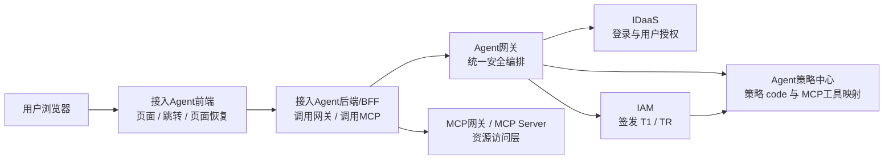
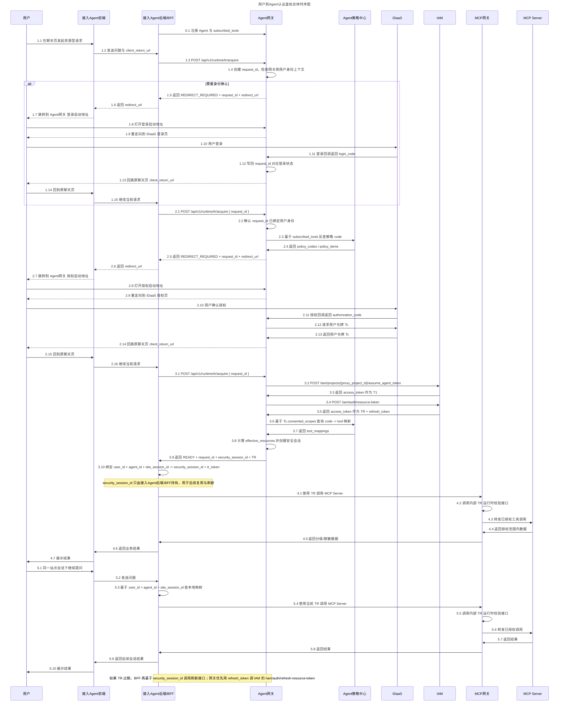
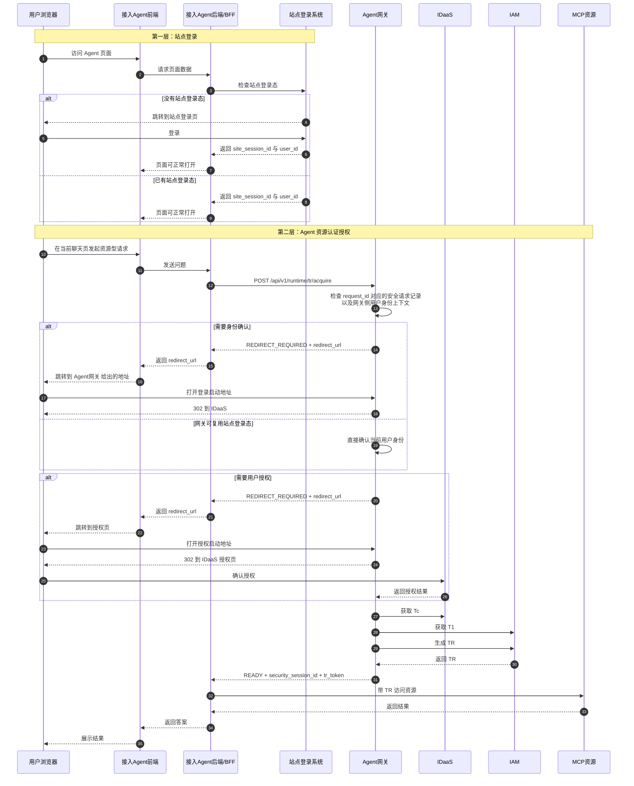
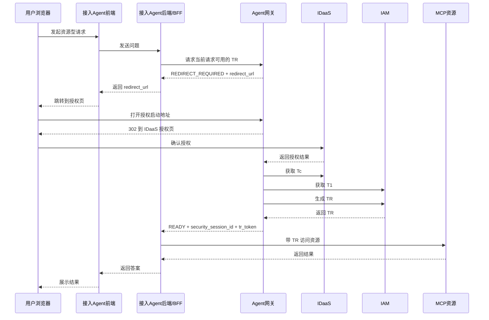
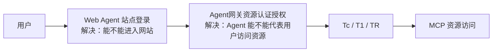
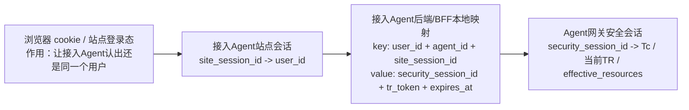
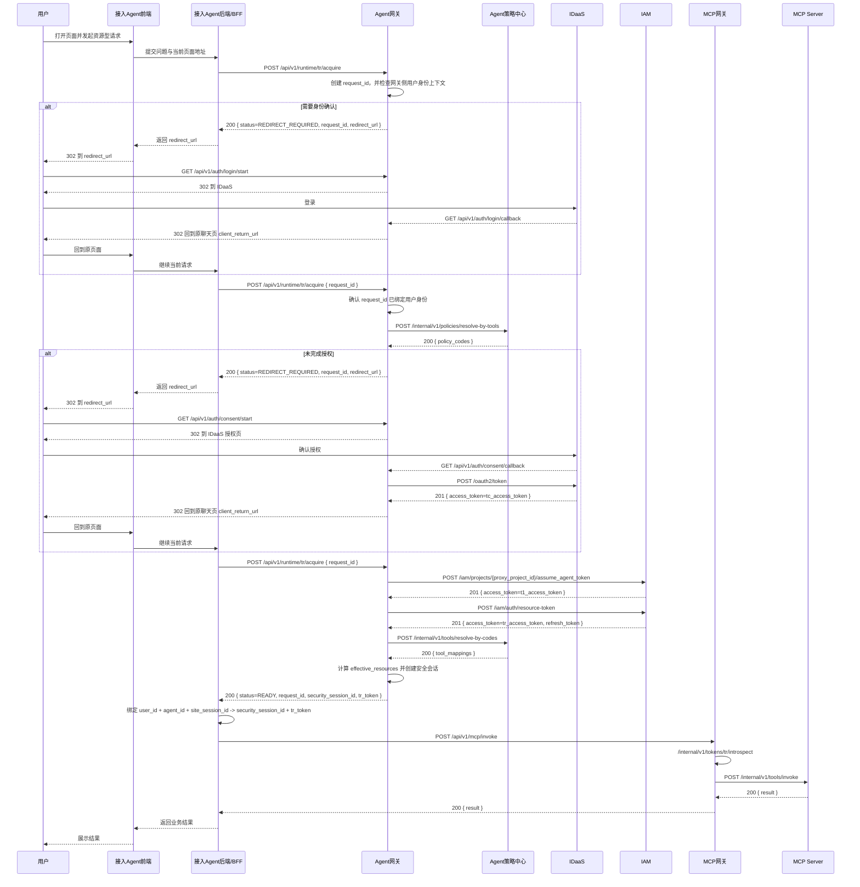

# Agent 安全体系总体架构

## 1. 系统定位

这套方案是一套可供多种业务 Agent 复用的通用安全底座。

它要同时解决三件事：

- 用户是谁
- 当前执行操作的 Agent 是谁
- 这个 Agent 在当前会话里到底能访问哪些资源

文档中的财报、发票和 `erp:*` 策略 code 仅用于示例说明。

## 2. 架构口径

这套方案统一采用下面这套边界：

- 浏览器流量入口是 `ALB -> 接入Agent`
- `Agent网关` 是内部安全编排服务
- 接入 Agent 不直接对接 `IDaaS`
- 登录、授权、`Tc / T1 / TR` 的申请、校验与刷新由 `Agent网关` 统一处理
- 接入 Agent 运行时只对外看 3 个接口：
  - `POST /api/v1/runtime/tr/acquire`
  - `POST /api/v1/runtime/security-sessions/{security_session_id}/tr/refresh`
  - `POST /api/v1/mcp/invoke`
- 接入 Agent 前端只负责页面、跳转和回到原页面
- 接入 Agent 后端/BFF 负责持有：
  - `request_id`
  - `security_session_id`
  - `tr_token`

一句话概括：

`接入Agent负责业务入口，Agent网关负责统一安全编排。`

## 3. 核心模块

- **用户 (User)**：最终使用者
- **ALB**：浏览器流量入口，负责把请求转给接入 Agent
- **接入Agent前端**：聊天页面、业务交互、跳转和页面恢复
- **接入Agent后端/BFF**：调用 `Agent网关`、调用 `MCP`、维护站点会话到安全上下文的本地映射
- **Agent网关**：内部安全编排服务，负责登录、授权、`Tc / T1 / TR` 的申请、校验与刷新
- **IDaaS**：用户登录和用户授权中心，签发 `Tc`
- **IAM**：Agent 身份和委托令牌中心，签发 `T1` 和 `TR`
- **Agent策略中心**：维护“策略 code <-> MCP 工具”的映射
- **MCP网关 / MCP Server**：资源访问层，只接受 `TR`

## 4. 系统总架构图

这张图表达的重点是：

- 用户第一跳先到接入 Agent，不到 `Agent网关`
- `Agent网关` 不承接网站首页流量，只承接安全编排能力
- 接入 Agent 前端和后端/BFF职责分离
- 接入 Agent 后端/BFF通过调用 `Agent网关`，拿到最终可用的 `TR`

### 4.1 总体时序图

## 5. Web Agent 场景下的两层认证

Web Agent 场景最容易混淆的是：为什么看起来像有两次“登录/认证”。

实际上是两层不同的能力：

- **第一层：站点登录**
  - 解决“用户能不能进入这个 Web Agent 网站”
- **第二层：Agent 资源认证授权**
  - 解决“这个 Agent 能不能代表当前用户访问 MCP 资源”

### 5.1 详细图

这张图要表达的重点是：

- 站点登录和 Agent 资源认证授权不是一回事
- `Agent网关` 判断“是否需要身份确认”时，依赖的是当前 `request_id` 对应的安全请求记录，以及网关侧用户身份上下文
- 如果 `Agent网关` 已经能够复用第一层站点登录态，确认当前用户具备可复用的企业身份上下文，就不需要再让接入 Agent 发起登录跳转，而是直接进入授权分支
- 接入 Agent 前端不需要识别 `IDaaS` 登录态，它只需要根据后端/BFF返回的 `READY` 或 `REDIRECT_REQUIRED` 推进流程

### 5.2 常见授权路径图

下面这张图只保留最常见的一条路径：

- 用户已经完成站点登录
- `Agent网关` 已经识别到用户身份
- 当前只差 Agent 资源授权

### 5.3 简化图

### 5.4 浏览器 cookie、站点会话、本地映射和 `security_session_id` 的关系

这四者要分清：

- 浏览器 cookie
  - 属于第一层站点登录
  - 用来让接入 Agent 找到当前浏览器对应的站点会话
- 站点会话
  - 由接入 Agent 自己的站点登录体系维护
  - 用来把“当前浏览器访问”稳定映射到同一个 `user_id`
- 接入 Agent 后端/BFF本地映射
  - 用来把“这个用户、这个 Agent、这个站点会话”关联到一条可复用的安全上下文
- `security_session_id`
  - 由 `Agent网关` 在首次成功拿到 `TR` 后创建
  - 指向网关侧维护的安全会话，而不是浏览器站点 session

一句话概括：

`浏览器 cookie` 负责找到当前站点会话，接入 Agent 后端/BFF通过站点会话把同一用户、同一 Agent 的请求关联到同一条安全上下文，`security_session_id` 则由 `Agent网关` 负责维护和复用。

## 6. 默认方案的主流程

当前接口与交互文档只覆盖默认方案。

## 7. 插件方案的定位

插件方案仍然保留为扩展能力：

- 接入 Agent 先做一次“无敏感数据”的工具识别
- 返回本次真正需要的 MCP 工具
- Agent 网关再去策略中心做 `tool -> code` 反查
- 最终把授权范围缩到本次请求最小集合

当前接口与交互文档不展开插件方案实现，只保留其架构定位。

## 8. 关键边界

- 用户第一跳到的是接入 Agent，不是 `Agent网关`
- 接入 Agent 不直接对接 `IDaaS`
- `Agent网关` 统一负责登录、授权和令牌生成
- 接入 Agent 不持有 `Tc / T1`
- 接入 Agent 前端不持有：
  - `request_id`
  - `security_session_id`
  - `tr_token`
- 接入 Agent 后端/BFF 持有：
  - `request_id`
  - `security_session_id`
  - `当前 TR`
- 真正访问 MCP 时，只能使用 `TR`
