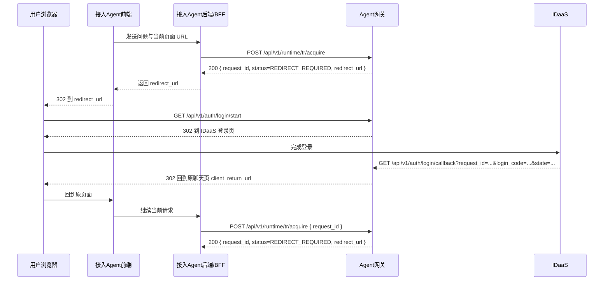
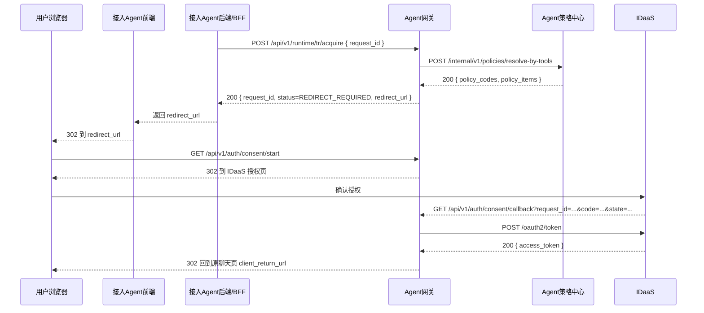

# 02. 接入准备与认证授权

## 1. 接入准备

### 1.1 `POST /api/v1/agents/register`

**调用方**：接入 Agent 后端/BFF 或平台配置  
**被调用方**：Agent 网关  
**用途**：注册 Agent 基本信息与已订阅工具

#### 请求示例

```json
{
  "agent_id": "agt_business_001",
  "agent_name": "业务数据助手",
  "appId": "com.huawei.business.agent",
  "version": "v2.1.0",
  "subscribed_tools": [
    "mcp:financial-report-server/query_monthly_report",
    "mcp:financial-report-server/list_report_categories",
    "mcp:invoice-server/query_invoices"
  ],
  "callback_base_url": "https://agent.local/chat"
}
```

#### 响应示例

```json
{
  "code": "0",
  "message": "success",
  "data": {
    "agent_id": "agt_business_001",
    "registration_status": "REGISTERED",
    "registered_at": "2026-04-02T10:00:00+08:00"
  }
}
```

> 说明：
>
> - 这一接口只用于接入前置配置或平台注册
> - `callback_base_url` 是可选字段，只用于回跳白名单或默认值兜底
> - 运行时主链路依赖的是 `client_return_url`
> - 登录回调、授权回调和会话关联由 `Agent网关` 在运行时流程中自行维护

## 2. 登录启动与登录回调

### 2.1 时序图



### 2.2 `POST /api/v1/runtime/tr/acquire`

**调用方**：接入 Agent 后端/BFF  
**被调用方**：Agent 网关  
**用途**：获取当前用户请求对应的 `TR`；如果前置登录或授权尚未完成，则返回继续流程所需的 `request_id + redirect_url`

#### 首次请求示例

```json
{
  "agent_id": "agt_business_001",
  "user_request": "分析 12 月财务报表",
  "client_return_url": "https://agent.local/chat?tab=main"
}
```

#### 首次响应：需要继续前置流程

```json
{
  "code": "0",
  "message": "success",
  "data": {
    "request_id": "req_sec_001",
    "status": "REDIRECT_REQUIRED",
    "redirect_url": "https://gateway.local/api/v1/auth/login/start?request_id=req_sec_001&agent_id=agt_business_001&client_return_url=https%3A%2F%2Fagent.local%2Fchat%3Ftab%3Dmain&state=st_login_001"
  }
}
```

#### 处理规则

- Agent 网关首先创建一条 `security_request` 记录
- 如果当前 `request_id` 尚未绑定网关侧用户身份上下文，则返回 `REDIRECT_REQUIRED`
- `client_return_url` 应该是原聊天页完整地址，浏览器完成前置动作后回到这个页面
- 对接入 Agent 来说，不需要区分这是登录跳转还是授权跳转，只要按 `redirect_url` 跳转即可

### 2.3 `GET /api/v1/auth/login/start`

**调用方**：用户浏览器  
**被调用方**：Agent 网关  
**用途**：由网关统一启动登录流程

#### Query 参数

| 参数 | 说明 |
|---|---|
| `request_id` | 当前安全请求 ID |
| `agent_id` | 发起请求的 Agent |
| `client_return_url` | 登录完成后回到原聊天页的完整地址 |
| `state` | 防 CSRF 状态值 |

#### 处理结果

- Agent 网关记录当前登录上下文
- 302 到 IDaaS 登录页

### 2.4 `GET /api/v1/auth/login/callback`

**调用方**：IDaaS  
**被调用方**：Agent 网关  
**用途**：登录成功后回调 Agent 网关

#### Query 参数示例

```text
request_id=req_sec_001
login_code=lgc_001
state=st_login_001
```

#### 回调处理结果

- Agent 网关把当前 `request_id` 标记为“已具备用户身份上下文”
- 写入网关侧用户身份上下文
- 302 回跳 `client_return_url`

## 3. 默认方案授权与 `Tc` 获取

### 3.1 时序图



### 3.2 `POST /api/v1/runtime/tr/acquire`

**调用方**：接入 Agent 后端/BFF  
**被调用方**：Agent 网关  
**用途**：在浏览器回跳后，基于 `request_id` 继续获取当前请求对应的 `TR`

#### 浏览器回跳后的请求示例

```json
{
  "agent_id": "agt_business_001",
  "request_id": "req_sec_001",
  "client_return_url": "https://agent.local/chat?tab=main"
}
```

#### 响应示例：继续进入授权

```json
{
  "code": "0",
  "message": "success",
  "data": {
    "request_id": "req_sec_001",
    "status": "REDIRECT_REQUIRED",
    "redirect_url": "https://gateway.local/api/v1/auth/consent/start?request_id=req_sec_001&state=st_consent_001",
    "policy_items": [
      {
        "policy_code": "erp:report:read",
        "display_name": "读取财报数据"
      },
      {
        "policy_code": "erp:report:category:list",
        "display_name": "查看报表分类"
      },
      {
        "policy_code": "erp:invoice:read",
        "display_name": "读取发票数据"
      }
    ]
  }
}
```

#### 处理规则

- Agent 网关确认当前 `request_id` 已绑定用户身份
- Agent 网关根据 `agent_registry.subscribed_tools` 调用策略中心反查 `policy_codes`
- 默认方案下，用户看到的是当前 Agent 订阅工具对应的整组授权项

### 3.3 `GET /api/v1/auth/consent/start`

**调用方**：用户浏览器  
**被调用方**：Agent 网关  
**用途**：由网关统一启动授权流程

#### Query 参数

| 参数 | 说明 |
|---|---|
| `request_id` | 当前安全请求 ID |
| `state` | 防 CSRF 状态值 |

#### 处理结果

- Agent 网关记录当前授权上下文
- 302 到 IDaaS 授权页

### 3.4 `GET /api/v1/auth/consent/callback`

**调用方**：IDaaS  
**被调用方**：Agent 网关  
**用途**：授权成功后回调 Agent 网关

#### Query 参数示例

```text
request_id=req_sec_001
code=ac_001
state=st_consent_001
```

### 3.5 `POST /oauth2/token`

**调用方**：Agent 网关  
**被调用方**：IDaaS  
**用途**：使用授权码换取 `Tc`

#### 请求体示例

```json
{
  "grant_type": "authorization_code",
  "code": "ac_001",
  "client_id": "agent_gateway_client",
  "redirect_uri": "https://gateway.local/api/v1/auth/consent/callback"
}
```

#### 字段说明

| 字段 | 说明 |
|---|---|
| `grant_type` | 固定为 `authorization_code` |
| `code` | IDaaS 在授权回调里返回的授权码 |
| `client_id` | Agent 网关在 IDaaS 注册的客户端标识 |
| `redirect_uri` | 与授权阶段保持一致的回调地址 |

> 说明：
>
> - `request_id` 是 Agent 网关内部流程主键，不是 OAuth2 换 token 参数
> - `request_id` 与授权码的关联关系由网关在授权上下文里维护

#### 成功响应示例

```json
{
  "access_token": "tc_access_token_001",
  "expires_at": "2026-04-02T10:05:00+08:00",
  "expires_in": 3600,
  "token_id": "tc_001",
  "token_type": "Bearer"
}
```

#### 回调完成后的处理结果

- Agent 网关保存 `Tc`
- 302 回跳原聊天页 `client_return_url`
- 这一阶段只覆盖到 `Tc` 获取
- `T1` 获取、`TR` 生成以及 `READY + security_session_id + tr_token` 的返回，统一放在 [03_T1与TR生成.md](/D:/IDEA_Project/init_env/auth-design-spec/docs/design/default_scheme_interfaces/03_T1与TR生成.md)
