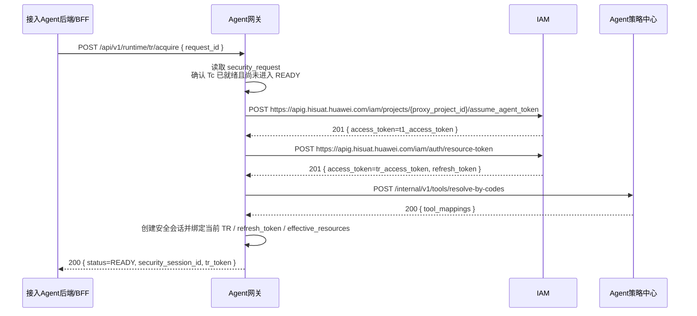

# 03. `T1` 获取、`TR` 生成与同步返回

## 1. 时序图



## 2. IAM 真实接口：获取 `T1`

**调用方**：Agent 网关  
**被调用方**：IAM  
**用途**：通过委托获取 AI 应用的 App Token（本方案中作为 `T1`）

### 真实地址

```text
POST https://apig.hisuat.huawei.com/iam/projects/{proxy_project_id}/assume_agent_token
```

其中：

- `proxy_project_id`：代理项目 ID，按本地测试环境配置
- `agent_service_account`：AI 应用程序集成账号名，按部署配置
- `principal`：接入 Agent 的 `appId`
- `agent_id`：业务侧 Agent 唯一标识

### 请求示例

```json
{
  "data": {
    "type": "assume_agent_token",
    "attributes": {
      "agent_service_account": "svc_ai_business_agent",
      "principal": "com.huawei.business.agent",
      "agent_id": "agt_business_001"
    }
  }
}
```

### 响应示例

```json
{
  "message": "OK",
  "code": "201",
  "enterprise": "ent_001",
  "access_token": "t1_access_token_001",
  "expires_at": "2026-04-02T10:10:00+08:00",
  "expires_in": 86399,
  "token_id": "atk_001",
  "token_type": "IAM_AI_SERVICE",
  "expires_on": 1775197488000
}
```

## 3. `POST /internal/v1/tools/resolve-by-codes`

**调用方**：Agent 网关  
**被调用方**：Agent 策略中心  
**用途**：按策略 code 正向解析 MCP 工具

### 请求示例

```json
{
  "policy_codes": [
    "erp:report:read",
    "erp:report:category:list",
    "erp:invoice:read"
  ]
}
```

### 响应示例

```json
{
  "code": "0",
  "message": "success",
  "data": {
    "tool_mappings": [
      {
        "policy_code": "erp:report:read",
        "server_id": "mcp:financial-report-server",
        "tool_name": "query_monthly_report"
      },
      {
        "policy_code": "erp:report:category:list",
        "server_id": "mcp:financial-report-server",
        "tool_name": "list_report_categories"
      },
      {
        "policy_code": "erp:invoice:read",
        "server_id": "mcp:invoice-server",
        "tool_name": "query_invoices"
      }
    ]
  }
}
```

## 4. IAM 真实接口：获取 `TR`

**调用方**：Agent 网关  
**被调用方**：IAM  
**用途**：基于 `Tc + T1` 生成 Resource Token（本方案中作为 `TR`）

### 真实地址

```text
POST https://apig.hisuat.huawei.com/iam/auth/resource-token
```

### 请求头

| Header | 值 |
|---|---|
| `Authorization` | `Bearer <t1_access_token>` |
| `Content-Type` | `application/json` |

### 请求示例

```json
{
  "data": {
    "type": "resource_token",
    "attributes": {
      "user_token": "tc_access_token_001"
    }
  }
}
```

### 响应示例

```json
{
  "message": "OK",
  "code": "201",
  "enterprise": "ent_001",
  "access_token": "tr_access_token_001",
  "expires_at": "2026-04-02T10:15:00+08:00",
  "expires_in": 86399,
  "token_id": "rtk_001",
  "token_type": "IAM_AI_SERVICE",
  "refresh_token": "refresh_token_001",
  "expires_on": 1775197488000
}
```

### 4.1 网关侧补充处理

IAM 真实返回体里不会直接把 `granted_resources` 放在 `TR` 原始响应中，因此 `Agent网关` 在收到 `TR` 后还需要补 2 步：

1. 读取 `TR` 中的 `agency_user.consented_scopes`
2. 结合：
   - `agent_registry.subscribed_tools`
   - `Agent策略中心` 的 `code -> tool` 映射
   计算当前会话生效的 `effective_resources`

网关会把：

- `tr_token`
- `refresh_token`
- `effective_resources`

写回 `security_request` 和后续安全会话，供 MCP 调用阶段使用。

## 5. `POST /api/v1/runtime/tr/acquire` 在 `READY` 时的响应

这里的“同步返回”指接入 Agent 后端/BFF在浏览器回跳后再次调用同一个 `TR` 获取接口，拿到最终结果，而不是由 `Agent网关` 主动推送。

```json
{
  "code": "0",
  "message": "success",
  "data": {
    "request_id": "req_sec_ready_001",
    "status": "READY",
    "security_session_id": "sec_ses_001",
    "tr_token": "tr_access_token_001",
    "expires_at": "2026-04-02T10:15:00+08:00"
  }
}
```

说明：

- 这里的 `tr_token` 本质上就是 IAM 响应中的 `access_token`
- 接入 Agent 接口继续使用 `tr_token` 字段名，只是为了让业务语义更清楚

### 5.1 对接入 Agent 的外部语义

对接入 Agent 后端/BFF来说，`POST /api/v1/runtime/tr/acquire` 只会看到两类结果：

- `READY`
  - 直接拿到 `security_session_id + tr_token`
- `REDIRECT_REQUIRED`
  - 前端按 `redirect_url` 跳转，并在浏览器回跳后由后端/BFF带着 `request_id` 再调一次同一个接口

网关内部仍然会区分：

- `LOGIN_REQUIRED`
- `CONSENT_REQUIRED`

但这些内部状态不要求接入 Agent 额外识别。

## 6. 安全会话创建规则

- 安全会话只在当前 `security_request` 首次进入 `READY` 时创建
- 安全会话创建后，`Agent网关` 把：
  - `request_id`
  - `agent_id`
  - `user_id`
  - `tc_ref`
  - `current_tr_ref`
  - `current_refresh_token_ref`
  - `effective_resources`
  绑定到同一条安全会话记录
- 接入 Agent 后端/BFF 收到 `READY` 后，再把：
  - `user_id`
  - `agent_id`
  - `site_session_id`
  - `security_session_id`
  - `tr_token`
  - `expires_at`
  写入本地映射
- 后续 `TR` 刷新会更新：
  - `current_tr_ref`
  - `current_refresh_token_ref`
  不再新建安全会话
