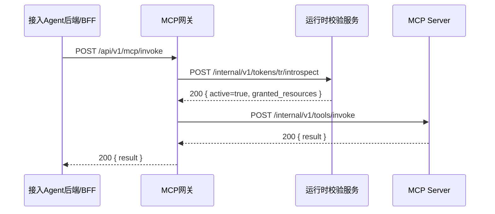
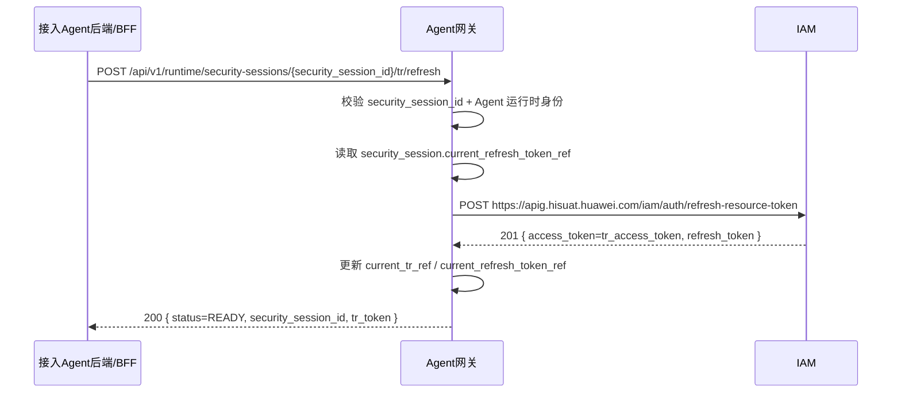

# 04. 资源访问与 `TR` 刷新

## 1. 资源访问

### 1.1 时序图



### 1.2 `POST /api/v1/mcp/invoke`

**调用方**：接入 Agent 后端/BFF  
**被调用方**：MCP 网关  
**用途**：使用 `TR` 访问 MCP 工具

#### 请求示例

```json
{
  "security_session_id": "sec_ses_001",
  "tr_token": "tr_access_token_001",
  "server_id": "mcp:financial-report-server",
  "tool_name": "query_monthly_report",
  "tool_input": {
    "year": "2025",
    "month": "12"
  }
}
```

#### 成功响应示例

```json
{
  "code": "0",
  "message": "success",
  "data": {
    "server_id": "mcp:financial-report-server",
    "tool_name": "query_monthly_report",
    "result": {
      "report_id": "FIN-2025-12",
      "currency": "CNY",
      "revenue": 12500000,
      "expense": 8300000,
      "profit": 4200000
    }
  }
}
```

### 1.3 `POST /internal/v1/tokens/tr/introspect`

**调用方**：MCP 网关  
**被调用方**：运行时校验服务  
**用途**：校验 `TR` 是否有效，并返回当前会话生效的资源范围

> 说明：
>
> - 当前 IAM 文档未提供官方 `TR introspect` 接口
> - 因此当前方案保留内部 `TR` 运行时校验接口
> - 这里返回的 `granted_resources` 是运行时计算结果，不是 `TR` 原始 payload 字段

#### 请求示例

```json
{
  "tr_token": "tr_access_token_001"
}
```

#### 响应示例

```json
{
  "code": "0",
  "message": "success",
  "data": {
    "active": true,
    "token_id": "rtk_001",
    "expires_at": "2026-04-02T10:15:00+08:00",
    "granted_resources": [
      {
        "server_id": "mcp:financial-report-server",
        "granted_tools": [
          "query_monthly_report",
          "list_report_categories"
        ]
      },
      {
        "server_id": "mcp:invoice-server",
        "granted_tools": [
          "query_invoices"
        ]
      }
    ]
  }
}
```

### 1.4 `POST /internal/v1/tools/invoke`

**调用方**：MCP 网关  
**被调用方**：MCP Server  
**用途**：执行经过授权校验后的工具调用

#### 请求示例

```json
{
  "user": {
    "user_id": "z01062668",
    "department": "财经财务管理部"
  },
  "agent": {
    "agent_id": "agt_business_001",
    "appId": "com.huawei.business.agent"
  },
  "tool_name": "query_monthly_report",
  "tool_input": {
    "year": "2025",
    "month": "12"
  }
}
```

#### 响应示例

```json
{
  "code": "0",
  "message": "success",
  "data": {
    "result": {
      "report_id": "FIN-2025-12",
      "currency": "CNY",
      "revenue": 12500000,
      "expense": 8300000,
      "profit": 4200000
    }
  }
}
```

## 2. 会话复用与 `TR` 刷新

### 2.1 时序图



### 2.2 `POST /api/v1/runtime/security-sessions/{security_session_id}/tr/refresh`

**调用方**：接入 Agent 后端/BFF  
**被调用方**：Agent 网关  
**用途**：在 `TR` 过期或缺失时刷新

#### 请求示例

```json
{
  "refresh_reason": "TR_EXPIRED"
}
```

#### 网关侧主逻辑

1. 校验 `security_session_id` 和 Agent 运行时身份
2. 读取 `security_session.current_refresh_token_ref`
3. 调用 IAM 真实接口：

```text
POST https://apig.hisuat.huawei.com/iam/auth/refresh-resource-token
```

请求体：

```json
{
  "data": {
    "type": "token",
    "attributes": {
      "refresh_token": "refresh_token_001"
    }
  }
}
```

4. IAM 返回新的：
   - `access_token`，作为新的 `TR`
   - `refresh_token`
5. Agent 网关更新当前安全会话里的：
   - `current_tr_ref`
   - `current_refresh_token_ref`

如果 `refresh_token` 不可用、已过期或被 IAM 拒绝，但 `Tc` 仍有效，Agent 网关可以回退到：

- 重新调用 `assume_agent_token` 获取 `T1`
- 再调用 `resource-token` 获取新的 `TR + refresh_token`

#### 真实 IAM 成功返回示例

```json
{
  "message": "OK",
  "code": "201",
  "enterprise": "ent_001",
  "access_token": "tr_access_token_002",
  "refresh_token": "refresh_token_002",
  "expires_at": "2026-04-02T10:45:00+08:00",
  "expires_in": 86399,
  "token_id": "rtk_002",
  "token_type": "IAM_AI_SERVICE",
  "expires_on": 1775197488000
}
```

#### 成功响应：刷新完成

```json
{
  "code": "0",
  "message": "success",
  "data": {
    "security_session_id": "sec_ses_001",
    "status": "READY",
    "tr_token": "tr_access_token_002",
    "expires_at": "2026-04-02T10:45:00+08:00"
  }
}
```

#### 响应：需要继续前置流程

```json
{
  "code": "0",
  "message": "success",
  "data": {
    "security_session_id": "sec_ses_003",
    "status": "REDIRECT_REQUIRED",
    "request_id": "req_sec_reauth_001",
    "redirect_url": "https://gateway.local/api/v1/auth/consent/start?request_id=req_sec_reauth_001&state=st_consent_002",
    "reason": "TC_EXPIRED"
  }
}
```

#### 响应：需要重新确认身份

```json
{
  "code": "0",
  "message": "success",
  "data": {
    "security_session_id": "sec_ses_004",
    "status": "REDIRECT_REQUIRED",
    "request_id": "req_sec_relogin_001",
    "redirect_url": "https://gateway.local/api/v1/auth/login/start?request_id=req_sec_relogin_001&state=st_login_002",
    "reason": "SESSION_LOGIN_INVALID"
  }
}
```

#### 错误响应：session 不存在

```json
{
  "code": "SESSION_NOT_FOUND",
  "message": "security_session_id is invalid or expired",
  "data": {
    "security_session_id": "sec_ses_not_found"
  }
}
```

> 说明：
>
> - `security_session_id` 只是会话索引，不是单独可换 `TR` 的凭证
> - 刷新接口仍然要求 Agent 运行时身份校验
> - `refresh_token` 保存在 `Agent网关` 侧安全会话中，不返回给接入 Agent
> - 成功响应里的 `tr_token` 本质上就是新的 `TR access_token`

## 3. 实施建议

- `Agent网关` 应成为 `Tc / T1` 的唯一持有者
- `Agent网关` 也应成为 `refresh_token` 的唯一持有者
- 接入 Agent 前端不感知 `security_session_id` 与 `TR`
- 接入 Agent 后端/BFF 仅缓存 `security_session_id + 当前 TR`
- `TR` 刷新逻辑必须走 `Agent网关`，不允许接入 Agent 直连 IAM
- 刷新主路径优先走 IAM 的 `/iam/auth/refresh-resource-token`
