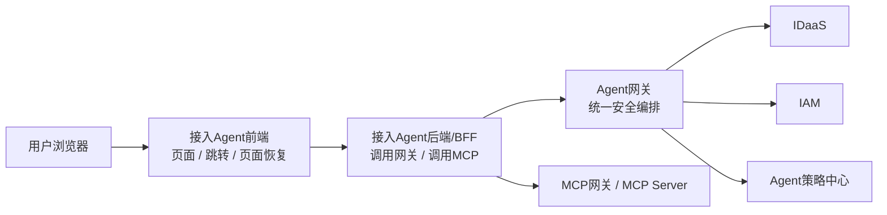
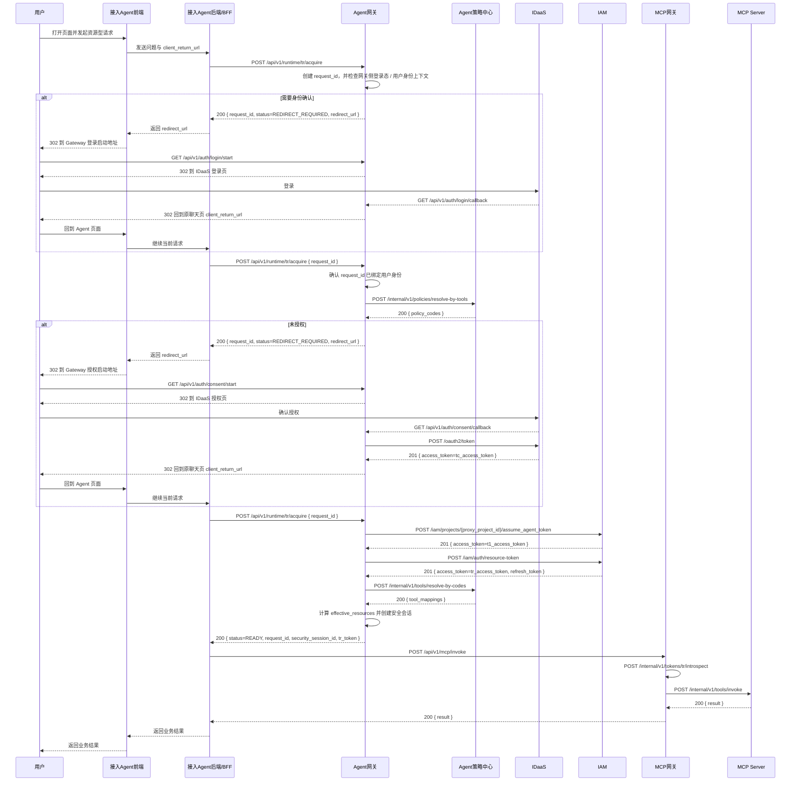

# 默认方案接口与模块交互

> 本目录只覆盖默认方案。财报、发票与 `erp:*` 策略 code 仅为示例业务场景。

## 文档导航

1. [01_全局约定.md](/D:/IDEA_Project/init_env/auth-design-spec/docs/design/default_scheme_interfaces/01_全局约定.md)
   统一约定、状态值、错误码、Token 和会话边界
2. [02_接入准备与认证授权.md](/D:/IDEA_Project/init_env/auth-design-spec/docs/design/default_scheme_interfaces/02_接入准备与认证授权.md)
   Agent 注册、登录启动、登录回调、默认方案授权、`Tc` 获取
3. [03_T1与TR生成.md](/D:/IDEA_Project/init_env/auth-design-spec/docs/design/default_scheme_interfaces/03_T1与TR生成.md)
   `T1` 获取、`TR` 生成、同步返回 `security_session_id + TR`
4. [04_资源访问与TR刷新.md](/D:/IDEA_Project/init_env/auth-design-spec/docs/design/default_scheme_interfaces/04_资源访问与TR刷新.md)
   MCP 调用、运行时校验、会话复用、`TR` 刷新
5. [05_数据对象与状态模型.md](/D:/IDEA_Project/init_env/auth-design-spec/docs/design/default_scheme_interfaces/05_数据对象与状态模型.md)
   数据对象、状态模型与典型交互场景

## 已锁定的设计前提

- 只设计默认方案，不展开插件方案接口
- 浏览器入口流量是：`ALB -> 接入Agent`
- `Agent网关` 是内部安全编排服务
- 接入 Agent 不直接对接 `IDaaS`
- 接入 Agent 前端只负责跳转和回到原页面
- 接入 Agent 后端/BFF 负责：
  - 调用 `Agent网关`
  - 调用 `MCP`
  - 保存 `request_id`
  - 保存 `security_session_id`
  - 保存当前 `TR`
- 接入 Agent 不持有 `Tc / T1`
- `TR` 过期后只能回 `Agent网关` 刷新
- `security_session_id` 只是会话索引，不是独立凭证
- Agent 调 `Agent网关` 时需要运行时身份认证，但当前文档不绑定具体技术实现

## 真实令牌接口基线

- `Tc` 接口：`POST /oauth2/token`
- `T1` 接口：`POST https://apig.hisuat.huawei.com/iam/projects/{proxy_project_id}/assume_agent_token`
- `TR` 接口：`POST https://apig.hisuat.huawei.com/iam/auth/resource-token`
- `TR` 刷新接口：`POST https://apig.hisuat.huawei.com/iam/auth/refresh-resource-token`
- 当前 IAM 文档未提供 `TR introspect` 官方接口，因此资源访问阶段保留内部 `TR` 运行时校验接口

## 接口分层

### 第一层：接入 Agent 可见接口

- `POST /api/v1/runtime/tr/acquire`
- `POST /api/v1/runtime/security-sessions/{security_session_id}/tr/refresh`
- `POST /api/v1/mcp/invoke`

### 第二层：Agent 网关内部编排接口

- `GET /api/v1/auth/login/start`
- `GET /api/v1/auth/login/callback`
- `GET /api/v1/auth/consent/start`
- `GET /api/v1/auth/consent/callback`
- `POST /internal/v1/policies/resolve-by-tools`
- `POST /oauth2/token`
- `POST https://apig.hisuat.huawei.com/iam/projects/{proxy_project_id}/assume_agent_token`
- `POST https://apig.hisuat.huawei.com/iam/auth/resource-token`
- `POST https://apig.hisuat.huawei.com/iam/auth/refresh-resource-token`

### 第三层：资源访问内部接口

- `POST /internal/v1/tokens/tr/introspect`
- `POST /internal/v1/tools/invoke`

## 静态结构图

## 总时序图

## 实现时的 4 条硬规则

- `security_request` 是唯一流程主记录，登录回调、授权回调、再次获取 `TR` 都围绕它推进
- `POST /api/v1/runtime/tr/acquire` 是接入 Agent 唯一的 `TR` 获取入口
- 安全会话只在首次进入 `READY` 后创建
- 浏览器回跳只负责让前端回到原聊天页，再由后端/BFF继续获取 `TR`
