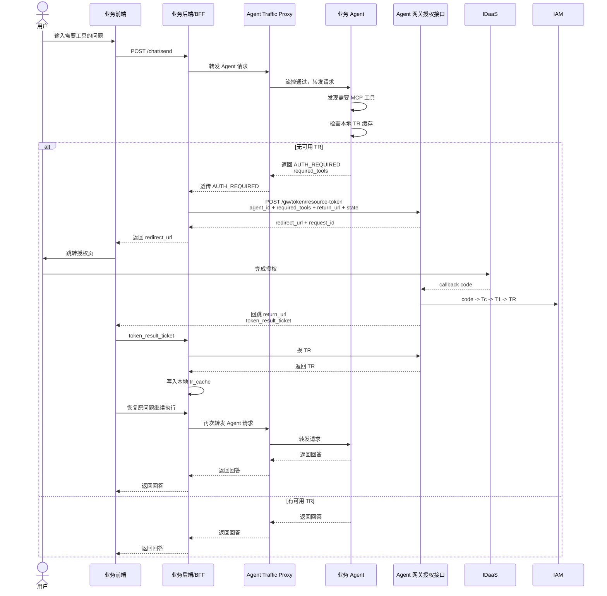
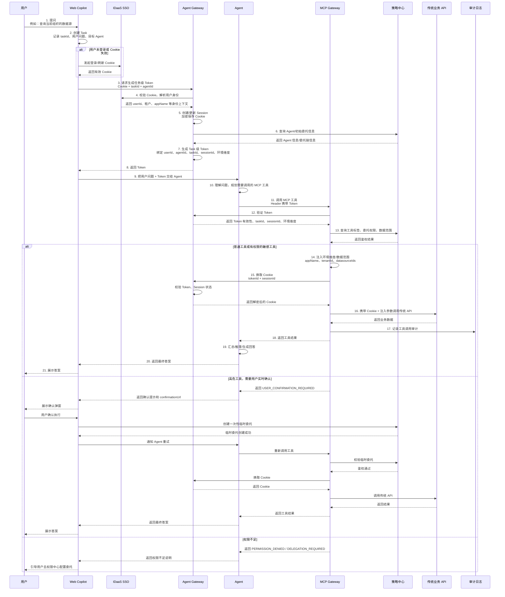
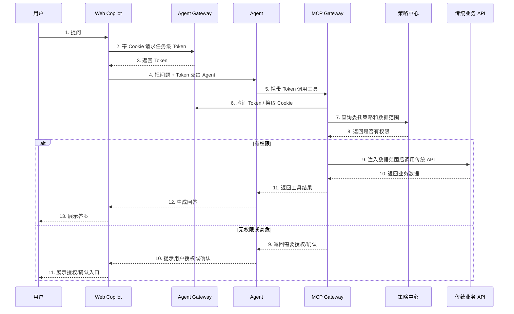
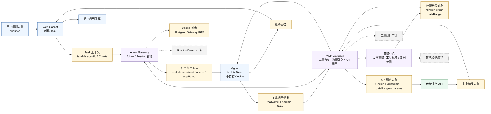

```mermaid
sequenceDiagram
    actor User as 用户
    participant FE as 业务前端
    participant BFF as 业务后端/BFF
    participant Proxy as Agent Traffic Proxy
    participant Agent as 业务 Agent
    participant GW as Agent 网关授权接口
    participant IDaaS as IDaaS
    participant IAM as IAM

    User->>FE: 输入需要工具的问题
    FE->>BFF: POST /chat/send
    BFF->>Proxy: 转发 Agent 请求
    Proxy->>Agent: 流控通过，转发请求

    Agent->>Agent: 发现需要 MCP 工具
    Agent->>Agent: 检查本地 TR 缓存

    alt 无可用 TR
        Agent-->>Proxy: 返回 AUTH_REQUIRED<br/>required_tools
        Proxy-->>BFF: 透传 AUTH_REQUIRED
        BFF->>GW: POST /gw/token/resource-token<br/>agent_id + required_tools + return_url + state
        GW-->>BFF: redirect_url + request_id
        BFF-->>FE: 返回 redirect_url
        FE->>User: 跳转授权页

        User->>IDaaS: 完成授权
        IDaaS-->>GW: callback code
        GW->>IAM: code -> Tc -> T1 -> TR
        GW-->>FE: 回跳 return_url<br/>token_result_ticket

        FE->>BFF: token_result_ticket
        BFF->>GW: 换 TR
        GW-->>BFF: 返回 TR
        BFF->>BFF: 写入本地 tr_cache

        FE->>BFF: 恢复原问题继续执行
        BFF->>Proxy: 再次转发 Agent 请求
        Proxy->>Agent: 转发请求
        Agent-->>Proxy: 返回回答
        Proxy-->>BFF: 返回回答
        BFF-->>FE: 返回回答
    else 有可用 TR
        Agent-->>Proxy: 返回回答
        Proxy-->>BFF: 返回回答
        BFF-->>FE: 返回回答
    end

```

```mermaid
sequenceDiagram
    participant U as 用户
    participant C as Web Copilot
    participant ID as IDaaS SSO
    participant AG as Agent Gateway
    participant A as Agent
    participant MCP as MCP Gateway
    participant SC as 策略中心
    participant API as 传统业务 API
    participant ES as 审计日志

    U->>C: 1. 提问<br/>例如：查询当前组织的数据源
    C->>C: 2. 创建 Task<br/>记录 taskId、用户问题、目标 Agent

    alt 用户未登录或 Cookie 失效
        C->>ID: 发起登录/刷新 Cookie
        ID-->>C: 返回有效 Cookie
    end

    C->>AG: 3. 请求生成任务级 Token<br/>Cookie + taskId + agentId
    AG->>ID: 4. 校验 Cookie，解析用户身份
    ID-->>AG: 返回 userId、租户、appName 等身份上下文
    AG->>AG: 5. 创建/更新 Session<br/>加密保存 Cookie
    AG->>SC: 6. 查询 Agent/初始委托信息
    SC-->>AG: 返回 Agent 信息/委托链信息
    AG->>AG: 7. 生成 Task 级 Token<br/>绑定 userId、agentId、taskId、sessionId、环境维度
    AG-->>C: 8. 返回 Token
    C->>A: 9. 把用户问题 + Token 交给 Agent

    A->>A: 10. 理解问题，规划需要调用的 MCP 工具
    A->>MCP: 11. 调用 MCP 工具<br/>Header 携带 Token

    MCP->>AG: 12. 验证 Token
    AG-->>MCP: 返回 Token 有效性、taskId、sessionId、环境维度

    MCP->>SC: 13. 查询工具标签、委托权限、数据范围
    SC-->>MCP: 返回鉴权结果

    alt 普通工具或有权限的敏感工具
        MCP->>MCP: 14. 注入环境维度/数据范围<br/>appName、tenantId、datasourceIds
        MCP->>AG: 15. 换取 Cookie<br/>tokenId + sessionId
        AG->>AG: 校验 Token、Session 状态
        AG-->>MCP: 返回解密后的 Cookie
        MCP->>API: 16. 携带 Cookie + 注入参数调用传统 API
        API-->>MCP: 返回业务数据
        MCP->>ES: 17. 记录工具调用审计
        MCP-->>A: 18. 返回工具结果
        A->>A: 19. 汇总/推理/生成回答
        A-->>C: 20. 返回最终答案
        C-->>U: 21. 展示答案

    else 高危工具，需要用户实时确认
        MCP-->>A: 返回 USER_CONFIRMATION_REQUIRED
        A-->>C: 返回确认提示和 confirmationUrl
        C-->>U: 展示确认弹窗
        U->>C: 用户确认执行
        C->>SC: 创建一次性临时委托
        SC-->>C: 临时委托创建成功
        C->>A: 通知 Agent 重试
        A->>MCP: 重新调用工具
        MCP->>SC: 校验临时委托
        SC-->>MCP: 鉴权通过
        MCP->>AG: 换取 Cookie
        AG-->>MCP: 返回 Cookie
        MCP->>API: 调用传统 API
        API-->>MCP: 返回结果
        MCP-->>A: 返回工具结果
        A-->>C: 返回最终答案
        C-->>U: 展示答案

    else 权限不足
        MCP-->>A: 返回 PERMISSION_DENIED / DELEGATION_REQUIRED
        A-->>C: 返回权限不足说明
        C-->>U: 引导用户去权限中心配置委托
    end
```

```mermaid
sequenceDiagram
    participant U as 用户
    participant C as Web Copilot
    participant AG as Agent Gateway
    participant A as Agent
    participant MCP as MCP Gateway
    participant SC as 策略中心
    participant API as 传统业务 API

    U->>C: 1. 提问
    C->>AG: 2. 带 Cookie 请求任务级 Token
    AG-->>C: 3. 返回 Token
    C->>A: 4. 把问题 + Token 交给 Agent

    A->>MCP: 5. 携带 Token 调用工具
    MCP->>AG: 6. 验证 Token / 换取 Cookie
    MCP->>SC: 7. 查询委托策略和数据范围
    SC-->>MCP: 8. 返回是否有权限

    alt 有权限
        MCP->>API: 9. 注入数据范围后调用传统 API
        API-->>MCP: 10. 返回业务数据
        MCP-->>A: 11. 返回工具结果
        A-->>C: 12. 生成回答
        C-->>U: 13. 展示答案
    else 无权限或高危
        MCP-->>A: 9. 返回需要授权/确认
        A-->>C: 10. 提示用户授权或确认
        C-->>U: 11. 展示授权/确认入口
    end
```

```mermaid
flowchart LR
    UQ["用户问题对象<br/>question"] --> WC["Web Copilot<br/>创建 Task"]
    WC --> TC["Task 上下文<br/>taskId / agentId / Cookie"]

    TC --> AG["Agent Gateway<br/>Token / Session 管理"]
    AG --> TK["任务级 Token<br/>taskId / sessionId / userId / appName"]

    TK --> A["Agent<br/>只持有 Token<br/>不持有 Cookie"]
    A --> TR["工具调用请求<br/>toolName + params + Token"]

    TR --> MCP["MCP Gateway<br/>工具鉴权 / 数据注入 / API 调用"]

    MCP --> SC["策略中心<br/>委托策略 / 工具标签 / 数据范围"]
    SC --> PR["权限结果对象<br/>allowed = true<br/>dataRange"]

    PR --> MCP
    MCP --> AG
    AG --> CK["Cookie 对象<br/>由 Agent Gateway 换取"]

    MCP --> APIREQ["API 请求对象<br/>Cookie + appName + dataRange + params"]
    APIREQ --> API["传统业务 API"]
    API --> R["业务结果对象"]
    R --> MCP
    MCP --> A
    A --> ANS["最终回答"]
    ANS --> WC
    WC --> USER["用户看到答案"]

    AG -.-> STORE1["Session/Token 存储"]
    SC -.-> STORE2["策略/委托存储"]
    MCP -.-> AUDIT["工具调用审计"]

    classDef actor fill:#eef6ff,stroke:#4f7db8,stroke-width:1px,color:#111;
    classDef gateway fill:#f7f1ff,stroke:#7a5ca8,stroke-width:1px,color:#111;
    classDef object fill:#fff7df,stroke:#b88720,stroke-width:1px,color:#111;
    classDef api fill:#eaf8ef,stroke:#4f9b68,stroke-width:1px,color:#111;
    classDef store fill:#f3f3f3,stroke:#888,stroke-dasharray:4 3,color:#111;

    class USER,UQ,WC,A actor;
    class AG,MCP,SC gateway;
    class TC,TK,TR,PR,CK,APIREQ,R,ANS object;
    class API api;
    class STORE1,STORE2,AUDIT store;
```