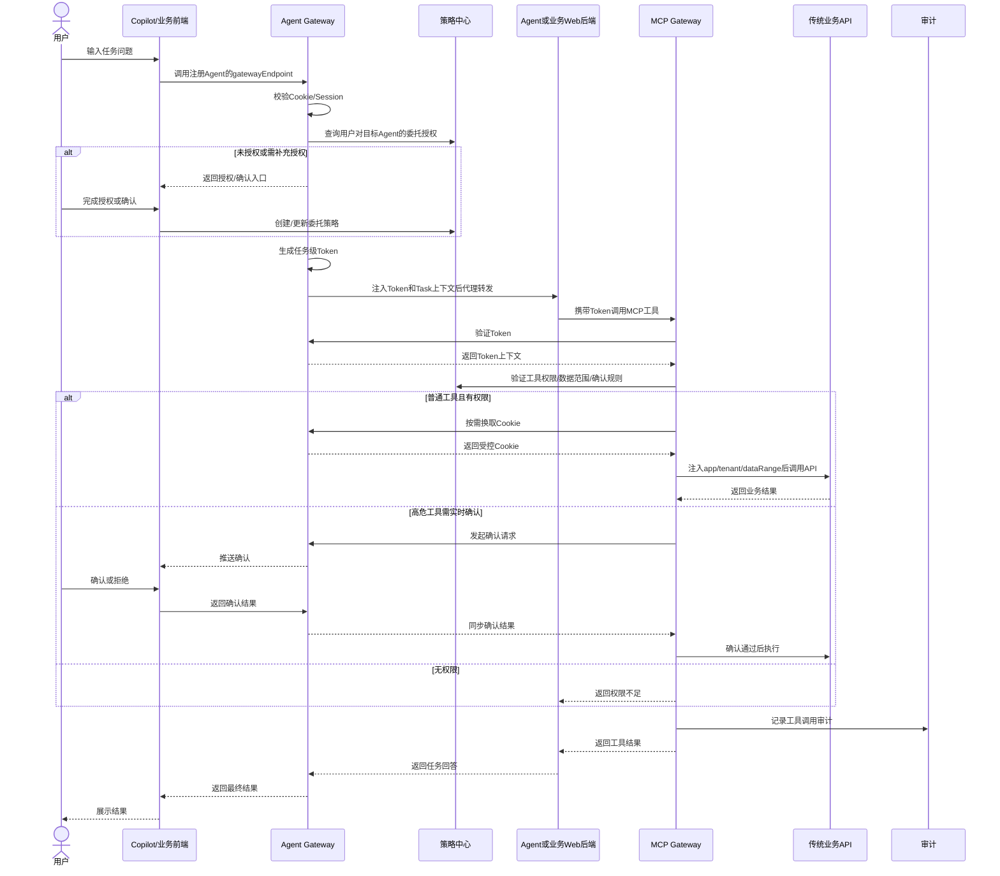

# Agent人机委托机制反串讲准备材料

| 项目 | 内容 |
| --- | --- |
| 文档用途 | 供会议中向领导反串讲整体方案、模块职责、接口能力、验证方式、责任分工和交付计划 |
| 输入材料 | `Agent人机委托机制架构设计文档.md`、`Agent Gateway详细设计文档.md`、`策略中心详细设计文档.md`、`MCP Gateway详细设计文档.md` |
| 辅助材料 | `整体方案流程图.md` |
| 推荐讲法 | 先讲问题和理念，再讲链路，再讲三个模块职责，最后讲验证、负责人和计划 |
| 状态 | 会议准备稿 |

---

## 1. 会议要达成什么

领导的诉求可以拆成六个要交代清楚的问题：

1. **整体方案是什么**：为什么需要Agent Gateway、策略中心、MCP Gateway三层。
2. **Agent网关要做什么**：提供什么能力、接口是什么、怎么验证、谁负责。
3. **策略中心要做什么**：提供什么能力、接口是什么、怎么验证、谁负责。
4. **MCP网关要做什么**：提供什么能力、接口是什么、怎么验证、谁负责。
5. **责任人怎么分**：每个模块主责、配合方、验证方要清楚。
6. **交付计划怎么定**：P0先做什么，什么时候接口冻结，什么时候联调，什么时候验收。

会议上不要陷入所有类和字段细节，重点讲清楚：**三层边界、主链路、授权确认闭环、验证责任和交付节奏。**

---

## 2. 一句话总方案

这套方案要解决的是：**Agent不能直接拿用户Cookie和全量权限执行任务，必须通过网关把用户登录态转换为任务级Token，再由策略中心动态判断委托权限，由MCP网关在工具调用时执行鉴权、数据注入和传统API调用。**

三层分工：

- **Agent Gateway**：入口与路由中心，管Agent注册、Copilot到Agent代理、A2A代理、Session、Cookie、任务级Token、实时确认通道。
- **策略中心**：权限决策中心，管委托策略、工具标签、数据范围、实时确认规则、委托链解析。
- **MCP Gateway**：工具执行网关，管MCP工具列表/调用、Token校验、工具级鉴权、数据注入、Cookie还原和审计。

---

## 3. 设计理念要怎么理解

### 3.1 Cookie不再透传给Agent

原来的风险是：Agent拿到用户Cookie后，天然拥有用户在传统系统里的完整权限。领导设计的核心是把Cookie收回到Agent Gateway：

- Cookie只在Agent Gateway加密保存和受控使用。
- Agent执行任务只拿任务级Token。
- Token绑定`taskId`、`sessionId`、`userId`、`agentId`、环境维度和委托链。
- 任务结束、Session失效、授权撤销时，Token可以立即失效。

### 3.2 Agent Gateway不是SDK接口集合，而是运行时入口

Agent Gateway的核心不是让Agent主动调用一堆网关API，而是让调用路径先经过网关：

- Copilot配置的是Agent Gateway暴露的`gatewayEndpoint`。
- Agent真实地址`agentEndpoint`只保存在注册信息里。
- 网关拦截请求后完成Cookie校验、委托检查、Token生成、Token注入和代理转发。
- 对OpenClaw等开源Agent，优先用协议适配器、请求头注入、Sidecar/Adapter等轻量方式接入，尽量不侵入Agent主体。

### 3.3 授权不是一次性静态放开，而是运行时动态决策

策略中心不是简单存白名单，而是运行时权限决策中心：

- 用户对Agent配置委托策略。
- 委托策略可以包含工具标签、具体工具、数据范围、有效期、确认规则。
- MCP Gateway每次工具调用时动态询问策略中心。
- 高危工具返回`needConfirm`，进入人在环确认。
- A2A时策略中心解析委托链，最终权限取每一级授权的交集，避免权限放大。

### 3.4 MCP Gateway负责把策略落到工具执行上

MCP Gateway是执行层，不自己决定长期授权：

- 它校验Token。
- 它询问策略中心是否允许调用工具。
- 它从Token和策略结果中注入可信环境维度和数据范围。
- 它需要传统API Cookie时，向Agent Gateway受控换取。
- 它记录工具调用审计。

---

## 4. 推荐反串讲主链路



和`整体方案流程图.md`里的初版流程相比，建议会议口径改成：**Copilot不显式拿Token再交给Agent，而是调Agent Gateway上的Agent入口，由网关生成Token并注入到转发请求里。** 这样更符合“Agent少改造、前后端解耦、开源Agent独立演进”的设计目标。

---

## 5. Agent Gateway反串讲口径

### 5.1 它的定位

Agent Gateway是**Agent运行时入口、路由和凭证转换中心**。

它要把三类调用收口：

1. Copilot/业务前端调用Agent。
2. Agent A调用Agent B，即A2A。
3. MCP Gateway验证Token和换取Cookie。

### 5.2 它要提供什么能力

| 能力 | 说明 | 优先级 |
| --- | --- | --- |
| Agent注册 | 保存`agentId`、真实`agentEndpoint`、网关`gatewayEndpoint`、协议适配、能力声明 | P0 |
| Agent查询 | 给Copilot、策略中心、MCP Gateway查询Agent信息 | P0 |
| 入口代理路由 | Copilot只调用网关入口，网关转发到真实Agent | P0 |
| Session管理 | 维护用户-Agent会话，保存加密Cookie | P0 |
| Token生成 | 生成任务级Token，绑定Task、Session、用户、Agent、环境维度、委托链 | P0 |
| Token验证 | 给MCP Gateway验证Token有效性 | P0 |
| Cookie换取 | MCP Gateway用Token换取Cookie调用传统API | P0 |
| A2A代理路由 | Agent通过网关调用其他Agent，生成calleeToken和委托链 | P1，若主链路依赖可提前P0 |
| 实时确认通道 | 接收MCP Gateway确认请求，推送给Copilot并回传结果 | P1 |
| 审计监控 | 记录Token、Session、Agent调用、A2A、确认请求 | P1 |

### 5.3 它要提供什么接口

| 接口 | 调用方 | 用途 | 责任边界 |
| --- | --- | --- | --- |
| `POST /api/v1/agents/register` | Agent开发者/管理端 | 注册Agent真实入口和能力 | Agent Gateway负责注册和健康检查 |
| `GET /api/v1/agents/{agentId}` | Copilot/策略中心/MCP Gateway | 查询Agent信息 | 不向前端暴露真实敏感地址 |
| `GET /api/v1/agents` | Copilot/管理端 | Agent列表 | 返回可展示Agent和gatewayEndpoint |
| `POST /agents/{agentId}/invoke` | Copilot/业务前端 | 调用注册Agent | 网关负责授权、Token注入、代理转发 |
| `POST /api/v1/tokens/verify` | MCP Gateway | 验证Token | 网关负责Token真伪和状态 |
| `POST /api/v1/cookies/exchange` | MCP Gateway | 换取Cookie | 只允许受信MCP Gateway调用 |
| `POST /api/v1/a2a/route` | Agent | A2A代理调用 | 网关负责calleeToken和真实地址转发 |
| `POST /api/v1/confirmations/request` | MCP Gateway | 发起用户确认 | 网关负责推送到Copilot |
| `POST /api/v1/confirmations/respond` | Copilot | 回传用户确认结果 | 网关负责确认状态闭环 |

### 5.4 如何验证

| 验证项 | 主责 | 配合 | 验收口径 |
| --- | --- | --- | --- |
| Agent注册和查询 | Agent Gateway负责人 | Agent接入负责人 | 注册成功，gatewayEndpoint可用，真实agentEndpoint不下发前端 |
| Copilot到Agent代理 | Agent Gateway负责人 | Copilot负责人、Agent负责人 | Copilot只调网关入口，网关能转发到Agent |
| Cookie转Token | Agent Gateway负责人 | IDaaS/安全负责人 | Cookie不进入Agent，Token绑定Task/Session |
| Token验证 | Agent Gateway负责人 | MCP Gateway负责人 | 过期、伪造、撤销Token均拒绝 |
| Cookie换取 | Agent Gateway负责人 | MCP Gateway负责人 | MCP可受控换取，其他调用拒绝，审计完整 |
| A2A路由 | Agent Gateway负责人 | 策略中心、Agent负责人 | 委托链正确，Agent A不感知Agent B真实地址 |
| 实时确认 | Agent Gateway负责人 | Copilot、MCP Gateway负责人 | 确认请求能触达用户，结果能回到MCP |

### 5.5 会议上要强调的边界

- Agent Gateway不负责工具调用执行，那是MCP Gateway。
- Agent Gateway不负责策略配置和权限决策，那是策略中心。
- Agent Gateway不要求业务Agent主动调用Token生成、Cookie换取、委托授权等内部API。

---

## 6. 策略中心反串讲口径

### 6.1 它的定位

策略中心是**委托授权和权限决策中心**。

它回答的问题是：

1. 用户有没有授权某个Agent。
2. 这个Agent能不能调用某个工具。
3. 调用这个工具时能访问哪些数据范围。
4. 当前操作是否需要实时确认。
5. A2A委托链是否连续、是否越权。

### 6.2 它要提供什么能力

| 能力 | 说明 | 优先级 |
| --- | --- | --- |
| 委托策略创建 | 用户给Agent配置权限、数据范围、有效期、确认规则 | P0 |
| 委托策略查询 | Agent Gateway/MCP Gateway查询委托状态 | P0 |
| 委托策略更新/删除 | 授权变更和撤销 | P0 |
| 工具标签查询 | 给策略配置页和MCP Gateway使用 | P0 |
| 委托权限验证 | 判断工具调用是否允许 | P0 |
| 委托链解析 | A2A场景解析多级委托链 | P0 |
| 策略缓存管理 | 提升运行时鉴权性能 | P0 |
| 策略模板库 | 给常见Agent推荐默认授权模板 | P1 |
| 实时确认规则 | 配置高危工具实时确认 | P1 |
| 委托历史和审计 | 支持追溯授权变更 | P1 |

### 6.3 它要提供什么接口

| 接口 | 调用方 | 用途 | 责任边界 |
| --- | --- | --- | --- |
| `POST /api/v1/delegation-policies` | Copilot/权限配置页 | 创建委托策略 | 策略中心负责合法性校验和生效 |
| `GET /api/v1/delegation-policies/{id}` | 管理端/网关 | 查询策略详情 | 策略中心负责权限隔离 |
| `GET /api/v1/delegation-policies?userId=&agentId=` | Agent Gateway | 判断用户是否已授权Agent | 策略中心负责状态和有效期准确 |
| `PUT /api/v1/delegation-policies/{id}` | Copilot/权限配置页 | 修改授权范围 | 策略中心负责缓存刷新 |
| `DELETE /api/v1/delegation-policies/{id}` | Copilot/权限配置页 | 撤销授权 | 新任务不可继续使用 |
| `POST /api/v1/permissions/verify` | MCP Gateway | 验证工具权限 | 返回allow/deny/needConfirm/dataRange |
| `POST /api/v1/delegation-chain/resolve` | Agent Gateway/MCP Gateway | 解析A2A委托链 | 权限和数据范围取交集 |
| `GET /api/v1/tool-tags` | Copilot/策略配置页 | 查询工具标签 | 工具元数据来源于MCP Gateway同步 |
| `POST /api/v1/tool-tags/sync` | MCP Gateway | 同步工具标签和风险等级 | 策略中心负责持久化和版本管理 |

### 6.4 如何验证

| 验证项 | 主责 | 配合 | 验收口径 |
| --- | --- | --- | --- |
| 委托策略CRUD | 策略中心负责人 | Copilot负责人 | 创建、更新、删除立即生效 |
| 工具权限验证 | 策略中心负责人 | MCP Gateway负责人 | allow/deny/needConfirm准确 |
| 数据范围验证 | 策略中心负责人 | 业务API负责人 | 租户、应用、数据源不越权 |
| 委托链解析 | 策略中心负责人 | Agent Gateway负责人 | 多级链路连续，权限取交集 |
| 工具标签同步 | 策略中心负责人 | MCP Gateway负责人 | 标签、风险等级、工具元数据一致 |
| 缓存刷新 | 策略中心负责人 | Agent Gateway/MCP Gateway负责人 | 策略变更后新请求按新策略执行 |

### 6.5 会议上要强调的边界

- 策略中心不生成Token。
- 策略中心不还原Cookie。
- 策略中心不执行工具。
- 策略中心给出权限决策，MCP Gateway负责执行决策。

---

## 7. MCP Gateway反串讲口径

### 7.1 它的定位

MCP Gateway是**工具调用执行网关**。

它站在Agent和传统业务API之间，确保每一次工具调用都经过：

1. Token校验。
2. 策略中心权限验证。
3. 数据范围注入。
4. 必要时用户确认。
5. Cookie受控换取。
6. 工具调用审计。

### 7.2 它要提供什么能力

| 能力 | 说明 | 优先级 |
| --- | --- | --- |
| MCP工具列表 | 给Agent暴露可用工具 | P0 |
| MCP工具调用 | 接收Agent工具调用请求 | P0 |
| Token校验 | 调Agent Gateway验证Token | P0 |
| 工具调用鉴权 | 调策略中心判断工具权限 | P0 |
| 数据范围注入 | 从Token和策略结果注入appName、tenantId、datasourceIds等 | P0 |
| Cookie还原调用传统API | 调Agent Gateway换取Cookie后访问传统API | P0 |
| 工具元数据管理 | 管理工具标签、风险等级、参数元数据 | P0 |
| 工具调用审计 | 记录每次工具调用、鉴权和结果 | P0 |
| 实时确认等待 | 高危工具等待用户确认后再执行 | P1 |
| 性能与缓存 | 工具元数据缓存、Cookie缓存、限流重试 | P1/P2 |

### 7.3 它要提供什么接口

| 接口 | 调用方 | 用途 | 责任边界 |
| --- | --- | --- | --- |
| MCP SSE工具列表接口 | Agent | 获取工具列表 | MCP Gateway负责工具元数据 |
| MCP SSE工具调用接口 | Agent | 调用工具 | MCP Gateway负责鉴权和执行 |
| `POST /api/v1/tools/verify-call-permission` | 内部/测试 | 预校验工具权限 | 结果应与策略中心一致 |
| `POST /api/v1/tools/call` | Agent/适配层 | REST模式调用工具 | 必须携带Token |
| `POST /api/v1/tools/metadata/sync` | 管理端/工具注册流程 | 同步工具标签到策略中心 | 标签、风险等级、版本准确 |

### 7.4 如何验证

| 验证项 | 主责 | 配合 | 验收口径 |
| --- | --- | --- | --- |
| 工具列表 | MCP Gateway负责人 | Agent负责人 | Agent能发现工具 |
| 工具调用 | MCP Gateway负责人 | 业务API负责人 | 有权限时能返回业务结果 |
| Token校验 | MCP Gateway负责人 | Agent Gateway负责人 | 无Token、过期Token、伪造Token拒绝 |
| 权限验证 | MCP Gateway负责人 | 策略中心负责人 | 权限不足拒绝，高危返回确认 |
| 数据注入 | MCP Gateway负责人 | 业务API负责人 | Agent传错环境也不会越权 |
| Cookie还原 | MCP Gateway负责人 | Agent Gateway负责人 | Cookie不暴露给Agent，仅MCP到传统API使用 |
| 实时确认 | MCP Gateway负责人 | Agent Gateway/Copilot负责人 | 未确认不执行，拒绝后不执行 |
| 审计日志 | MCP Gateway负责人 | 安全/审计负责人 | 工具调用链路可追溯 |

### 7.5 会议上要强调的边界

- MCP Gateway不生成Token。
- MCP Gateway不管理用户长期Session。
- MCP Gateway不维护委托策略。
- MCP Gateway执行策略中心返回的决策。

---

## 8. 业务前端、业务后端和Agent怎么嵌入

### 8.1 标准Copilot到Agent模式

```text
用户 -> Copilot -> Agent Gateway -> Agent -> MCP Gateway -> 传统API
```

关键点：

- Copilot不直连Agent真实地址。
- Copilot调用Agent Gateway返回的`gatewayEndpoint`。
- Agent Gateway生成并注入任务级Token。
- Agent只消费Token，不持有Cookie。

### 8.2 业务Agent前面有Web后端/BFF的模式

如果业务Agent原架构是：

```text
业务前端 -> 业务后端/BFF -> 业务Agent
```

推荐嵌入方式是：

```text
业务前端 -> Agent Gateway -> 业务后端/BFF -> 业务Agent
```

或者在保留原业务入口时，让业务后端/BFF把Agent调用转到Agent Gateway：

```text
业务前端 -> 业务后端/BFF -> Agent Gateway -> 业务Agent
```

两种模式的区别：

| 模式 | 优点 | 风险 | 推荐程度 |
| --- | --- | --- | --- |
| 前端直接调Agent Gateway | 网关完整拦截，职责最清晰 | 前端入口要切到gatewayEndpoint | 推荐 |
| BFF调Agent Gateway | 保留业务前端入口 | BFF要适配Token和授权恢复逻辑 | 可选 |
| Gateway代理到BFF | Agent本体少改 | BFF至少要透传Token给Agent/MCP调用层 | 推荐给已有复杂业务系统 |

### 8.3 能不能业务Agent不改代码就动态授权

要分级回答：

| 接入级别 | 改造量 | 能力 |
| --- | --- | --- |
| L0 零代码代理 | Agent不改，网关只代理入口 | 只能做入口级授权，难以做工具级动态授权 |
| L1 BFF/Sidecar轻量适配 | 不改Agent主体，改BFF或Sidecar | 可透传Token和Task上下文，支持大部分动态授权 |
| L2 Agent/MCP调用层适配 | Agent或工具调用层改造 | 支持完整工具级鉴权、人在环确认和A2A |

会议建议口径：

> 零代码可以做到入口级授权，但要做到工具级动态授权和人在环确认，至少需要BFF、Sidecar或MCP调用层有一层轻量适配。我们不要求开源Agent主体深改，但必须有运行时上下文透传点。

---

## 9. 责任分工建议

实际姓名在会上确认，这里先按角色拆。

| 模块 | 主责角色 | 配合角色 | 核心交付 |
| --- | --- | --- | --- |
| Agent Gateway | Agent Gateway负责人 | Copilot、策略中心、MCP Gateway、Agent接入负责人 | 注册、入口代理、Token、Session、Cookie换取、A2A、确认通道 |
| 策略中心 | 策略中心负责人 | Copilot、MCP Gateway、Agent Gateway负责人 | 委托策略、工具标签、权限验证、委托链、确认规则 |
| MCP Gateway | MCP Gateway负责人 | 策略中心、Agent Gateway、业务API负责人 | MCP工具、工具鉴权、数据注入、Cookie还原、审计 |
| Copilot/前端 | Copilot负责人 | Agent Gateway、策略中心负责人 | Agent列表、授权配置、确认弹窗、错误提示 |
| 业务后端/BFF | 业务后端负责人 | Agent Gateway、Agent负责人 | gatewayEndpoint接入、Token上下文透传、授权恢复 |
| 业务Agent | Agent负责人 | MCP Gateway、业务后端负责人 | 工具调用携带Token、处理权限错误、A2A调用 |
| IDaaS/IAM/安全 | 安全负责人 | Agent Gateway负责人 | Cookie校验、密钥、Token签名、安全评审 |
| 测试联调 | QA/联调负责人 | 各模块负责人 | 联调用例、验收报告、问题闭环 |

---

## 10. 验证矩阵

| 场景 | 主验证方 | 参与方 | 必须证明 |
| --- | --- | --- | --- |
| 用户首次调用Agent | Agent Gateway | Copilot、Agent | Copilot只调网关入口，网关生成Token并转发 |
| 未授权调用Agent | Agent Gateway/策略中心 | Copilot | 能触发授权，授权后恢复执行 |
| Agent调用普通工具 | MCP Gateway | 策略中心、Agent Gateway | Token有效、权限通过、API返回 |
| Agent调用高危工具 | MCP Gateway | Agent Gateway、Copilot、策略中心 | 需要用户确认，确认后才执行 |
| 权限不足 | MCP Gateway/策略中心 | Agent | 返回明确拒绝，不调用传统API |
| Cookie换取 | Agent Gateway/MCP Gateway | 安全负责人 | Cookie不暴露给Agent，只在MCP到API链路使用 |
| 数据范围注入 | MCP Gateway | 业务API负责人 | appName/tenantId/dataRange以Token和策略为准 |
| A2A调用 | Agent Gateway/策略中心 | MCP Gateway、Agent | 委托链连续，权限取交集 |
| 业务BFF接入 | 业务后端负责人 | Agent Gateway、Agent | BFF能接收/透传Token上下文 |
| 策略变更 | 策略中心 | Agent Gateway、MCP Gateway | 新策略及时生效，缓存不脏读 |
| 异常安全 | QA/安全负责人 | 全部模块 | 过期Token、伪造Token、确认超时、Agent不可用均可处理 |

---

## 11. 交付计划建议

### 11.1 D1-D2：口径和接口冻结

| 工作 | 负责人 | 产出 |
| --- | --- | --- |
| 确认三层职责边界 | 项目负责人 + 三模块负责人 | 职责边界表 |
| 冻结P0接口清单 | 三模块负责人 | API清单、请求响应样例、错误码 |
| 确认接入模式 | Agent Gateway负责人 + 业务Agent负责人 | 直连Agent/BFF/Sidecar接入选择 |
| 确认人在环入口 | Copilot负责人 + Agent Gateway负责人 | 确认弹窗交互和回调接口 |

### 11.2 第1周：P0骨架打通

| 模块 | 交付 |
| --- | --- |
| Agent Gateway | Agent注册、查询、gatewayEndpoint、Session、Token生成/验证 |
| 策略中心 | 委托策略CRUD、工具标签模型、权限验证基础接口 |
| MCP Gateway | MCP工具列表、工具调用入口、Token验证接入 |
| Copilot/业务端 | Agent列表展示、调用gatewayEndpoint、基础错误提示 |

验收：用户请求能经过Agent Gateway到Agent，Agent调用MCP工具时必须携带Token。

### 11.3 第2周：授权和工具调用闭环

| 模块 | 交付 |
| --- | --- |
| Agent Gateway | Cookie换取、入口代理完善、审计 |
| 策略中心 | 数据范围、策略缓存、工具标签同步 |
| MCP Gateway | 工具鉴权、数据注入、Cookie还原调用传统API |
| Copilot/业务端 | 授权配置页或授权入口 |

验收：未授权拒绝，有授权放行，传统API调用不越权，Cookie不进入Agent。

### 11.4 第3周：人在环和A2A

| 模块 | 交付 |
| --- | --- |
| Agent Gateway | 实时确认通道、A2A代理路由 |
| 策略中心 | 确认规则、临时委托、委托链解析 |
| MCP Gateway | 高危工具确认等待、确认后重试 |
| Copilot/业务端 | 确认弹窗、确认结果回传 |

验收：高危工具必须确认后执行；A2A链路权限不放大。

### 11.5 第4周：联调验收

| 工作 | 产出 |
| --- | --- |
| 主链路联调 | 联调报告 |
| 异常场景测试 | 问题清单和修复状态 |
| 性能基线 | Token验证、策略验证、工具调用延迟数据 |
| 安全评审 | Cookie、Token、委托链、审计评审结论 |
| 演示准备 | 演示脚本和验收材料 |

---

## 12. 风险和对策

| 风险 | 影响 | 对策 | 责任方 |
| --- | --- | --- | --- |
| Copilot仍直连Agent | 网关无法拦截和注入Token | 前端只配置gatewayEndpoint，真实agentEndpoint不下发 | Copilot + Agent Gateway |
| 业务Agent不愿改造 | 工具级动态授权难落地 | 支持L0/L1/L2接入，默认推荐BFF/Sidecar轻量适配 | Agent Gateway + 业务Agent |
| 策略中心性能不足 | 每次工具调用变慢 | 策略缓存、热点预热、批量查询、变更通知 | 策略中心 |
| 工具标签不准 | 授权粒度失真 | MCP工具注册必须带标签、风险等级、数据范围元数据 | MCP Gateway |
| 高危确认体验差 | 用户卡顿或误操作 | 确认规则分级、超时策略、批量确认、清晰文案 | Copilot + 策略中心 |
| Cookie换取滥用 | 传统API风险回流 | MCP专用接口、Token绑定、频控、审计、安全校验 | Agent Gateway + 安全 |
| A2A权限放大 | 多Agent协作越权 | 委托链连续校验，权限和数据范围取交集 | 策略中心 |
| 责任边界不清 | 联调扯皮 | 场景验证矩阵指定主责和配合方 | 项目负责人 |

---

## 13. 会议上建议确认的问题

1. Agent Gateway是否明确作为Copilot到Agent、A2A的统一运行时入口。
2. P0是否包含A2A，还是先只做Copilot到Agent主链路。
3. 业务BFF在Agent前面的系统，默认采用哪种接入模式。
4. 是否接受“零代码只能入口级授权，工具级动态授权至少需要BFF/Sidecar/MCP层轻量适配”的边界。
5. 人在环确认弹窗由Copilot统一承接，还是业务前端各自承接。
6. 策略配置页面归属哪个团队。
7. 工具标签、风险等级由谁维护，是否纳入工具注册必填。
8. 接口冻结、联调环境、验收演示的具体日期和负责人。

---

## 14. 反串讲提纲

1. **先讲问题**：Cookie透传、Agent权限过大、工具调用不可控、A2A权限不清。
2. **再讲核心理念**：Cookie收回网关，Agent只拿任务Token，策略中心动态决策，MCP执行鉴权。
3. **讲主链路**：Copilot调Agent Gateway入口，网关注入Token，Agent调MCP，MCP问策略中心并调传统API。
4. **讲Agent Gateway**：注册、入口代理、Token、Session、Cookie、A2A、确认通道。
5. **讲策略中心**：委托策略、工具标签、权限验证、数据范围、确认规则、委托链。
6. **讲MCP Gateway**：工具列表/调用、Token校验、鉴权执行、数据注入、Cookie还原、审计。
7. **讲接入模式**：直连Agent、BFF在前、开源Agent轻量适配。
8. **讲验证矩阵**：按场景验收，不只按模块自测。
9. **讲责任分工**：每个模块主责、配合、验收口径。
10. **讲计划**：接口冻结、P0开发、人在环/A2A、联调验收。

---

## 15. 会议结论记录模板

| 决策项 | 结论 | 负责人 | 截止时间 |
| --- | --- | --- | --- |
| Agent Gateway是否为统一入口 | 待确认 | 项目负责人 | 会议当天 |
| P0是否包含A2A | 待确认 | 项目负责人 | 会议当天 |
| 业务BFF默认接入模式 | 待确认 | 业务后端负责人 | 会议当天 |
| 人在环确认入口归属 | 待确认 | Copilot负责人 | 会议当天 |
| 策略配置页归属 | 待确认 | 策略中心/Copilot负责人 | 会议当天 |
| 工具标签维护归属 | 待确认 | MCP Gateway负责人 | 会议当天 |
| 接口冻结时间 | 待确认 | 各模块负责人 | D+2 |
| 联调环境时间 | 待确认 | QA/联调负责人 | D+7 |
| 验收演示时间 | 待确认 | 项目负责人 | D+20 |

