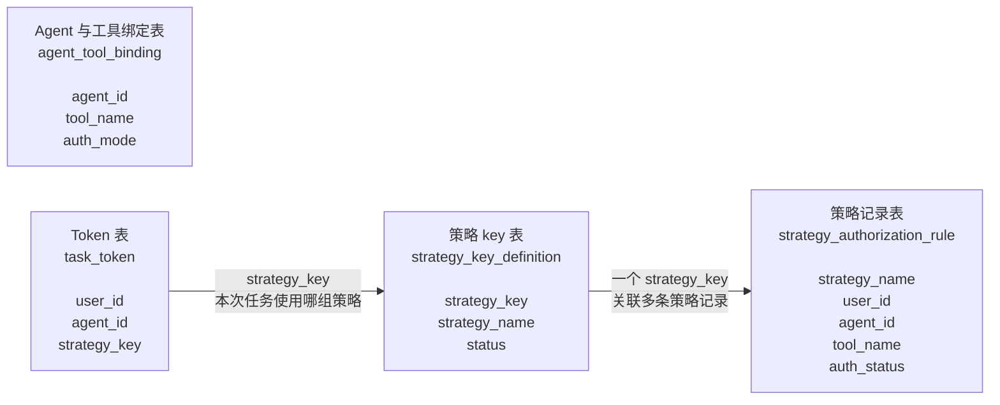
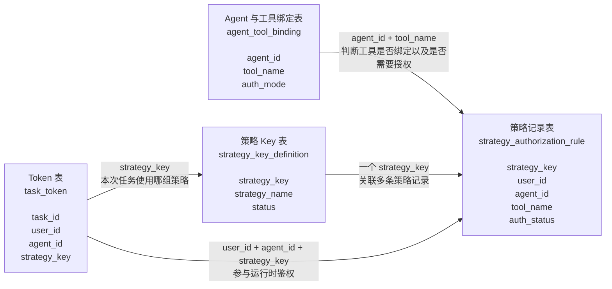

# 四表数据建模





## 1. 建模目标

本文只描述 Agent 人机委托方案中的四张核心表：

1. Agent 与工具绑定表
2. Token 表
3. 策略 Key 表
4. 策略记录表

核心关系：

- Agent 与工具绑定表定义：某个 Agent 能使用哪些工具，以及工具是否需要授权。
- Token 表定义：一次任务中，人、Agent、Task、策略 Key 的绑定关系。
- 策略 Key 表定义：一组策略的唯一标识。
- 策略记录表定义：某个策略 Key 下的多条具体授权记录。

## 2. Agent 与工具绑定表

表名：`agent_tool_binding`

作用：定义 Agent 绑定了哪些工具，以及每个工具在该 Agent 下的授权模式。

| 字段 | 类型建议 | 含义 |
|---|---|---|
| `id` | bigint | 主键 |
| `agent_id` | varchar | Agent ID |
| `tool_name` | varchar | 工具名称 |
| `auth_mode` | varchar | 授权模式 |
| `status` | varchar | 状态：ACTIVE / INACTIVE |
| `created_at` | datetime | 创建时间 |
| `updated_at` | datetime | 更新时间 |

`auth_mode` 枚举：

| 值 | 含义 |
|---|---|
| `NO_AUTH` | 无需授权 |
| `DELEGATION_REQUIRED` | 需授权 |
| `ALWAYS_CONFIRM` | 每次都需授权或确认 |

建议唯一约束：

```text
unique(agent_id, tool_name)
```

示例：

| agent_id | tool_name | auth_mode | status |
|---|---|---|---|
| `agent-001` | `datasource_list` | `NO_AUTH` | ACTIVE |
| `agent-001` | `datasource_create` | `DELEGATION_REQUIRED` | ACTIVE |
| `agent-001` | `datasource_delete` | `ALWAYS_CONFIRM` | ACTIVE |

## 3. Token 表

表名：`task_token`

作用：记录任务级 Token，绑定人、Agent、任务和策略 Key。

| 字段 | 类型建议 | 含义 |
|---|---|---|
| `token_id` | varchar | Token ID |
| `token_hash` | varchar | Token 摘要，不建议存明文 Token |
| `task_id` | varchar | 任务 ID |
| `user_id` | varchar | 用户 ID |
| `agent_id` | varchar | Agent ID |
| `strategy_key` | varchar | 本次任务关联的策略 Key |
| `status` | varchar | 状态：ACTIVE / EXPIRED / REVOKED |
| `issued_at` | datetime | 签发时间 |
| `expires_at` | datetime | 过期时间 |

关键说明：

- Token 是任务级的，必须绑定 `task_id`。
- Token 里记录 `user_id`、`agent_id`、`strategy_key`，用于运行时鉴权。
- Agent 只能拿到 Token，不能拿到用户 Cookie。
- 数据库只存 `token_hash`，不存明文 Token。

示例：

| token_id | task_id | user_id | agent_id | strategy_key | status |
|---|---|---|---|---|---|
| `token-001` | `task-001` | `user-001` | `agent-001` | `strategy-001` | ACTIVE |

## 4. 策略 Key 表

表名：`strategy_key_definition`

作用：定义一个策略 Key。一个策略 Key 可以关联多条具体策略记录。

| 字段 | 类型建议 | 含义 |
|---|---|---|
| `strategy_key` | varchar | 策略 Key |
| `strategy_name` | varchar | 策略名称 |
| `description` | varchar | 策略说明 |
| `status` | varchar | 状态：ACTIVE / INACTIVE |
| `created_at` | datetime | 创建时间 |
| `updated_at` | datetime | 更新时间 |

示例：

| strategy_key | strategy_name | status |
|---|---|---|
| `strategy-001` | 用户 A 授权数据查询 Agent 的策略组 | ACTIVE |

## 5. 策略记录表

表名：`strategy_authorization_rule`

作用：记录某个 `strategy_key` 下的一条具体授权策略。每条策略记录表示一条授权事实，例如“某个人授权某个 Agent 使用某个工具”。

| 字段 | 类型建议 | 含义 |
|---|---|---|
| `rule_id` | varchar | 策略记录 ID |
| `strategy_key` | varchar | 所属策略 Key |
| `user_id` | varchar | 授权人 |
| `agent_id` | varchar | 被授权 Agent |
| `tool_name` | varchar | 被授权工具 |
| `auth_status` | varchar | 授权状态：ACTIVE / EXPIRED / REVOKED |
| `auth_type` | varchar | 授权类型：LONG_TERM / TEMPORARY / ONE_TIME |
| `created_at` | datetime | 创建时间 |
| `expires_at` | datetime | 过期时间 |

建议索引：

```text
index(strategy_key)
index(user_id, agent_id, tool_name, auth_status)
```

示例：

| strategy_key | user_id | agent_id | tool_name | auth_status | auth_type |
|---|---|---|---|---|---|
| `strategy-001` | `user-001` | `agent-001` | `datasource_list` | ACTIVE | LONG_TERM |
| `strategy-001` | `user-001` | `agent-001` | `connector_list` | ACTIVE | LONG_TERM |
| `strategy-001` | `user-001` | `agent-001` | `datasource_delete` | REVOKED | ONE_TIME |

## 6. 四表中文关联图



## 7. 运行时鉴权使用方式

MCP Gateway 收到工具调用请求后，按以下顺序使用这四张表：

1. 解析 Token，得到 `task_id`、`user_id`、`agent_id`、`strategy_key`。
2. 查询 `agent_tool_binding`，用 `agent_id + tool_name` 判断 Agent 是否绑定该工具，以及工具的 `auth_mode`。
3. 如果 `auth_mode = NO_AUTH`，可直接执行工具。
4. 如果 `auth_mode = DELEGATION_REQUIRED`，查询 `strategy_authorization_rule`，判断是否存在匹配的 ACTIVE 授权记录。
5. 如果 `auth_mode = ALWAYS_CONFIRM`，每次都触发用户确认流程。
6. 通过 `strategy_key_definition` 确认 Token 中的 `strategy_key` 是否有效。
7. 鉴权通过后，MCP Gateway 才能继续调用传统业务 API。

核心判断条件：

```text
token.user_id
token.agent_id
token.strategy_key
tool_name
```

匹配策略记录：

```text
strategy_authorization_rule.strategy_key = token.strategy_key
strategy_authorization_rule.user_id = token.user_id
strategy_authorization_rule.agent_id = token.agent_id
strategy_authorization_rule.tool_name = 当前调用工具
strategy_authorization_rule.auth_status = ACTIVE
```

## 8. 设计要点

- `strategy_key` 是一组策略的标识，不是一条策略。
- 一个 `strategy_key` 可以关联多条 `strategy_authorization_rule`。
- 每条 `strategy_authorization_rule` 表示一条具体授权记录。
- `task_token` 通过 `strategy_key` 绑定本次任务使用的策略组。
- `agent_tool_binding` 只定义 Agent 与工具的绑定关系和授权模式，不记录人的授权。
- 人对 Agent、工具的授权记录在 `strategy_authorization_rule` 中维护。
